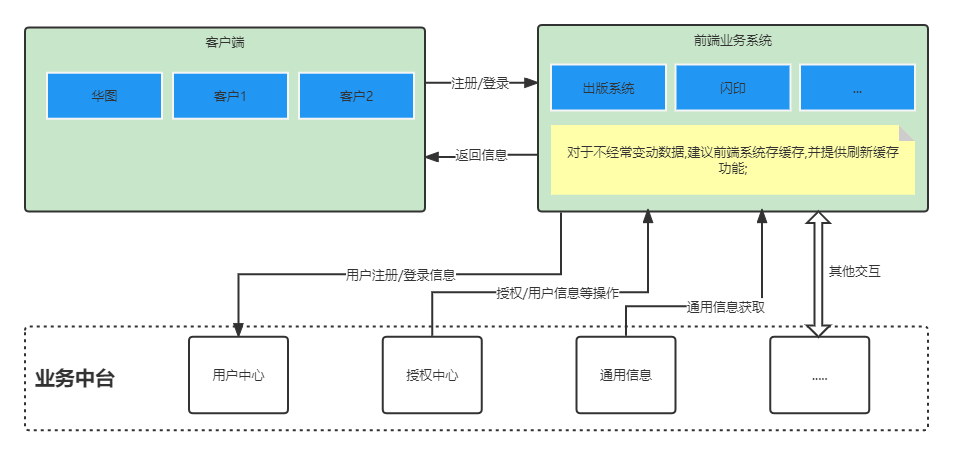
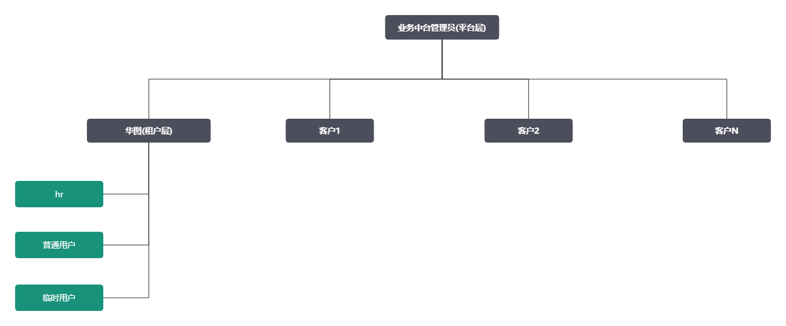
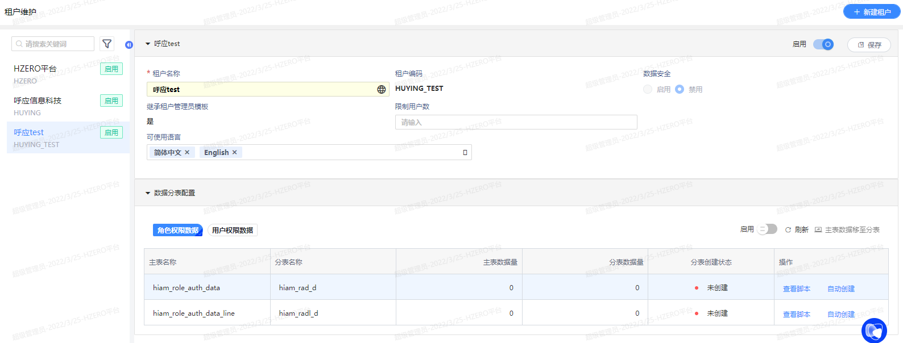
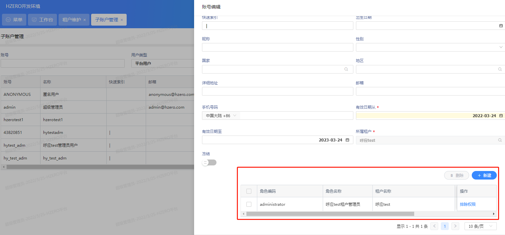
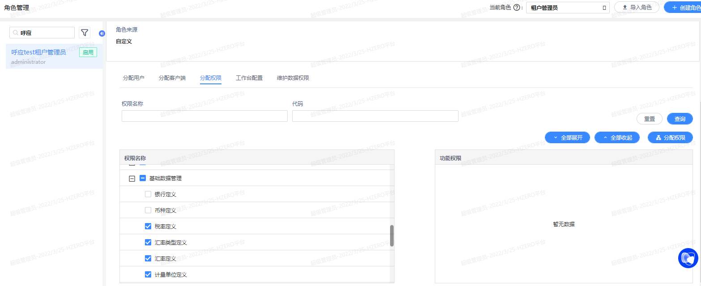
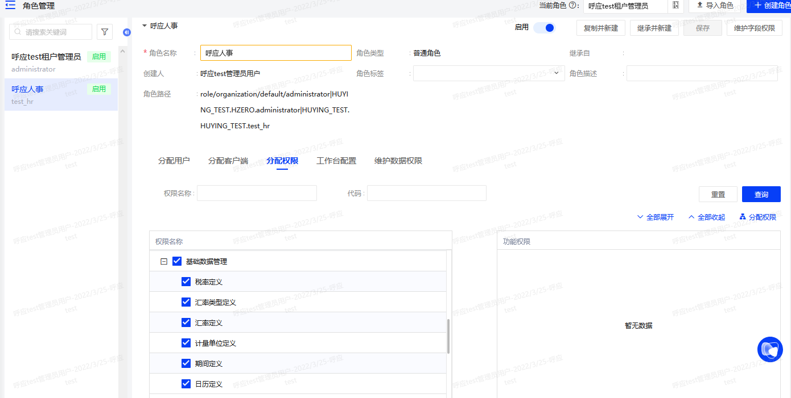
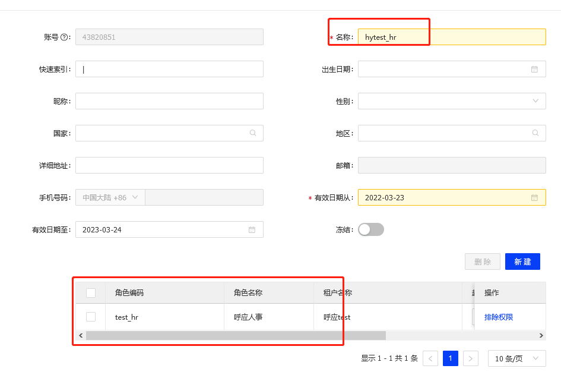
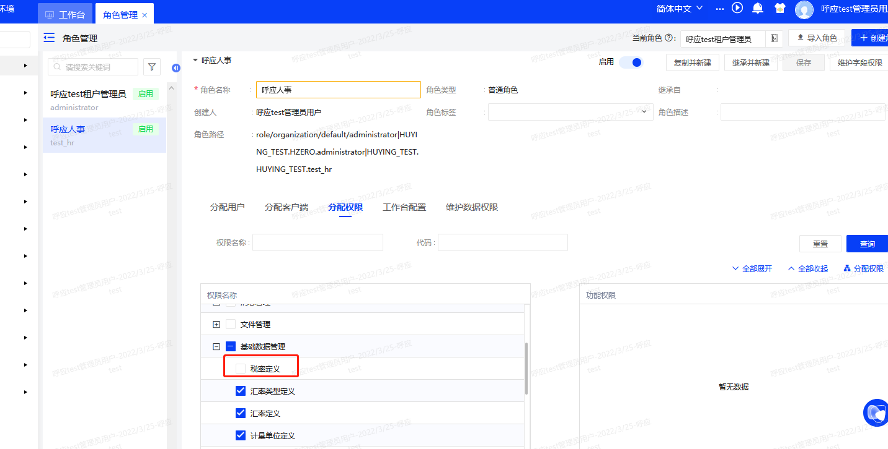
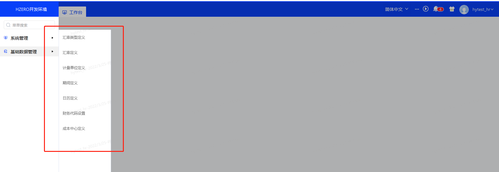

# 03月

## 03-22

1. 文档编写,hzero租户的租户能做到的功能描述

## 03-24

### 基本权限管理

* 涉及菜单及操作

1. 租户管理-新建租户
2. 子账户管理-新建
   填写信息后->需要分配角色->保存
   租户和角色都使用新建的租户
3. 缺失权限管理-会保存请求时权限报错的日志,可以通过刷新权限把这个接口权限自动加入
4. 消息服务-在平台层,可以发布消息选择租户,但是租户层,范围会小一些,不可以发布消息到其他租户
5. 文件服务-租户层，菜单只有文件的使用配置，这说明，配置文件服务器，是平台层做的
6. 通过测试平台设置完角色权限后,租户不用重新登录,只需要刷新页面即可(疑问:是刷新页面清缓存还是平台分配权限后会主动清理缓存)
7. 用户可以看到自身的角色，以及自身所在租户下的所拥有的角色下的子孙角色，但是看不到其他租户下的所拥有角色的子孙角色;  用户能看到自身租户内的所拥有的所有角色以及该角色下的子孙角色，无论是否是自己创建的; 

``` 
整体可分为两种情况:
将“管理角色”修改为“租户管理员”，即“租户管理员”分为“主租户管理员”和“兼租户管理员”，区别如下：
i.主租户管理员：为当前租户的用户，可以看到这个租户下的自身拥有的角色和所有的子孙角色
ii.兼租户管理员：非当前租户的用户，可以看到这个租户下的自身拥有的角色和自身所创建的角色
```

8. 权限和角色分配步骤

```
a)为API分配给租户
b)新建菜单，会生成默认权限集，为权限集分配API
c)新建角色，为角色分配权限（菜单）
d)新建用户，为用户选择角色，或者为角色分配用户

ps:也可以反向操作,当有api权限缺失时,使用"缺失权限管理",反向给权限
```

### 数据权限管理

1. 数据权限规则,分为两类: 数据库前缀; SQL
2. 单据权限

### 业务中台的疑问及思考

1. 中台用户管理

## 03-25

### 业务中台与前端及用户关系



### 用户系统初步构想



### 租户及权限操作

1. 新建租户

   

2. 子账户管理-新建一个`呼应test`租户
   填写信息后(租户和角色都使用新建的租户)->需要分配角色(新建租户后会自动生成一个对应的租户管理员)->保存

   

   

3. 管理租户的角色权限(这里对基础数据管理做演示)

   * 在平台管理层去掉`呼应test`租户的`银行定义`菜单权限

   

   * 在`呼应test`的租户账号下去新建角色时,不会有自己缺少的角色权限`银行定义`;

   

4. 在租户层

   * 用`呼应test`租户去创建一个新的子账号`hytest_hr`,并分配角色`呼应人事`

   

   * 给`呼应人事`分配权限,取消`税率定义`的权限

   

   * 使用`hytest_hr`可以看到菜单中没有`税率定义`

​		

## 03-30

### dockerfile记录

```cpp
docker rm -f oauth

docker rmi oauth

cd /docker/source/bon-demo/bon-oauth

git pull

mvn clean package

docker build -t oauth .

docker run -d -p 8020:8020 --name=oauth oauth

```

### 运行命令

```cpp
#!/bin/bash
echo "input name is:" $1 
echo "input port is:" $2 

echo "==============rm docker===========" $1
docker rm -f $1
echo "==============rm docker image=========" $1
docker rmi $1

cd /docker/source/bon-demo/bon-$1

echo "=============git pull==========="
git pull

echo "==============maven package=========="
mvn clean package

echo "===============docker build==================="
docker build -t $1 .

echo "================docker run================"
docker run -d -p $2:$2 --name=$1 $1
```


### 生成执行文件

```cpp
#!/bin/bash
echo -e "input name is:" $1 > /docker/run-script/$1.sh
echo -e "input port is:" $2 >> /docker/run-script/$1.sh

echo -e "==============rm docker===========" $1 >> /docker/run-script/$1.sh
echo -e "docker rm -f "$1 >> /docker/run-script/$1.sh
echo -e "==============rm docker image=========" $1 >> /docker/run-script/$1.sh
echo -e "docker rmi "$1 >> /docker/run-script/$1.sh

echo -e "cd /docker/source/bon-demo/bon-"$1 >> /docker/run-script/$1.sh

echo -e "=============git pull===========" >> /docker/run-script/$1.sh
echo -e "git pull" >> /docker/run-script/$1.sh

echo -e "==============maven package==========" >> /docker/run-script/$1.sh
echo -e "mvn clean package" >> /docker/run-script/$1.sh
 
echo -e "===============docker build===================" >> /docker/run-script/$1.sh
echo -e "docker build -t "$1 . >> /docker/run-script/$1.sh

echo -e "================docker run================" >> /docker/run-script/$1.sh
echo -e "docker run -d -p "$2":"$2" --name="$1 $1 >> /docker/run-script/$1.sh

chmod +x /docker/run-script/$1.sh
```

### update-all

```cpp
#!/bin/bash
sh register.sh
sh admin.sh  
sh gateway.sh  
sh iams.sh  
sh oauth.sh  
sh platform.sh    
sh swagger.sh
```

### run-all

```cpp
#!/bin/bash
docker start  register
docker start  admin  
docker start  gateway  
docker start  iams  
docker start  oauth  
docker start  platform   
docker start  swagger
```


### stop-all

```cpp
#!/bin/bash
docker stop  register
docker stop  admin  
docker stop  gateway  
docker stop  iams  
docker stop  oauth  
docker stop  platform   
docker stop  swagger
```


### rancher

```cpp
docker run -d --restart=unless-stopped -p 10080:8080 rancher/server
```

### 客户表结构

```sql
-- hc_pod.company_info_t definition

CREATE TABLE "company_info_t" (
  "id" bigint(20) NOT NULL AUTO_INCREMENT COMMENT 'ID',
  "companyName" varchar(50) DEFAULT NULL COMMENT '企业名称',
  "companyType" int(11) DEFAULT NULL COMMENT '1 出版社 \r\n2 民营公司\r\n3 教育机构',
  "contactMan" varchar(50) DEFAULT NULL COMMENT '联系人',
  "contactMobile" varchar(20) DEFAULT NULL COMMENT '手机号',
  "businessLicense" varchar(200) DEFAULT NULL COMMENT '营业执照',
  "bookLicense" varchar(200) DEFAULT NULL COMMENT '图书许可证',
  "taxLicense" varchar(200) DEFAULT '' COMMENT '税务登记证',
  "bankLicense" varchar(200) DEFAULT NULL COMMENT '银行开户许可证',
  "createTime" datetime DEFAULT NULL,
  "createUser" bigint(50) DEFAULT NULL,
  "status" int(10) DEFAULT NULL COMMENT '1、启用  2、锁定 3、待审核  4、驳回 5、OA审核中 6、OA审核失败',
  "customerHabits" varchar(255) DEFAULT NULL COMMENT '客户习惯',
  "businessType" int(6) DEFAULT NULL COMMENT '业务模式',
  "creditAccount" int(1) DEFAULT '0' COMMENT '账期客户 1是 0否',
  "creditInfoCreated" int(1) DEFAULT '0' COMMENT '信用数据创建 1成功 0失败',
  "creditScore" int(11) DEFAULT '0' COMMENT '信用评分',
  "creditQuota" bigint(20) DEFAULT '0' COMMENT '授信额度',
  "groupCompanyId" int(8) DEFAULT NULL COMMENT '集团公司id',
  PRIMARY KEY ("id"),
  KEY "idx_companyId" ("id") USING BTREE,
  KEY "idx_companyName" ("companyName") USING BTREE
) ENGINE=InnoDB AUTO_INCREMENT=3923 DEFAULT CHARSET=utf8 COMMENT='企业信息表';
```

### nginx刷新404

```
location / {
    root html;
    index  index.html index.htm;
    # 配置此项
    try_files $uri $uri/ /index.html; 
}
```

## 03-31

### 数据库

```sql
CREATE TABLE `hcom_company`  (
  `id` bigint(20) NOT NULL AUTO_INCREMENT COMMENT 'ID',
  `company_name` varchar(50) DEFAULT NULL COMMENT '企业名称',
  `company_type` int(11) DEFAULT NULL COMMENT '1 出版社 \r\n2 民营公司\r\n3 教育机构',
  `contact_man` varchar(50) DEFAULT NULL COMMENT '联系人',
  `contact_mobile` varchar(20) DEFAULT NULL COMMENT '手机号',
  `business_license` varchar(200) DEFAULT NULL COMMENT '营业执照',
  `book_license` varchar(200) DEFAULT NULL COMMENT '图书许可证',
  `tax_license` varchar(200) DEFAULT '' COMMENT '税务登记证',
  `bank_license` varchar(200) DEFAULT NULL COMMENT '银行开户许可证',
  `status` int(10) DEFAULT NULL COMMENT '1、启用  2、锁定 3、待审核  4、驳回 5、OA审核中 6、OA审核失败',
  `customer_habits` varchar(255) DEFAULT NULL COMMENT '客户习惯',
  `business_type` int(6) DEFAULT NULL COMMENT '业务模式',
  `credit_account` int(1) DEFAULT '0' COMMENT '账期客户 1是 0否',
  `credit_infoCreated` int(1) DEFAULT '0' COMMENT '信用数据创建 1成功 0失败',
  `credit_score` int(11) DEFAULT '0' COMMENT '信用评分',
  `credit_quota` bigint(20) DEFAULT '0' COMMENT '授信额度',
  `group_companyId` int(8) DEFAULT NULL COMMENT '集团公司id',
  `object_version_number` bigint(20) NOT NULL DEFAULT 1 COMMENT '行版本号，用来处理锁',
  `creation_date` datetime(0) NOT NULL DEFAULT CURRENT_TIMESTAMP,
  `created_by` bigint(20) NOT NULL DEFAULT -1,
  `last_updated_by` bigint(20) NOT NULL DEFAULT -1,
  `last_update_date` datetime(0) NOT NULL DEFAULT CURRENT_TIMESTAMP,
  PRIMARY KEY (`id`),
  KEY `idx_companyId` (`id`) USING BTREE,
  KEY `idx_company_name` (`company_name`) USING BTREE
) ENGINE = InnoDB AUTO_INCREMENT = 1 CHARACTER SET = utf8mb4 COLLATE = utf8mb4_bin COMMENT = '企业信息表' ROW_FORMAT = Dynamic;
```
