# 04月

## 04-01

### 新增一个服务所需步骤
#### 1. 使用服务选配下载一个新的服务
#### 2. 使用系统开发助手开启
* 从服务选配里找一个对应版本的助手代码
* 调整配置启动助手
* 在`开发助手`->`系统工具`->`手动刷新表IAM权限`
> 需要走有这一步,这一步能把助手的api权限加到系统中
* 在服务管理中加入路由配置
* 查看助手网页,使用ddd模式下载一个表的生成代码
#### 3. 将下载的代码放入新的服务中
* 在`开发助手`->`系统工具`->`手动刷新表IAM权限`
> 需要走有这一步,这一步能把助手的api权限加到系统中
* 在服务管理中加入路由配置
* 在swagger文档中查看接口
> 如果没有找到接口信息,就使用`admin`服务的`动态刷新`接口手动刷新swagger文档

### 租户分级可行性
1. 如果把租户分层级,`闪印`和`华图`本质是同一层级租户,只是多一个表来维护他们的父子关系
在平台管理中:a和b的数据

### 租户层级关系开发
1. 新建表,parentId和tenantId
2. 放入用户服务中

## 04-02

## 租户源码
* TenantCoreServiceImpl
> 使用了观察者模式
* hzero-iam-saas
> 里面有一个控制器`TenantManageController`,用来操作租户的新增修改

## 新增nacos
```
docker run -d -e \
prefer_host_mode=192.168.56.104  \
-e MODE=standalone  \
-e JVM_XMS=128m \
-e JVM_XMX=128m \
-e JVM_XMN=64m \
-v  /nacos/logs:/home/nacos/logs  \
-p 8848:8848  \
--restart=always \
--privileged=true  \
--name nacos \
 nacos/nacos-server
```

# 04-03
## 使用nacos作为注册和配置中心
### 生成所有文件
```cpp
sh /docker/run-script/gen/gen-script.sh admin 8060 8061
sh /docker/run-script/gen/gen-script.sh gateway 8080 8081
sh /docker/run-script/gen/gen-script.sh generator 8265 8266
sh /docker/run-script/gen/gen-script.sh iam-saas 8030 8031
sh /docker/run-script/gen/gen-script.sh oauth 8020 8021
sh /docker/run-script/gen/gen-script.sh platform 8100 8101
sh /docker/run-script/gen/gen-script.sh swagger 8050 8051
```

### 修改生成脚本
```cpp
#!/bin/bash
echo -e "echo \"input name is:\"" $1 > /docker/run-script/$1.sh
echo -e "echo \"input port is:\"" $2 >> /docker/run-script/$1.sh
echo -e "echo \"input management port is:\"" $3 >> /docker/run-script/$1.sh

echo -e "echo \"==============rm docker===========\"" $1 >> /docker/run-script/$1.sh
echo -e "docker rm -f "$1 >> /docker/run-script/$1.sh
echo -e "echo \"==============rm docker image=========\"" $1 >> /docker/run-script/$1.sh
echo -e "docker rmi "$1 >> /docker/run-script/$1.sh

echo -e "cd /docker/source/hy-middle/hy-"$1 >> /docker/run-script/$1.sh

echo -e "echo \"=============git pull===========\"" >> /docker/run-script/$1.sh
echo -e "git pull" >> /docker/run-script/$1.sh

echo -e "echo \"==============maven package==========\"" >> /docker/run-script/$1.sh
echo -e "mvn clean package" >> /docker/run-script/$1.sh
 
echo -e "echo \"===============docker build===================\"" >> /docker/run-script/$1.sh
echo -e "docker build -t "$1 . >> /docker/run-script/$1.sh

echo -e "echo \"================docker run================\"" >> /docker/run-script/$1.sh
echo -e "docker run -d -p "$2":"$2" -p "$3":"$3" --name="$1 $1 >> /docker/run-script/$1.sh

chmod +x /docker/run-script/$1.sh
```

### 日志文件查看
```cpp
#!/bin/bash
if [ -n "$2" ]; then
    docker logs -f --tail $2 $1
else 
    docker logs -f --tail 10 $1
fi
```

### swagger服务踩坑
使用nacos时,swagger服务要自己导入依赖
```xml
<dependency>
    <groupId>commons-lang</groupId>
    <artifactId>commons-lang</artifactId>
    <version>2.4</version>
</dependency>
```

### 调用远程服务
### feign原理
* SynchronousMethodHandler 里面有feign请求和响应的记录
* 通过实现Decoder和ErrorDecoder可以自定义feign的返回信息


## 04-07
### 辅助开发包文档(通过feign知道异常代码机制)
https://open.hand-china.com/document-center/doc/component/106/16250?doc_id=160351&doc_code=116465


## 04-08
### 服务部署流程
1. 新建项目
2. 开发->应用服务->新建应用服务
    * `服务模板`采用`项目`
    * 新建后会对应生成一个代码仓库
    
3. 将代码上传到对应的应用代码库中
    * 要检查代码中`charts文件夹`的`文件夹名称`以及`chart.yaml`文件内容是和应用名一致的
    * 可以将`charts`下的`values.yaml`文件先行修改,后期部署时就不用再修改了
4. 应用流水线->创建流水线
    * 里面的内容需要留意分支信息,选择后会根据分支名过滤,比如触发分支选择`feature`,那么只有含有`feature`名的分支会触发流水线
    * 新建流水线后会自动给对应的代码库生成或修改`gitlab-ci.yml`
5. 部署->资源->创建应用(需要先连接好集群)
    * 对应集群环境中创建应用
6. 部署->`对应集群环境`->网络->创建网络
7. 部署->`对应集群环境`->域名->创建域名

### 开启sql打印


### *mybatis插件*(mapper怎么使用)
地址: https://open.hand-china.com/document-center/doc/component/108/16254?doc_id=160401&doc_code=29074

### *idea插件*(骚操作较多)
地址: https://open.hand-china.com/document-center/doc/product/10216/10618?doc_id=172899&_back=%2Fdocument-center%2Fsearch%3Fs%3Dsql%25E6%2597%25A5%25E5%25BF%2597%25E6%2589%2593%25E5%258D%25B0&doc_code=130069

## 04-11
### idea插件记录
1. 生成pojo: 通过实体类快速生成DTO或者VO
2. 快速生成计划任务类
3. 快速生成导入部分代码
4. 快速复制controller
5. pom下可以快速导入依赖
6. sql日志会记录到mybatis-console中
7. json转为实体类
8. 生成表的sql表字段
9. controller生成请求url

### DetailsHelper
> 根据请求解析出userDetail和clientDetail对象

### 代码分支
* 分支的规划
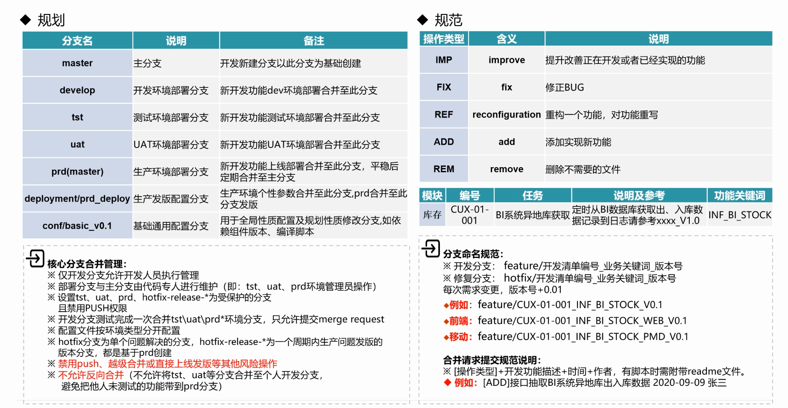
* 分支的大概流程
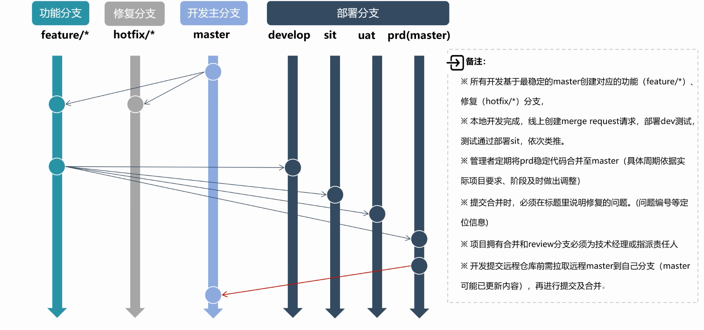
* 分支的发版流程
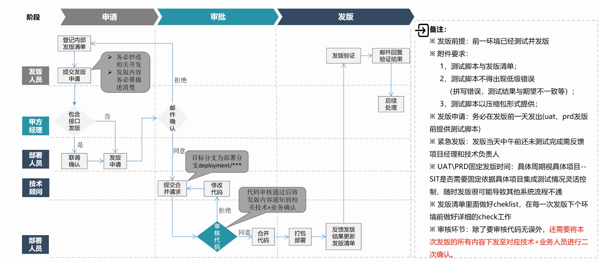

### 开发流程
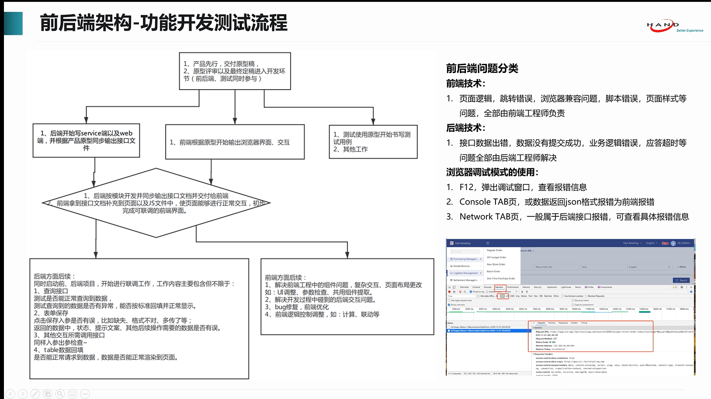

### 密码安全策略
> 菜单->`安全策略`

### ddd代码分层
1. api: 用户接口层,向外提供服务

2. app: 应用层,包含应用服务,负责用例流程调度,事务控制

3. domain: 领域层,包含领域对象服务,专注核心业务

4. infra: 基础设置层,提供数据持久化,防腐层实现,第三方库,消息等

### ddd文档地址
1. 指导手册地址:
https://open.hand-china.com/document-center/doc/product/10137/10227?doc_id=32613

2. demo地址:
https://open.hand-china.com/document-center/doc/product/10137/10227?doc_id=32713

## 04-12
### 异常规约
https://open.hand-china.com/document-center/doc/product/10137/10227?doc_id=32620

### 异常使用
https://open.hand-china.com/document-center/doc/component/106/16250?doc_id=160355&doc_code=41082

### 开发者模式
> 让路由指定执行本地的服务.
https://open.hand-china.com/document-center/doc/component/428/16708?doc_id=207071&doc_code=11326


### 异常信息可以返回前端
在开发环境中，为了方便排查问题，如果我们想将异常栈返回到前端，可以指定 spring.profiles.active=dev。

### JwtTokenFilter 
> 所有请求经过网关鉴权后，会将用户信息转成 Jwt_Token，然后请求服务，服务中有一个 JwtTokenFilter 会将 Jwt_Token 转成 CustomUserDetails。
> 需要注意的是，JwtTokenFilter 默认拦截 /v1/* 的请求，如果需要拦截其它API，可通过 hzero.resource.pattern 配置。

### ApplicationContextHelper
```java
ApplicationContext applicationContext = ApplicationContextHelper.getContext();
Environment env = applicationContext.getBean(Environment.class);
```
#### 静态注入字段到实例对象中
```java
public class RedisMessageSource extends AbstractMessageSource implements IMessageSource {
    private RedisHelper redisHelper;
    private int redisDb = 1;
    public RedisMessageSource() {
        ApplicationContextHelper.asyncInstanceSetter(RedisHelper.class, this, "setRedisHelper");
        ApplicationContextHelper.asyncInstanceSetter(Environment.class, this, "setEnvironment");
    }
    private void setRedisHelper(RedisHelper redisHelper) {
        this.redisHelper = redisHelper;
    }
    private void setEnvironment(Environment environment) {
        this.redisDb = Integer.parseInt(environment.getProperty("hzero.service.platform.redis-db", "1"));
    }
}
```

### 定义后端消息
消息编码格式为：`服务简码.消息级别.功能模块.消息描述编码`
其中，消息级别可以定义如下值：

* info：操作成功，提示类消息
* warn：业务失败，提醒警告类消息
* error：错误较严重，阻塞流程或服务的异常类消息

如果消息要动态传入参数，可以通过 {n} 占位符来表示，n 从 0 开始，例如：密码长度必须在 {0} - {1} 位之间。
中文：
```java
hiam.info.user.registerSuccess=您的账号注册成功
hiam.warn.user.passLength=密码长度必须在 {0} - {1} 位之间
hiam.error.user.accountExists=您输入的账号[{0}]已注册
```
英文：

```java
hiam.info.user.registerSuccess=Account registration successful.
hiam.warn.user.passLength=Password length must be between {0} - {1} bits
hiam.error.user.accountExists=The account [{0}] already exists.
```
#### MessageAccessor 

> 消息文件创建好之后，还需将消息文件注册到 `MessageAccessor` 环境中才能使用。
可以创建一个服务配置类，接着创建一个 SmartInitializingSingleton 对象，然后将消息文件的路径添加到 MessageAccessor 中。

例如下面的代码：
```java
@Configuration
public class IamConfiguration {
    @Bean
    public SmartInitializingSingleton iamSmartInitializingSingleton() {
        return () -> {
            // 加入消息文件
            MessageAccessor.addBasenames("classpath:messages/messages_hiam");
        };
    }
}
```

##### 获取消息
> MessageAccessor 默认先从 Redis 缓存中获取多语言消息，获取不到再从本地文件中获取
> 在 [开发管理 > 多语言管理 > 返回消息管理] 功能下，就可以维护多语言消息，这些消息会自动缓存到 Redis 中，这样就可以在程序运行期间更改多语言消息了。
```java
public void getMessage() {
    // 获取消息：hiam.info.user.registerSuccess=您的账号注册成功
    String msg1 = MessageAccessor.getMessage("hiam.info.user.registerSuccess").getDesc();
    // 获取带参数的消息：hiam.warn.user.passLength=密码长度必须在 {0} - {1} 位之间
    String msg2 = MessageAccessor.getMessage("hiam.warn.user.passLength", new Object[]{6, 30}).getDesc();
    // 指定默认消息，没有则使用默认消息
    String msg3 = MessageAccessor.getMessage("hiam.warn.user.emailNotBlank", "Email is blank.").getDesc();
    // 指定消息的语言
    String msg4 = MessageAccessor.getMessage("hiam.warn.user.emailNotBlank", LanguageHelper.locale()).getDesc();
}
```

### 通用线程池(CommonExecutor)
> 默认参数：核心线程数=CPU核数，最大线程数=8*核心线程数，空闲时间=5min，队列大小=65536
```java
// 只需指定一个线程池名称
ThreadPoolExecutor executor = CommonExecutor.buildThreadFirstExecutor("PoolName"); 
```
> CommonExecutor 的 displayThreadPoolStatus 方法可以按一定频率输出线程池状态到日志中。


### 服务的路由配置
```java
// 类上加上 @ChoerodonExtraData 
@ChoerodonExtraData
public class HiamExtraDataManager implements ExtraDataManager {
   @Autowired
   private Environment environment;
   @Override
   public ExtraData getData() {
       ChoerodonRouteData routeData = new ChoerodonRouteData();
       // 服务简码
       routeData.setName(environment.getProperty("hzero.service.current.name", "hiam"));
       // 服务路径
       routeData.setPath(environment.getProperty("hzero.service.current.path", "/iam/**"));
       // 服务ID
       routeData.setServiceId(environment.getProperty("hzero.service.current.service-name", "hzero-iam"));
       // 服务所在包路径
       routeData.setPackages("org.hzero.iam");
       // 去除第一段路由
       routeData.setStripSegment(1);
       // 重要：将 routeData 放入 extraData 中
       extraData.put(ExtraData.ZUUL_ROUTE_DATA, routeData);
       return extraData;
   }
}
```

### 通用的模式封装
1. 动态职责链
2. 观察者事件总线

### 服务器配置信息
**HZeroService类**

### 分支管理
```
feature/*
hotfix/*
dev
sit
uat
master
development/prd_develop
conf/basic_v0.1
```

## 04-13
### 辅助开发核心包(通用工具)
https://open.hand-china.com/document-center/doc/component/106/16250?doc_id=160365&doc_code=41158

### oauth认证服务
文档地址: 
https://open.hand-china.com/document-center/doc/component/165/16196?doc_id=159919&doc_code=39195
#### 主要功能
基于Oauth2协议的统一认证服务
统一登录界面
账户、手机、邮箱登录
短信登录
多种模式的单点登录
三方渠道登录功能
LDAP认证服务支持
可客制化登录模板

#### LDAP认证
* 简介
LDAP认证是通过WSS3.0加上轻量目录LDAP协议搭建的种认证方式，使用https加密传输，主要用于做文档管理。
LDAP认证就是把用户数据放在LDAP服务器上，通过LDAP服务器上的数据对用户进行认证处理。
* 方式
每一个登陆，连接请求去发送本地的用户、密码给LDAP服务器，然后在LDAP服务器上进行匹配，然后判断是否可以通过认证。


### security核心原理
security 的核心原理如下图所示，进入 oauth 服务的所有API请求都会进入 FilterChainProxy，然后根据API选择一组匹配的滤器链来处理接口调用。

第一个过滤器 SecurityContextPersistenceFilter 会读取当前登录用户信息 Authentication 放到 SecurityContext 上下文中，FilterSecurityInterceptor 会根据 SecurityContext 上下文判断用户是否已经登录，否则将抛出异常，由 ExceptionTranslationFilter 捕获，并决定跳到何处去登录。

hzero-oauth 服务针对不同的认证模式配置了多组过滤器链，如标准登录、短信登录、单点登录、三方登录等，它们的API调用会进入到各自的一组过滤器链中。不同的是红色的那部分，即用户认证过滤器，这部分是 hzero-oauth 定制逻辑。用户认证过滤器主要就是根据传入的用户登录参数来校验认证信息，并进行各方面的校验工作，认证通过后，将用户信息放入 SeurityContext 上下文中，代表用户已登录。

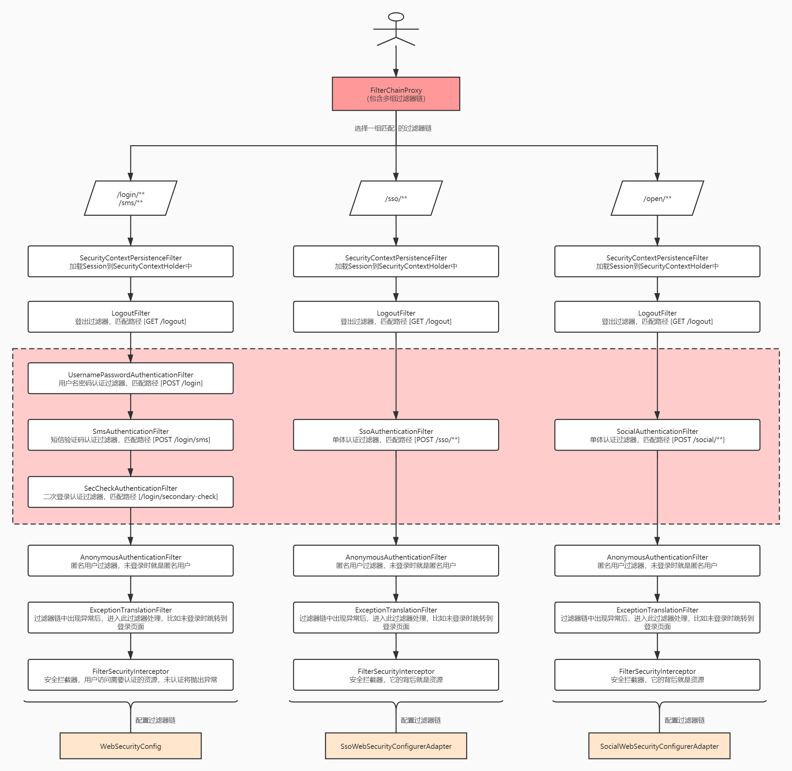

### 登录获取令牌核心流程
如下是登录核心逻辑，首先访问 /oauth/authorize 接口时，由于用户未登录，会重定向到 /oauth/login 页面进行登录，用户登录时，就会进入 security 过滤器链中，最核心的便是用户认证过滤器进行用户的认证。认证成功后再重定向到 /oauth/authorize 接口获取令牌。

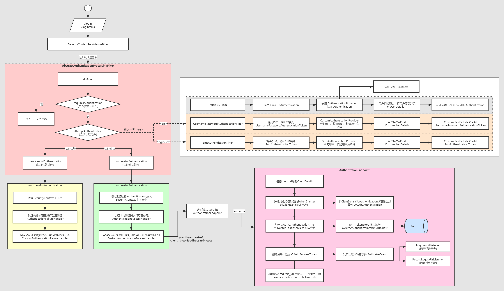

### 核心组件类图
认证最核心的类便是 AbstractAuthenticationProcessingFilter，定制化主要就是围绕这个过滤器所依赖的组件进行的，其中绿色标识的类可以根据实际需求进行定制化。

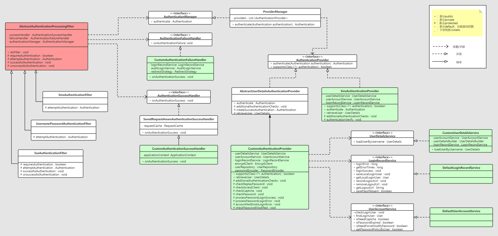

###　ＵＭＬ类图
1. 标识含义

标识|含义
--|--
`+`|public类型
`-`|private类型
`#`|protect类型
` `|为空时缺省类型

2. 类的表现方式

示例|备注
--|--
-name:String|属性name是private String类型的
+work():void|方法work是public void类型的

3. 类的关系
    * 关联关系
        * 单向关联
        * 双向关联
        * 自关联
    * 聚合: 整体和部分的关系;整体不存在时,部分可以自己存在:如学校和老师
    * 组合: 更强烈的整体部分关系;整体部分不存在时,部分也不存在:如头和嘴
    * 依赖: 某个类的方法通过`局部变量、方法的参数或者对静态方法`的调用来访问`另一个类（被依赖类）中的某些方法`来完成一些职责
    * 继承
    * 实现
4. 关系间的异同点
    * `关联关系`和`聚合及组合`: 聚合和组合是需要有整体和部分的关系,关联则没有这层;
    * `依赖`和`关联,聚合,组合`: 依赖是局部变量,方法参数,静态方法需要用到另一个类的方法; 其他的则是类中的`成员变量`是另一个类;

### 自定义登录获取令牌
1. 认证对象 SmsAuthenticationToken
> 包含认证对象的信息
SmsAuthenticationToken 继承 AbstractAuthenticationToken,一般需要提供两个构造方法：
第一个构造方法封装认证信息，比如这里的手机号，并调用 setAuthenticated(false) 设置未认证；
第二个构造方法封装认证信息和授权，一般授权可以传空集合即可，注意调用 setAuthenticated(true) 设置已认证。


2. 开发认证器 SmsAuthenticationProvider
> 验证SmsAuthenticationToken里面的信息是否正确
自定义认证器 SmsAuthenticationProvider 实现 AuthenticationProvider 接口，实现两个方法：
supports：判断当前认证器是否支持认证 authentication
authenticate：认证用户信息，认证通过后返回一个已认证的 Authentication，认证失败抛出认证失败异常即可。大致的流程是：认证登录用户信息、加载用户 UserDetails、创建 Authentication。

3. 开发认证组件 MobileLoginTokenService 
> 从request中获取手机号信息
自定义 MobileLoginTokenService 继承 LoginTokenService，一般只需要实现 attemptAuthentication 抽象方法即可。在 attemptAuthentication 方法中提取用户认证信息，封装到自定义的认证对象 SmsAuthenticationToken 中。其它可重载的方法可以参考 LoginTokenService 提供的 protected 方法。

4. 配置认证组件
开发好认证组件后，需要通过配置类来初始化对象，即初始化 MobileLoginTokenService。


### LoginTokenService的loginForToken认证流程
1. 通过 MobileLoginTokenService 从 request 中获取手机号信息
2. 通过 SmsAuthenticationProvider 验证 SmsAuthenticationToken 里面的信息是否正确
3. this.successfulAuthentication() 将认证信息 SmsAuthenticationToken 放入 SecurityContextHolder 上下文中
4. this.createAccessToken(request) 生成token,并且通过 this.applicationContext.publishEvent(authorizeEvent) 发出认证事件
5. 封装成 AuthenticationResult 返回

### oauth登录流程
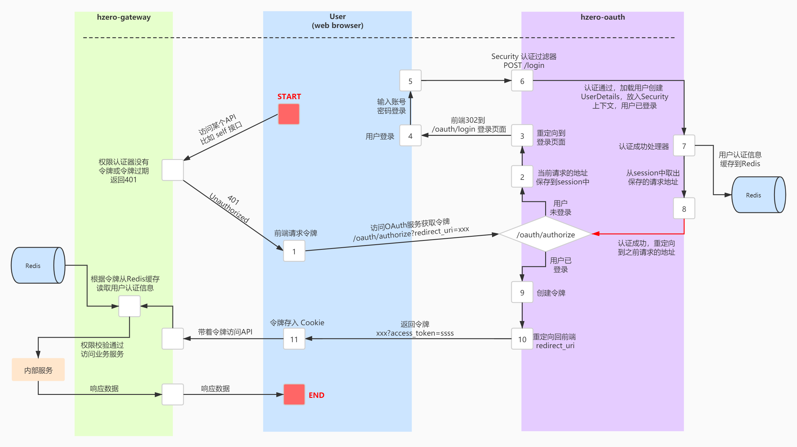

### 单点登录
#### 通用流程
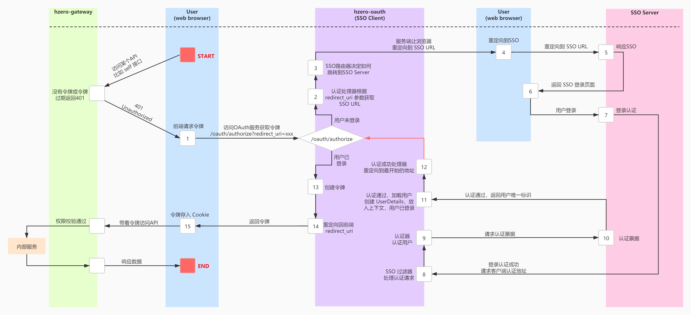

### hzero单点登录组件核心流程
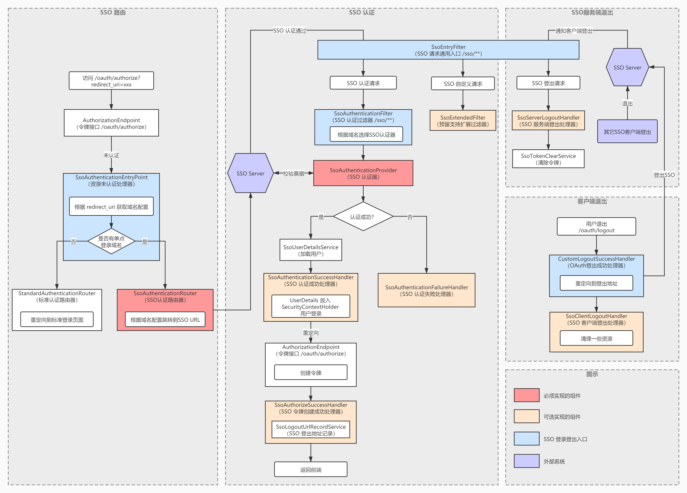

### cas单点登录流程
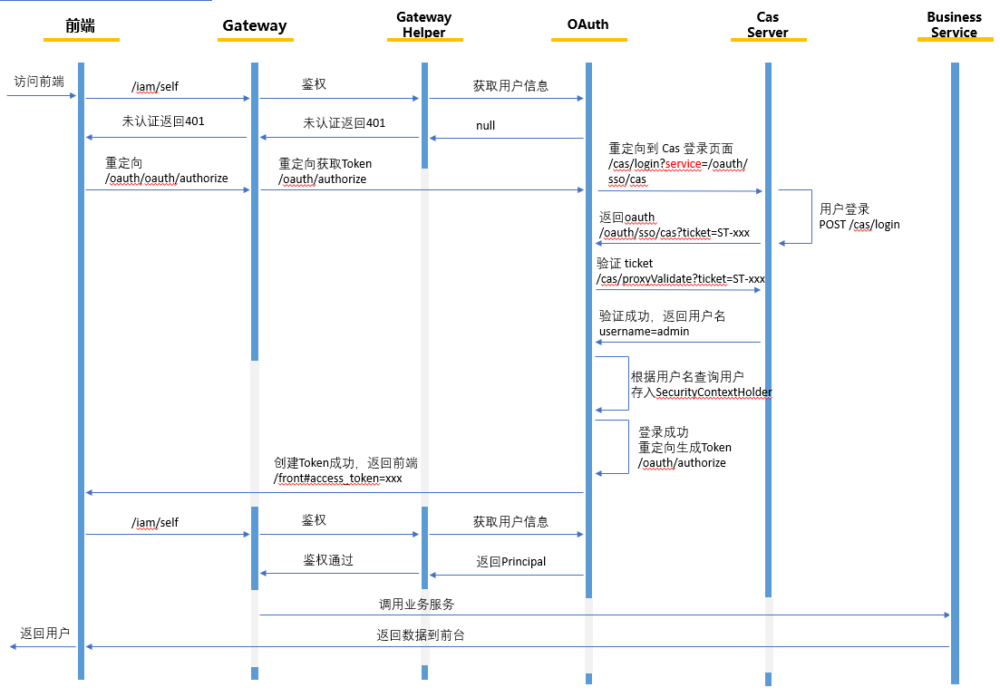

## 04-14
### npm安装hzero-cli
```cpp
npm install -g hzero-cli --registry http://nexus.saas.hand-china.com/content/groups/hzero-npm-group
```


## 04-15

### 行狼培训

#### 简介

行狼是一个监控平台,监控中间件,应用,日志

#### 文档地址

> https://open.hand-china.com/document-center/doc/product/10070/10671


## 04-18

### 部署nacos服务


## 前端运行

#### npm安装`hzero-cli`

```
npm install -g hzero-cli --registry http://nexus.saas.hand-china.com/content/groups/hzero-npm-group
```


#### npm查看组件版本

```
npm view shared
```


#### npm安装缺少的组件

```
# npm view出来的全路径
npm install http://nexus.saas.hand-china.com/repository/hzero-npm-group/shared/-/shared-0.2.0.tgz
```


### 用户中心内容

1. 登录信息扩展
2. 注册功能扩展
3. 用户信息字段对齐
4. 用户鉴权信息扩展开发
5. 租户关系维护


## 04-19

### 注册中心

#### refreshScope踩坑记录

1. spring.application.name 需要在bootstrap中配置,不然扫描为null
2. 或者nacos.config.prefix配置为服务名

#### 配置顺序

```
本地配置文件<部署配置文件<nacos配置文件
```

### 分支管理

```
feature-** 新功能开发
hotfix-** 修复分支

```


## 04-20

### 文档

【腾讯文档】出版业务中台-基础数据功能清单
https://docs.qq.com/sheet/DZndBRmtST05UTGN0

### 平台治理客户端

https://open.hand-china.com/document-center/doc/component/923/13615

```yaml
1. 可以配置注册到平台治理服务中
hzero:
  admin:
    client: 
      # 如果不开启服务发现，则需要直接指定admin服务地址，可配置多个admin节点
      server-list:
          - localhost:8061
      # 重试间隔
      retry-internal: 3000 # millsecond
      # 连接超时
      connect-timeout: 5000 # millsecond
      # 读超时
      read-timeout: 8000 # millsecond
      # 服务发现
      discovery:
        # 是否开启服务发现
        enabled: true
        # 服务发现的服务名
        service-id: hzero-admin
2. 通过平台治理消息发送通知
```


### 培训信息

1、权限体系-访问权限、数据权限、单据权限
录屏文件及文档：https://pan.hand-china.com/owncloud/index.php/s/KlynureP47aOs7k     密码：HZERO
2、HZERO 1.9 特性介绍
录屏文件：https://pan.hand-china.com/owncloud/index.php/s/XPrtXEmlcvDyt9H     密码：HZERO


### 连接开发环境本地开发


## 04-21

### 修改服务为nacos

1. 从流水线备份老charts值

2. 修改values

   ```yaml
   # Nacos 配置中心地址
   NACOS_CONFIG_SERVER_ADDR: 10.4.0.61:8848
   # Nacos命名空间　
   NACOS_CONFIG_NAMESPACE: 3767dfeb-ec5f-4611-97bb-ee530d19ef89
   # Nacos文件格式
   NACOS_CONFIG_FILE_EXTENSION: yaml
   # Nacos注册中心地址
   NACOS_DISCOVERY_SERVER_ADDR: 10.4.0.61:8848
   
   # 数据库地址
   SPRING_DATASOURCE_URL: jdbc:mysql://10.4.0.61:3306/hzero_scheduler?useUnicode=true&characterEncoding=utf-8&useSSL=false
   # 数据库用户名
   SPRING_DATASOURCE_USERNAME: admin
   # 数据库密码
   SPRING_DATASOURCE_PASSWORD: NHgbIfSUOMhScKuCrJZR
   # 连接池最小空闲连接数
   SPRING_DATASOURCE_MINIMUM_IDLE: 20
   # 连接池允许的最大连接数
   SPRING_DATASOURCE_MAXIMUM_POOL_SIZE: 200
   # 等待连接池分配连接的最大时长（毫秒）
   SPRING_DATASOURCE_CONNECTION_TIMEOUT: 30000
   
   # Redis host
   SPRING_REDIS_HOST: 10.4.0.61
   # Redis Port
   SPRING_REDIS_PORT: 6379
   # Redis 密码
   SPRING_REDIS_PASSWORD: hucais567
   ```

   

3. 修改pom文件

   ```xml
   <dependency>
       <groupId>com.alibaba.cloud</groupId>
       <artifactId>spring-cloud-starter-alibaba-nacos-discovery</artifactId>
       <version>2021.1</version>
   </dependency>
   <dependency>
       <groupId>com.alibaba.cloud</groupId>
       <artifactId>spring-cloud-starter-alibaba-nacos-config</artifactId>
       <version>2021.1</version>
   </dependency>
   ```

   

4. 修改配置文件

   * 服务名修改

   * nacos配置修改

     ```yaml
     cloud:
         nacos:
           config:
             server-addr: ${NACOS_CONFIG_SERVER_ADDR:10.4.0.61:8848}
             namespace: ${NACOS_CONFIG_NAMESPACE:3767dfeb-ec5f-4611-97bb-ee530d19ef89}
             file-extension: ${NACOS_CONFIG_FILE_EXTENSION:yaml}
           discovery:
             server-addr: ${NACOS_DISCOVERY_SERVER_ADDR:10.4.0.61:8848}
             namespace: ${NACOS_DISCOVERY_NAMESPACE:3767dfeb-ec5f-4611-97bb-ee530d19ef89}
             metadata:
               VERSION: 1.8.0.RELEASE
     ```


## 04-24

### 任务文档地址

https://www.kdocs.cn/l/ccLho1krGo0U

## 04-25

### 租户关系开发

1. 新增接口
2. 修改接口
3. 删除时

## 04-26

### 获取用户信息

IAM 服务保存了接口权限信息，一般情况下，（按照HZERO规范生成的）新服务注册到注册中心后，系统会自动从该服务拉取该服务接口权限信息，并通过IAM权限刷新接口保存到数据库和缓存中，这时新服务的API在网关的鉴权（网关从redis中获取权限信息）才能通过。

这里HZERO做了三件事：

- 自动监听服务注册事件，并从新服务拉取接口权限信息（该工作由hzero-admin服务完成）
- hzero-admin 服务通过远程调用通知 hzero-iam 服务完成权限刷新工作
- hzero-iam 从新服务拉取权限接口信息，并保存到数据库和缓存

如果出现这样到情况，新服务注册后，接口权限没有刷新到IAM，导致网关鉴权失败，报错 PERMISSION_MISMATCH。

则原因可能是：

- hzero-admin 服务不可用，无法监听到服务注册事件
- hzero-iam 服务不可用或 hzero-admin 与 hzero-iam 网络不通或网络抖动，hzero-admin 远程调用 hzero-iam 失败
- 新服务不符合HZERO规范

### 创建内部用户操作流程

1. `UserPublicController`

```java
@Permission(permissionWithin = true)
    @ApiOperation(value = "创建用户 - 内部调用接口，需传入默认分配的角色；如果传入了 type ，则校验验证码，不传则不校验")
    @PostMapping("/users/internal")
    public ResponseEntity<User> createUserInternal(
            @RequestBody User user,
            @ApiParam(value = "验证码业务范围") @RequestParam(required = false) String businessScope,
            @ApiParam(value = "创建类型：手机-phone/邮箱-email") @RequestParam(required = false) String type,
            @ApiParam(value = "是否校验验证码") @RequestParam(required = false, defaultValue = "true") boolean validateCaptcha,
            @ApiParam(value = "验证码Key：发送验证码时返回的 captchaKey") @RequestParam(required = false) String captchaKey,
            @ApiParam(value = "验证码：用户输入的验证码") @RequestParam(required = false) String captcha) {
        // 手机注册
        if (StringUtils.equalsIgnoreCase(type, User.FIELD_PHONE)) {
            if (validateCaptcha) {
                userCaptchaService.validateCaptcha(captchaKey, captcha, user.getPhone(),
                        UserType.ofDefault(user.getUserType()), businessScope);
            }
            user.setPhoneCheckFlag(BaseConstants.Flag.YES);
        }
        // 邮箱注册
        else if (StringUtils.equalsIgnoreCase(type, User.FIELD_EMAIL)) {
            if (validateCaptcha) {
                userCaptchaService.validateCaptcha(captchaKey, captcha, user.getEmail(),
                        UserType.ofDefault(user.getUserType()), businessScope);
            }
            user.setEmailCheckFlag(BaseConstants.Flag.YES);
        }
        user.setUserType(UserType.ofDefault(user.getUserType()).value());
        validObject(user);
        return Results.success(userService.createUserInternal(user));// 此步正式创建用户
    }
```

2. `UserServiceImpl`的`createUserInternal`使用了拦截器链模式

> userInterceptorChainManager是一个拦截器管理器;只为注册为bean,主要操作在其父类`AbstractInterceptorChainManager`

```java
@Override
    @Transactional(rollbackFor = Exception.class)
    public User createUserInternal(User user) {
        userInterceptorChainManager.doInterceptor(UserOperation.CREATE_USER_INTERNAL, user, (u) -> {
            // 创建用户
            userCreateInternalService.createUser(u);
        });

        return user;
    }
```

3. `AbstractInterceptorChainManager`初始化拦截器`initInterceptorChain`

```java
private Map<ChainId, InterceptorChain<T>> initInterceptorChain(List<HandlerInterceptor<T>> interceptorList,
                                                                   List<InterceptorChainConfigurer<T, InterceptorChainBuilder<T>>> configurerList) {
        if (CollectionUtils.isEmpty(interceptorList)) {
            throw new IllegalArgumentException("Interceptors is empty.");
        }

        if (CollectionUtils.isEmpty(configurerList)) {
            throw new IllegalArgumentException("Interceptor configurers is empty.");
        }
		// 让拦截器构造器将注册到spring的拦截器管理起来
        InterceptorChainBuilder<T> builder = new InterceptorChainBuilder<>(interceptorList);
		// 对拦截器配置类排序;配置类上有@order注解
        configurerList.sort(AnnotationAwareOrderComparator.INSTANCE);
		// 循环调用配置类的配置,配置是可以多个,此处可以扩展
        configurerList.forEach(configurer -> {
            configurer.configure(builder);// 开始配置
            builder.clearChain();// 清楚当前chainId
        });

        List<InterceptorChain<T>> chains = builder.performBuild();// 开始构造

        return chains.stream().collect(Collectors.toMap(InterceptorChain::getChainId, Function.identity()));
    }
```

4. 用户拦截器配置类`UserInterceptorChainConfigurer`

> 用户这里有几种用户操作类型,根据对应的操作类型,给配置对应的拦截器,实现对于不同操作拦截器可插拔,拦截器的里代码复用
>
> 如果要加一个新的拦截器,需要在这里加一个配置逻辑

```java
@Order(0)
@Component
public class UserInterceptorChainConfigurer implements InterceptorChainConfigurer<User, InterceptorChainBuilder<User>> {

    @Override
    public void configure(InterceptorChainBuilder<User> builder) {
        builder
                .selectChain(UserOperation.CREATE_USER)// 选择操作类型,确定拦截器链
                .pre()// 前置操作调用的拦截器标识
                .addInterceptor(ValidationInterceptor.class)// 前置拦截器
                .post()// 后置拦截器标识
                .async() // 开启异步执行(这里表示后置拦截器异步执行)
                .addInterceptor(CommonMemberRoleInterceptor.class) // 后置拦截器
                .addInterceptor(UserConfigInterceptor.class)// 后置拦截器
                .addInterceptor(SendMessageInterceptor.class)// 后置拦截器
                .addInterceptor(LastHandlerInterceptor.class);// 后置拦截器

        builder
                .selectChain(UserOperation.UPDATE_USER)
                .pre()
                .addInterceptor(ValidationInterceptor.class)
                .post()
                .addInterceptor(CommonMemberRoleInterceptor.class)
                .addInterceptor(UserConfigInterceptor.class)
                .addInterceptor(LastHandlerInterceptor.class);

        builder
                .selectChain(UserOperation.REGISTER_USER)
                .post()
                .async()
                .addInterceptor(RegisterMemberRoleInterceptor.class)
                .addInterceptor(UserConfigInterceptor.class)
                .addInterceptor(LastHandlerInterceptor.class);

        builder
                .selectChain(UserOperation.CREATE_USER_INTERNAL)
                .pre()
                .addInterceptor(ValidationInterceptor.class)
                .post()
                .async()
                .addInterceptor(InternalMemberRoleInterceptor.class)
                .addInterceptor(UserConfigInterceptor.class)
                .addInterceptor(LastHandlerInterceptor.class);

        builder
                .selectChain(UserOperation.UPDATE_USER_INTERNAL)
                .pre()
                .addInterceptor(ValidationInterceptor.class)
                .post()
                .addInterceptor(LastHandlerInterceptor.class);

        builder
                .selectChain(UserOperation.IMPORT_USER)
                .post()
                .addInterceptor(InternalMemberRoleInterceptor.class)
                .addInterceptor(UserConfigInterceptor.class)
                .addInterceptor(LastHandlerInterceptor.class);
    }
}
```

5. 拦截器构造类`InterceptorChainBuilder`开始构造`performBuild`

> 这一步直接将要实现的核心操作封装成consumer放入拦截器链里了

```java
/**
     * 构建拦截器链
     *
     * @return 一组拦截器链
     */
    public List<InterceptorChain<T>> performBuild() {
        List<InterceptorChain<T>> chains = new ArrayList<>();

        for (ChainId chainId : chainIds) {
            // 根据链的id得到对应的前置拦截器列表和后置拦截器列表
            List<HandlerInterceptor<T>> preInterceptors = filterInterceptor(preInterMap.get(chainId));
            List<HandlerInterceptor<T>> postInterceptors = filterInterceptor(postInterMap.get(chainId));

            if (preInterceptors.isEmpty() && postInterceptors.isEmpty()) {
                throw new IllegalStateException("Registered Pre-Interceptors and Post-Interceptors is empty.");
            }

            // 初始化前置和后置拦截器消费者方法
            Consumer<T> preConsumer = (T t) -> {
            };
            Consumer<T> postConsumer = (T t) -> {
            };

            if (!preInterceptors.isEmpty()) {
                // 如果是异步操作,将各个拦截器的操作交给线程池异步执行
                if (preAsyncMap.get(chainId)) {
                    preConsumer = (T obj) -> {
                        List<AsyncTask<T>> tasks = createAsyncTask(preInterceptors, obj);
                        CommonExecutor.batchExecuteAsync(tasks, PRE + chainId.id());
                    };
                } else {
                    // 同步操作,将拦截器的拦截操作给消费者函数接口,后期外部直接调用此函数接口方法,就直接执行拦截器的代码
                    preConsumer = (T obj) -> {
                        for (HandlerInterceptor<T> item : preInterceptors) {
                            item.interceptor(obj);
                        }
                    };
                }
            }

            if (!postInterceptors.isEmpty()) {
                if (postAsyncMap.get(chainId)) {
                    postConsumer = (T obj) -> {
                        List<AsyncTask<T>> tasks = createAsyncTask(postInterceptors, obj);
                        CommonExecutor.batchExecuteAsync(tasks, POST_PRE + chainId.id());
                    };
                } else {
                    postConsumer = (T obj) -> {
                        for (HandlerInterceptor<T> item : postInterceptors) {
                            item.interceptor(obj);
                        }
                    };
                }
            }

            // 根据chainId添加了一组拦截器链
            chains.add(new InterceptorChain<T>(chainId, preConsumer, postConsumer));
        }

        return chains;
    }
```


6. service调用及通用拦截器的执行操作

```java
	
//service方法
//----------------
    public User createUserInternal(User user) {
        // 此处调用接口
        userInterceptorChainManager.doInterceptor(UserOperation.CREATE_USER_INTERNAL, user, (u) -> {
            // 创建用户
            userCreateInternalService.createUser(u);
        });

        return user;
    }
	
//拦截器管理类方法
//--------------
	/**
     * 拦截器调用入口，将核心操作封装成 Consumer 对象传入。
     *
     * @param target    The target to handle.
     * @param operation The core operation to intercept.
     */
    public final void doInterceptor(ChainId chainId, T target, Operation<T> operation) {
        InterceptorChain<T> chain = chainMap.get(chainId);
        if (chain == null) {
            throw new NotFoundException("InterceptorChain Not Found For [" + chainId.id() + "]");
        }

        chain.doExecute(target, operation);
    }

//通用拦截器方法
//----------
	/**
     * 拦截器调用入口，将核心操作封装成 Consumer 对象传入。
     *
     * @param target      The target to handle.
     * @param operation The core operation to intercept.
     */
    public final void doExecute(T target, Operation<T> operation) {
        // 前置拦截器的操作已经封装成consumer,此时调用调用accept方法,就执行了拦截器里的操作
        preConsumer.accept(target);

        // 具体操作,此处就是service,创建用户操作`userCreateInternalService.createUser(u);`
        if (operation != null) {
            operation.execute(target);
        }

        // 后置拦截器
        postConsumer.accept(target);
    }
```

7. 总结

   1. 先写拦截器,实现 `HandlerInterceptor`; 参照 `ValidationInterceptor`
   2. 写好配置类实现 `InterceptorChainConfigurer`;在配置类里面使用写好的拦截器; 参照 `UserInterceptorChainConfigurer`; 可配置拦截器的顺序 `@Order`
   3. 在代码中使用

   ```java
   // 拦截器管理器`userInterceptorChainManager`根据`UserOperation.CREATE_USER_INTERNAL`拦截器标识来知道执行哪个拦截器链,自己方法的操作使用函数接口方法提供
   userInterceptorChainManager.doInterceptor(UserOperation.CREATE_USER_INTERNAL, user, (u) -> {
       // 创建用户
       userCreateInternalService.createUser(u);
   });
   ```

### 注册用户自定义

1. 扩展 `UserBuildService`,此类是一个抽象类,创建和手机注册,邮箱注册,都需继承此类实现自己的逻辑

2. 用户创建流程

   ```java
   // 处理用户密码(此处自定义密码校验)
   decryptUserPassword(user);
   
   // 初始化用户信息(设置用户的状态,比如是否要校验手机号)
   initUser(user);
   
   // 基础信息校验(校验邮箱和手机号是否为空,可以通过iamProperties参数配置)
   baseValidity(user);
   
   // 用户有效性检查(需要子类自己实现)
   checkValidity(user);
   
   // 检查登录名(检查用户登录名，默认策略：存在则校验用户名，不存在则自动生成)
   //usernamePattern格式校验通过实现接口`InitializingBean`的`afterPropertiesSet`方法,`usernamePattern`让设置操作在配置加载完成后执行
   checkLoginName(user);
   
   
   // 生成登录账号(生成用户登录账号，默认使用8位随机数组成)(采用SecureRandom真随机数加递归)
   generateLoginName(user);
   
   // 插入数据库之前的一些处理(保存临时密码,存储密码真实值,将加密密码放入数据库字段)
   handleBeforePersist(user);
   
   // 持久化用户(需要子类自己实现)
   persistUser(user);
   
   // 创建 UserInfo(需要子类自己实现)
   handleUserInfo(user);
   
   // 缓存用户信息(缓存到redis)
   cacheUser(user);
   
   LOGGER.info("end create user, user={}", user);
   
   // 返回用户信息
   return user;
   ```

### 出版中心用户字段

【腾讯文档】出版用户中心字段属性
https://docs.qq.com/sheet/DZlFHTk9tb2ZETEZ1

## 04-27

### 用户验证密码的方式

实现`EncryptClient`并注入spring;  autoconfiguration已经配置了,会使用我们实现的类

```java
@Bean
@ConditionalOnMissingBean({EncryptClient.class})
public EncryptClient encryptClient(EncryptRepository encryptRepository) {
    return new DefaultEncryptClient(encryptRepository);
}
```

可以参考`DefaultEncryptClient`实现

### 创建用户时自定义部分

1. checkValidity(user);//用户有效性检查 --- 校验角色,校验租户
2. checkMemberRole// 判断是否传了角色
3. checkUserTenant//判断租户的用户数量是否超过限制
4. checkUserAccount//检查合法性,用户是否注册或者邮箱
5. persistUser//插入数据库
6. handleUserInfo//创建用户信息

### 同一个用户租户间的权限问题

a租户:有a1和a2角色

b租户:有b1和b2角色

现在有个用户m(假设m用户是a租户下的),给用户m添加上这四个角色(跨租户给予角色只能通过平台层操作,因为租户层只能看到自己的角色);之后使用m账号登录,默认是a租户下,可以切换a1,a2角色;  然后再通过切换到租户到b,并且租户b下有两个角色b1,b2可以选择

### saga的使用

1. `@saga` 和 `@sagatask` 
2. `produce`

## 04-28

### 测试调用接口,自定义填入权限

```java
	String json = "{"username":"admin","password":"unknown password","userType":"P","authorities":[],"accountNonExpired":true,"accountNonLocked":true,"credentialsNonExpired":true,"enabled":true,"userId":2,"realName":"超级管理员","email":"admin@hzero.com","timeZone":"GMT+8","language":"zh_CN","roleId":1,"roleLabels":[],"roleIds":[1,2],"siteRoleIds":[1],"tenantRoleIds":[2],"roleMergeFlag":false,"secGrpIds":[],"roleTypes":{"1":"GEN","2":"GEN"},"tenantId":0,"tenantNum":"HZERO","tenantIds":[0],"imageUrl":"http://hzerodevoss.saas.hand-china.com/hz-public/hiam02/0/b1f8ec1cf94447218562992ba274bcbe@hzero_default_favicon.png","organizationId":0,"clientId":null,"clientName":"client","clientAuthorizedGrantTypes":null,"clientResourceIds":null,"clientScope":null,"clientRegisteredRedirectUri":null,"clientAccessTokenValiditySeconds":null,"clientRefreshTokenValiditySeconds":null,"clientAutoApproveScopes":null,"additionInfo":null,"additionInfoMeaning":null,"apiEncryptFlag":1,"apiReplayFlag":0,"menuIdFlag":0,"dateFormat":"yyyy-MM-dd","timeFormat":"HH:mm:ss","admin":true}";
	String json = "{\"username\":\"admin\",\"password\":\"unknown password\",\"userType\":\"P\",\"authorities\":[],\"accountNonExpired\":true,\"accountNonLocked\":true,\"credentialsNonExpired\":true,\"enabled\":true,\"userId\":2,\"realName\":\"超级管理员\",\"email\":\"admin@hzero.com\",\"timeZone\":\"GMT+8\",\"language\":\"zh_CN\",\"roleId\":1,\"roleLabels\":[],\"roleIds\":[1,2],\"siteRoleIds\":[1],\"tenantRoleIds\":[2],\"roleMergeFlag\":false,\"secGrpIds\":[],\"roleTypes\":{\"1\":\"GEN\",\"2\":\"GEN\"},\"tenantId\":0,\"tenantNum\":\"HZERO\",\"tenantIds\":[0],\"imageUrl\":\"http://hzerodevoss.saas.hand-china.com/hz-public/hiam02/0/b1f8ec1cf94447218562992ba274bcbe@hzero_default_favicon.png\",\"organizationId\":0,\"clientId\":null,\"clientName\":\"client\",\"clientAuthorizedGrantTypes\":null,\"clientResourceIds\":null,\"clientScope\":null,\"clientRegisteredRedirectUri\":null,\"clientAccessTokenValiditySeconds\":null,\"clientRefreshTokenValiditySeconds\":null,\"clientAutoApproveScopes\":null,\"additionInfo\":null,\"additionInfoMeaning\":null,\"apiEncryptFlag\":1,\"apiReplayFlag\":0,\"menuIdFlag\":0,\"dateFormat\":\"yyyy-MM-dd\",\"timeFormat\":\"HH:mm:ss\",\"admin\":true}";

    CustomUserDetails details = JsonUtils.fromJson(json, CustomUserDetails.class);
    DetailsHelper.setCustomUserDetails(details);

```

### 权限验证流程

1. SecurityContextPersistenceFilter

   > 验证过滤器

2. AuthorizationEndpoint(login登录)

   > 认证端点获取令牌,认证的主要方法,包含认证,存redis,发布事件

3. TokenEndpoint(token登录)

   > 认证端点获取令牌

### 登录后加入扩展信息
