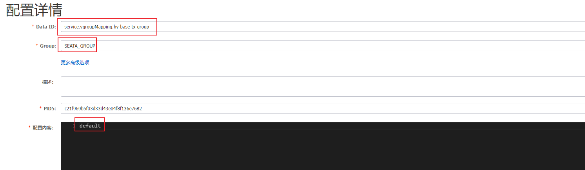
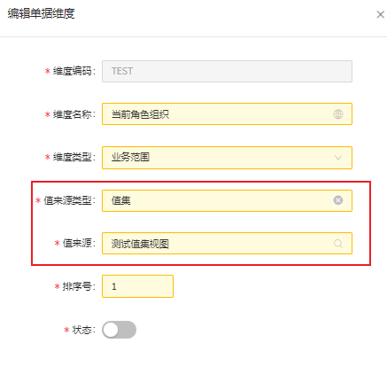
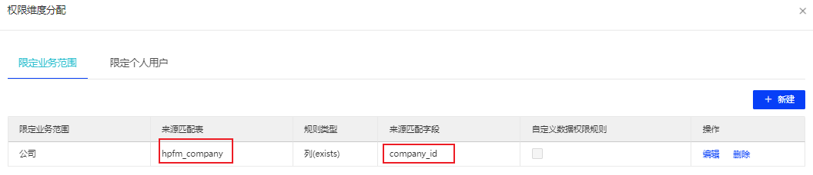
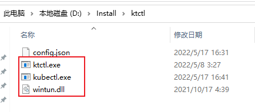
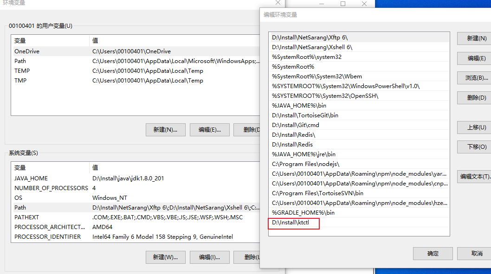
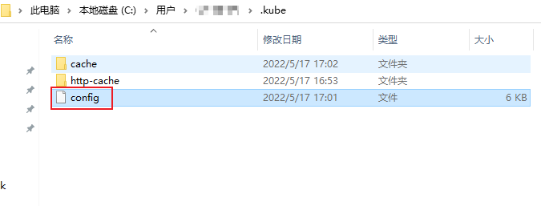
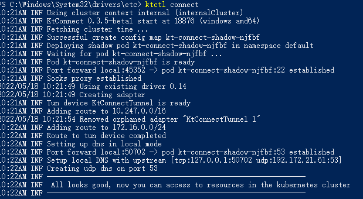
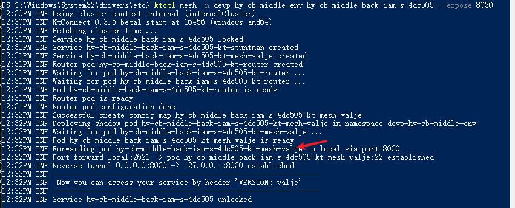
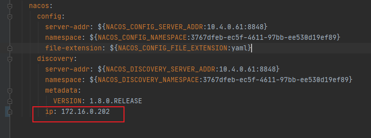

# 05月

## 05-05

### 今日任务

1. 创建用户及相应字段插入数据库
2. 拉取到对应用户的信息
3. 字段加密工具
4. 远程拉取用户数据

### 创建用户接口

* 接口地址
> post

http://192.168.56.104:8080/iam/v1/extend/6/users

* 请求参数

```json
{
  "userType": "P",
  "loginName": "ht_test2",
  "realName": "华图测试4",
  "gender": "",
  "organizationId": "6",
  "internationalTelCode": "+86",
  "startDateActive": "2022-04-27",
  "tenantName": "华图",
  "defaultRoles": [],
  "memberRoleList": [
    {
      "code": "cbtest",
      "level": "organization",
      "tenantId": 7,
      "tenantName": "华图",
      "name": "华图租户角色",
      "sourceType": "organization",
      "memberType": "user",
      "assignLevel": "organization",
      "assignLevelValue": 7,
      "assignLevelValueMeaning": "华图",
      "_status": "create",
      "manageableFlag": 1,
      "roleId": "7",
      "sourceId": "7"
    }
  ],
  "extendUserInfo": {
    "applyType": "申请（代理）类型",
    "businessLicense": "营业执照",
    "idArdPicBack": "身份证反面",
    "userTypeYun": "出版云印用户类型",
    "subDomain": "子域名",
    "idCardNo": "身份证号码",
    "businessLicenseCode": "营业执照号",
    "bookLicense": "图书许可证",
    "menuLogo": "菜单logo",
    "userBelonging": "1",
    "abbreviationName": "公司简称",
    "moduleId": "1",
    "_innerMap": "{}",
    "adPic": "广告语图片",
    "proxyLogo": "代理LOGO图片",
    "upCustomer": "1",
    "companyType": "1",
    "bankLicense": "银行开户许可证",
    "companyId": "1",
    "themeColor": "主题颜色",
    "background": "登录图",
    "loginLogo": "登录logo",
    "idArdPicFront": "身份证正面",
    "taxLicense": "税务登记证",
    "proxyId": "1"
  }
}
```

## 05-06

### 加密路径id值

* 前言 

> hzero请求接口时有些id字段需要加密,导致postman等外部调用测试不了接口
> 因此通过查看汉得的加密代码,写了一个id加密值的类,供参考使用
> 使用方法: 根据需要自行设置(id,表名,token)三个值,一般来说请求只根据id和token加密,表名可以不填;

* 加密代码

```java
public class EncryptTest {

    @Test
    public void test() {

        List<String> encryptKeyList = new ArrayList(8);
        encryptKeyList.add("297010915528814633");// id
        encryptKeyList.add("");// 表名
        encryptKeyList.add(getSubToken("b093f338-266a-471d-ada8-7cbe8af1466c")); // token
        // A5/vRTuHzZshct28bZSAiw== 是汉得目前放入的默认密钥值,如果配置了自己的密钥,需要修改这个值
        String s = wrap(EncryptionUtils.AES.encryptWithUrlEncoder(StringUtils.collectionToDelimitedString(encryptKeyList, ":"), "A5/vRTuHzZshct28bZSAiw=="));
        System.out.println(s);
    }

    String getSubToken(String token) {
        if (StringUtils.hasText(token)) {
            if (token.toLowerCase().startsWith("bearer ")) {
                token = token.substring("bearer ".length());
            }

            token = org.apache.commons.lang3.StringUtils.substring(token.replace("-", ""), 0, 10);
        } else {
            token = "NO_TOKEN";
        }

        return token;
    }
    private String wrap(String content) {
        return "=" + content + "=";
    }

}
```

### 创建租户关系接口

*　接口地址
> post

http://192.168.56.104:8080/iam/v1/tenant-relations
```json

```

## 05-07

### 数据权限

1. 创建公司
* model
```json5
{
  "longTermFlag": "1",  //长期标志
  "sourceKey": "string",  //源数据key
  "unifiedSocialCode": "123123123123123123",  //统一社会信用码
  "legalRepName": "123",  //法人姓名
  "domesticForeignRelation": "1",  //境内境外，1境内，0境外
  "companyName": "北京分公司",  //公司名称
  "groupId": "1",  //集团ID hpfm_group.group_id
  "enabledFlag": "1",  //启用标识
  "buildDate": "2012-07-07",  //成立日期
  "licenceUrl": "url",  //营业执照附件路径
  "sourceCode": "HZERO",  //数据来源,值集：HPFM.DATA_SOURCE
  "addressDetail": "detail address",  //详细地址
  "registeredRegionId": "1",  //地区ID
  "taxpayerType": "string",  //纳税人类型，值集HPFM.TAXPAYER_TYPE
  "unitId": "1",  //关联组织ID hpfm_unit.unit_id
  "registeredCountryId": "1",  //国家ID
  "companyType": "string",  //公司类型
  "licenceEndDate": "string",  //营业期限
  "businessScope": "string",  //经营范围
  "companyNum": "string",  //公司编码
  "companyId": "1",  //公司ID
  "organizingInstitutionCode": "123123123123",  //组织机构代码
  "tenantId": "8",  //租户ID hpfm_tenant.tenant_id
  "dunsCode": "string",  //邓白氏编码
  "shortName": "string"  //公司简称
}
```
* mock值
```json
{
  "longTermFlag": "1",  
  "sourceKey": "string",  
  "unifiedSocialCode": "123123123123123123",  
  "legalRepName": "123", 
  "domesticForeignRelation": "1",  
  "companyName": "北京分公司",  
  "groupId": "=eK8dolHMey8o2O2HiYNihQ===",  
  "enabledFlag": "1", 
  "buildDate": "2012-07-07",  
  "licenceUrl": "url", 
  "sourceCode": "HZERO",  
  "addressDetail": "detail address",
  "registeredRegionId": "=eK8dolHMey8o2O2HiYNihQ===", 
  "taxpayerType": "string", 
  "unitId": "=eK8dolHMey8o2O2HiYNihQ===",  
  "registeredCountryId": "=eK8dolHMey8o2O2HiYNihQ===",  
  "companyType": "string",  
  "licenceEndDate": "2022-12-25",
  "businessScope": "string", 
  "companyNum": "string",   
  "organizingInstitutionCode": "123123123123",  
  "tenantId": "8",  
  "dunsCode": "string",  
  "shortName": "string"  
}
```

2. 使用`平台管理员`新建`单据维度`-`company`


3. 使用`平台管理员`新建`单据权限`


4. 编辑`单据权限`的`维护权限维度`


5. 使用`租户管理员`创建角色


6. 分配用户,维护数据权限


7. 重新登陆会有新建角色可以选择,切换角色后公司只能看到配置的部分


## 05-09

### 创建客户json

```json
{
  "companyInfoModelReq": {
    "companyName": "100",
    "companyType": "1",
    "contactMan": "laownag",
    "contactMobile": "17673943339",
    "businessLicense": "www.baidu",
    "bookLicense": "sfaafss",
    "taxLicense": "sfag",
    "bankLicense": "sfaf",
    "groupCompanyName": "北京搜书文化传播有限公司",
    "creditAccount": "1",
    "loginAccount": "196452234",
    "loginPassword": "loginPassword"
  },
  "invoiceModel": {
    "companyName": "400",
    "taxNumber": "1000",
    "bankAccount": "農業銀行",
    "bankName": "d地主一行",
    "companyAddress": "donggunag",
    "contactTel": "17679348253"
  },
  "user": {
    "userType": "P",
    "loginName": "ht_test100",
    "realName": "华图测试100",
    "gender": "",
    "organizationId": "6",
    "internationalTelCode": "+86",
    "startDateActive": "2022-04-27",
    "tenantName": "华图",
    "defaultRoles": [],
    "memberRoleList": [
      {
        "code": "cbtest",
        "level": "organization",
        "tenantId": 7,
        "tenantName": "华图",
        "name": "华图租户角色",
        "sourceType": "organization",
        "memberType": "user",
        "assignLevel": "organization",
        "assignLevelValue": 7,
        "assignLevelValueMeaning": "华图",
        "_status": "create",
        "manageableFlag": 1,
        "roleId": "7",
        "sourceId": "7"
      }
    ],
    "extendUserInfo": {
      "applyType": "申请（代理）类型",
      "businessLicense": "营业执照",
      "idArdPicBack": "身份证反面",
      "userTypeYun": "出版云印用户类型",
      "subDomain": "子域名",
      "idCardNo": "身份证号码",
      "businessLicenseCode": "营业执照号",
      "bookLicense": "图书许可证",
      "menuLogo": "菜单logo",
      "userBelonging": "1",
      "abbreviationName": "公司简称",
      "moduleId": "1",
      "adPic": "广告语图片",
      "proxyLogo": "代理LOGO图片",
      "upCustomer": "1",
      "companyType": "1",
      "bankLicense": "银行开户许可证",
      "companyId": "1",
      "themeColor": "主题颜色",
      "background": "登录图",
      "loginLogo": "登录logo",
      "idArdPicFront": "身份证正面",
      "taxLicense": "税务登记证",
      "proxyId": "1"
    }
  }
}
```

### 用户注册流程
1. 创建用户接口
> /iam/v1/extend/6/users
2. 查询当前用户的管理角色
> /hzero/v1/roles/self/admin-roles
3. 分页查询当前用户可管理的所有(子孙)角色
> /hzero/v1/roles/self/manageable-roles


### 值集配置注解大致源码解析
> 看文档可以知道大概是利用aop来扫描注解,有两个注解`@ProcessLovValue`和`@LovValue`

1. 处理值集值映射的切面`LovValueAspect`,从此处代码可知,需要在加上`@ProcessLovValue`注解才能被增强;

```java
@Aspect
public class LovValueAspect {
	
	private LovValueHandle lovValueHandle;
	
	public LovValueAspect(LovValueHandle lovValueHandle) {
		this.lovValueHandle = lovValueHandle;
	}
	
	@AfterReturning(value = "@annotation(org.hzero.boot.platform.lov.annotation.ProcessLovValue)",returning="result") 
	public Object afterReturning(JoinPoint proceedingJoinPoint, Object result) throws Throwable {
		MethodSignature signature = (MethodSignature) proceedingJoinPoint.getSignature();
		Method method = signature.getMethod();
		ProcessLovValue processLovValue = method.getAnnotation(ProcessLovValue.class);
		result = this.lovValueHandle.process(processLovValue.targetField(), result);
		return result;
	}
	
}
```
2. 主要处理逻辑在`LovValueHandle`中,有个默认实现的handle: `DefaultLovValueHandle`

```java
@Override
public Object process(String[] targetFields, Object result) {
    try {
        if (result == null) {
            this.logger.debug("result is null, skip translate");
            return null;
        }
        this.logger.debug("lov translate begin");
        if(this.logger.isDebugEnabled()) {
            this.logger.debug("target fields is [{}]", ArrayUtils.isEmpty(targetFields) ? "[]" : Arrays.toString(targetFields));
        }
        // 有其他解析需求的话可以在这里扩展
        if (result instanceof Collection) {
            // 如果传入对象为集合,则直接处理其中的Elements
            this.processCollection(targetFields, (Collection<?>) result);
        } else {
            // 未命中任何解析方式,进行默认解析,方法里面对`@LovValue`注解字段进行扫描
            this.processDefault(targetFields, result);
        }
        this.logger.debug("lov translate end");
    } catch (IllegalArgumentException | IllegalAccessException | NoSuchFieldException | SecurityException e) {
        logger.error(e.getMessage(), e);
    }
    return result;
}
```
3. `LovValueHandle`在`LovAutoConfiguration`中注入

> `hzero.lov.value.enable` 配置为true生效,不过默认也是为true的.

```java
@ConditionalOnProperty(prefix = "hzero.lov" + '.' + "value", name = "enabled", havingValue = "true", matchIfMissing = true)
@EnableAspectJAutoProxy
static class LovValue {

   //Hzero平台HTTP协议,默认http;   服务远程调用方式配置,因为值集会去platform服务获取.
    @Value("${hzero.platform.httpProtocol:http}")
    private String hzeroPlatformHttpProtocol;

    @Bean
    @ConditionalOnMissingBean
    public LovValueHandle lovValueHandle(LovAdapter lovAdapter, RestTemplate restTemplate) {
        return new DefaultLovValueHandle(lovAdapter, restTemplate, this.hzeroPlatformHttpProtocol);
    }

    @Bean
    public LovValueAspect lovValueAspect(LovValueHandle lovValueHandle) {
        return new LovValueAspect(lovValueHandle);
    }
}
```

#### 简单使用步骤示例
* controller加上`ProcessLovValue`注解
* 字段上加入`@LovValue`注解
* 对应字段定义接受字段`xxxMeaning`

## 05-10
### seata分布式事务
#### 使用docker安装seata
1. 新建文件夹

```shell script
mkdir -p /docker/seata/logs
mkdir -p /docker/seata/seata-config
```
2. `seata-config文件夹`中加入`file.conf`和`registry.conf`文件
* file.conf
```conf
## transaction log store, only used in seata-server
store {
  ## store mode: file、db、redis
  mode = "db" ## 原来为file
 
  ## file store property
  file {
    ## store location dir
    dir = "sessionStore"
    # branch session size , if exceeded first try compress lockkey, still exceeded throws exceptions
    maxBranchSessionSize = 16384
    # globe session size , if exceeded throws exceptions
    maxGlobalSessionSize = 512
    # file buffer size , if exceeded allocate new buffer
    fileWriteBufferCacheSize = 16384
    # when recover batch read size
    sessionReloadReadSize = 100
    # async, sync
    flushDiskMode = async
  }

  ## database store property
  db {
    ## the implement of javax.sql.DataSource, such as DruidDataSource(druid)/BasicDataSource(dbcp)/HikariDataSource(hikari) etc.
    datasource = "druid"
    ## mysql/oracle/postgresql/h2/oceanbase etc.
    dbType = "mysql"
    driverClassName = "com.mysql.jdbc.Driver"
    ## 因为设置为db，所以需要选择数据库，这里设置数据库及密码，seata是需要创建的，默认的表是通过脚本运行得到的
     url = "jdbc:mysql://192.168.56.104:3306/seata?serverTimezone=GMT%2B8"
    user = "root"
    password = "123123"
    minConn = 5
    maxConn = 30
    globalTable = "global_table"
    branchTable = "branch_table"
    lockTable = "lock_table"
    queryLimit = 100
    maxWait = 5000
  }
}
```
* registry.conf
```conf
#服务,将type从file改成nacos,将seata服务配置进nacos
registry {

  type = "nacos"
  nacos {
    application = "seata-server"
    serverAddr = "192.168.56.104:8848"
    group = "SEATA_GROUP"
    namespace = "ef5ea81b-ea35-4810-a246-d5b7b4adaef7"
    cluster = "default"
    username = "nacos"
    password = "nacos"
  }
}
 
config {
  # file、nacos 、apollo、zk、consul、etcd3
  type = "nacos"

  nacos {
    serverAddr = "192.168.56.104:8848"
    namespace = "ef5ea81b-ea35-4810-a246-d5b7b4adaef7"
    group = "SEATA_GROUP"
    username = "nacos"
    password = "nacos"
  }
}
```

3. 将`config.txt`中的内容加入到`nacos`中
* 推送命令文件`nacos-config.sh`
```shell script
#!/usr/bin/env bash
# Copyright 1999-2019 Seata.io Group.
#
# Licensed under the Apache License, Version 2.0 (the "License");
# you may not use this file except in compliance with the License.
# You may obtain a copy of the License at、
#
#      http://www.apache.org/licenses/LICENSE-2.0
#
# Unless required by applicable law or agreed to in writing, software
# distributed under the License is distributed on an "AS IS" BASIS,
# WITHOUT WARRANTIES OR CONDITIONS OF ANY KIND, either express or implied.
# See the License for the specific language governing permissions and
# limitations under the License.

while getopts ":h:p:g:t:u:w:" opt
do
  case $opt in
  h)
    host=$OPTARG
    ;;
  p)
    port=$OPTARG
    ;;
  g)
    group=$OPTARG
    ;;
  t)
    tenant=$OPTARG
    ;;
  u)
    username=$OPT
```

* `config.txt`文件,修改`mysql`部分和`group`
```properties
transport.type=TCP
transport.server=NIO
transport.heartbeat=true
transport.enableClientBatchSendRequest=false
transport.threadFactory.bossThreadPrefix=NettyBoss
transport.threadFactory.workerThreadPrefix=NettyServerNIOWorker
transport.threadFactory.serverExecutorThreadPrefix=NettyServerBizHandler
transport.threadFactory.shareBossWorker=false
transport.threadFactory.clientSelectorThreadPrefix=NettyClientSelector
transport.threadFactory.clientSelectorThreadSize=1
transport.threadFactory.clientWorkerThreadPrefix=NettyClientWorkerThread
transport.threadFactory.bossThreadSize=1
transport.threadFactory.workerThreadSize=default
transport.shutdown.wait=3
service.vgroupMapping.my_test_tx_group=default
service.default.grouplist=192.168.56.104:8091
service.enableDegrade=false
service.disableGlobalTransaction=false
client.rm.asyncCommitBufferLimit=10000
client.rm.lock.retryInterval=10
client.rm.lock.retryTimes=30
client.rm.lock.retryPolicyBranchRollbackOnConflict=true
client.rm.reportRetryCount=5
client.rm.tableMetaCheckEnable=false
client.rm.sqlParserType=druid
client.rm.reportSuccessEnable=false
client.rm.sagaBranchRegisterEnable=false
client.tm.commitRetryCount=5
client.tm.rollbackRetryCount=5
client.tm.degradeCheck=false
client.tm.degradeCheckAllowTimes=10
client.tm.degradeCheckPeriod=2000
store.mode=db
store.file.dir=file_store/data
store.file.maxBranchSessionSize=16384
store.file.maxGlobalSessionSize=512
store.file.fileWriteBufferCacheSize=16384
store.file.flushDiskMode=async
store.file.sessionReloadReadSize=100
store.db.datasource=druid
store.db.dbType=mysql
store.db.driverClassName=com.mysql.jdbc.Driver
store.db.url=jdbc:mysql://192.168.56.104:3306/seata?useUnicode=true
store.db.user=root
store.db.password=123123
store.db.minConn=5
store.db.maxConn=30
store.db.globalTable=global_table
store.db.branchTable=branch_table
store.db.queryLimit=100
store.db.lockTable=lock_table
store.db.maxWait=5000
store.redis.host=127.0.0.1
store.redis.port=6379
store.redis.maxConn=10
store.redis.minConn=1
store.redis.database=0
store.redis.password=null
store.redis.queryLimit=100
server.recovery.committingRetryPeriod=1000
server.recovery.asynCommittingRetryPeriod=1000
server.recovery.rollbackingRetryPeriod=1000
server.recovery.timeoutRetryPeriod=1000
server.maxCommitRetryTimeout=-1
server.maxRollbackRetryTimeout=-1
server.rollbackRetryTimeoutUnlockEnable=false
client.undo.dataValidation=true
client.undo.logSerialization=jackson
client.undo.onlyCareUpdateColumns=true
server.undo.logSaveDays=7
server.undo.logDeletePeriod=86400000
client.undo.logTable=undo_log
client.log.exceptionRate=100
transport.serialization=seata
transport.compressor=none
metrics.enabled=false
metrics.registryType=compact
metrics.exporterList=prometheus
metrics.exporterPrometheusPort=9898
```

* 使用命令推送
```shell script
sh nacos-config.sh -h 192.168.56.104 -p 8848 -t [命名空间] -g -u nacos -w nacos SEATA_GROUP 
```

4. 运行docker命令安装seata

```shell script
docker run -it -d   -p 8091:8091 \
-v /docker/seata/seata-config/registry.conf:/seata-server/resources/registry.conf \
-v /docker/seata/seata-config/file.conf:/seata-server/resources/file.conf \
-v /docker/seata/logs:/root/logs \
-e SEATA_IP=192.168.56.104 \
-e SEATA_PORT=8091 \
--privileged=true \
--name seata  seataio/seata-server:1.4.2
```

5. 1.4.2版本要加入`@EnableAutoDataSourceProxy`
```java
// 因为1.4.0版本SeataDataSourceAutoConfiguration有改变
@EnableAutoDataSourceProxy
public class HycbmiddlebackiamsaasApplication {
```

#### 客户端配置使用
1. pom.xml配置
```xml
<dependency>
    <groupId>com.alibaba.cloud</groupId>
    <artifactId>spring-cloud-starter-alibaba-seata</artifactId>
    <exclusions>
        <exclusion>
            <groupId>io.seata</groupId>
            <artifactId>seata-all</artifactId>
        </exclusion>
        <exclusion>
            <groupId>io.seata</groupId>
            <artifactId>seata-spring-boot-starter</artifactId>
        </exclusion>
    </exclusions>
</dependency>
<dependency>
    <groupId>io.seata</groupId>
    <artifactId>seata-spring-boot-starter</artifactId>
    <version>1.4.2</version>
</dependency>
<dependency>
    <groupId>io.seata</groupId>
    <artifactId>seata-all</artifactId>
    <version>1.4.2</version>
</dependency>
```

2. 配置yaml
```yaml
## 客户端seata的相关配置
seata:
  ## 是否开启seata，默认true
  enabled: true
  application-id: ${spring.application.name}
  ## seata事务组的名称，一定要和config.tx(nacos)中配置的相同
  tx-service-group: ${spring.application.name}-tx-group
  ## 配置中心的配置
  config:
    ## 使用类型nacos
    type: nacos
    ## nacos作为配置中心的相关配置，需要和server在同一个注册中心下
    nacos:
      ## 命名空间，需要server端(registry和config)、nacos配置client端(registry和config)保持一致
      namespace: ef5ea81b-ea35-4810-a246-d5b7b4adaef7
      ## 地址
      server-addr: 192.168.56.104:8848
      ## 组， 需要server端(registry和config)、nacos配置client端(registry和config)保持一致
      group: SEATA_GROUP
      ## 用户名和密码
      username: nacos
      password: nacos
  registry:
    type: nacos
    nacos:
      ## 这里的名字一定要和seata服务端中的名称相同，默认是seata-server
      application: seata-server
      ## 需要server端(registry和config)、nacos配置client端(registry和config)保持一致
      group: SEATA_GROUP
      namespace: ef5ea81b-ea35-4810-a246-d5b7b4adaef7
      username: nacos
      password: nacos
      server-addr: 192.168.56.104:8848
```

3. nacos中加入配置
> 配置的前缀`service.vgroupMapping.`,后面部分需要与配置中的`tx-service-group`值一样,例如:
> `service.vgroupMapping.`+`tx-service-group`



4. 发起者的方法上加入注解`@GlobalTransactional`

#### seata传递XID原理
1. 发起者所属微服务在`SeataFeignClient`方法中,会在头文件加上XID
2. 远程feign调用的服务会在拦截器`SeataHandlerInterceptor`中获取到XID

#### seata序列化问题修复
1. pom加入依赖
```xml
<dependency>
    <groupId>com.esotericsoftware</groupId>
    <artifactId>kryo</artifactId>
    <version>4.0.2</version>
</dependency>
<dependency>
    <groupId>de.javakaffee</groupId>
    <artifactId>kryo-serializers</artifactId>
    <version>0.41</version>
</dependency>
```
2. seata配置`nacos`
```text
client.undo.logSerialization=kryo
```

## 05-11
### 数据权限原理分析
* 配置数据语句拦截器`SqlParserInterceptorConfiguration`
```java
@Configuration
public class SqlParserInterceptorConfiguration {
    @Value("${spring.application.name:application}")
    private String serviceName;
    private List<SqlInterceptor> sqlInterceptors;

// 将拦截器注册到spring容器里
    @Bean
    @ConditionalOnMissingBean
    public SqlParserInterceptor sqlParserInterceptor() {
        return new SqlParserInterceptor(serviceName, sqlInterceptors);
    }

    // 这里会接收所有实现了`SqlInterceptor`接口并注入了spring的bean
    @Autowired(required = false)
    public SqlParserInterceptorConfiguration setSqlInterceptors(List<SqlInterceptor> sqlInterceptors) {
        this.sqlInterceptors = sqlInterceptors;
        return this;
    }

}
```
* 汉得的自定义数据权限的sql拦截器`SqlParserInterceptor`
```java
// 实现了Interceptor,所以会被mybatis加入拦截sql
public class SqlParserInterceptor implements Interceptor {

    ...
// 主要方法
public Object intercept(Invocation invocation) throws Throwable {
        if (CollectionUtils.isEmpty(sqlInterceptors) || SqlParserHelper.isClose()) {
            return invocation.proceed();
        }
        // update -> prepared key
        if (invocation.getArgs().length == 2) {
            preparedGenerateKey(invocation);
        }
        BoundSql boundSql = SqlUtils.getBoundSql(invocation);
        if (boundSql == null) {
            return invocation.proceed();
        }
        currentBoundSql.set(boundSql);
        currentInvocation.set(invocation);
        String sqlId = SqlUtils.getSqlId(invocation);
        Statement statement;
        try {
            statement = CCJSqlParserUtil.parse(boundSql.getSql());
            CustomUserDetails userDetails = DetailsHelper.getUserDetails();
// 循环执行定义的SqlInterceptor拦截器
            for (SqlInterceptor sqlInterceptor : sqlInterceptors) {
                sqlInterceptor.before();
                statement = sqlInterceptor.handleStatement(statement, serviceName, sqlId, getArgs(invocation, statement), userDetails != null ? userDetails : DetailsHelper.getAnonymousDetails());
                sqlInterceptor.after();
            }
        } catch (Exception e) {
            logger.error("Error parser sql.", e);
            return invocation.proceed();
        } finally {
            currentInvocation.remove();
            currentBoundSql.remove();
        }
        return SqlUtils.resetSql(invocation, boundSql, statement.toString()).proceed();
    }

...

}
```
* 自定义的sql拦截器接口`SqlInterceptor`
```java
// 比如查询简单语句的拼接
default PlainSelect handlePlainSelect(PlainSelect plainSelect, String serviceName, String sqlId, Map args, CustomUserDetails userDetails) {
    // 拦截列
    List<SelectItem> selectItems = plainSelect.getSelectItems();
    if (!CollectionUtils.isEmpty(selectItems)) {
        for (int i = 0; i < selectItems.size(); ++i) {
            SelectItem selectItem = selectItems.get(i);
            if (selectItem instanceof SelectExpressionItem && ((SelectExpressionItem) selectItem).getExpression() instanceof SubSelect) {
                SelectExpressionItem selectExpressionItem = (SelectExpressionItem) selectItem;
//handleSubSelect由实现类自己实现
                selectExpressionItem.setExpression(handleSubSelect((SubSelect) selectExpressionItem.getExpression(), serviceName, sqlId, args, userDetails));
            } else if (selectItem instanceof SelectExpressionItem && ((SelectExpressionItem) selectItem).getExpression() instanceof CaseExpression) {
                SelectExpressionItem selectExpressionItem = (SelectExpressionItem) selectItem;
                selectExpressionItem.setExpression(handleCase((CaseExpression) selectExpressionItem.getExpression(), serviceName, sqlId, args, userDetails));
            } else {
                selectItem = handleSelectItem(selectItem, serviceName, sqlId, args, userDetails);
            }
            selectItems.set(i, selectItem);
        }
    }
    // 拦截FROM
    FromItem fromItem = plainSelect.getFromItem();
    if (fromItem instanceof Table) {
//handleTable由实现类自己实现
        FromItem afterHandlerFromItem = handleTable((Table) fromItem, serviceName, sqlId, args, userDetails);
        plainSelect.setFromItem(afterHandlerFromItem);
    } else if (fromItem instanceof SubSelect) {
        handleSubSelect((SubSelect) fromItem, serviceName, sqlId, args, userDetails);
    }
    // 拦截JOIN
    List<Join> joins = plainSelect.getJoins();
    if (!CollectionUtils.isEmpty(joins)) {
        for (Join join : joins) {
            handleJoin(join, serviceName, sqlId, args, userDetails);
        }
    }
    // 拦截WHERE
    Expression where = plainSelect.getWhere();
    if (where != null) {
        handleExpression(where, serviceName, sqlId, args, userDetails);
    }
    return plainSelect;
}
```
* `SqlInterceptor`接口的实现类`PermissionSqlBuilder`

> 这个拦截器是用于数据权限的实现类


```java
// 拦截前
    @Override
    public void before() {
        permissionSqlRepository.resetCache();
        onlyHandlePrefix.remove();
        tableAliasNumber.set(new AtomicInteger(0));
    }
// 拦截后
    @Override
    public void after() {
        permissionSqlRepository.resetCache();
        onlyHandlePrefix.remove();
    }
// 处理拦截,主要的方法其实接口类已经实现,这里只做数据权限相关的处理
    @Override
    public FromItem handleTable(Table table, String serviceName, String sqlId, Map args, CustomUserDetails userDetails) {
        init(getInitFilterSqlInterceptors());
        return handleTable2FromItem(table, serviceName, sqlId, args, userDetails == null ? DetailsHelper.getAnonymousDetails() : userDetails);
    }
    private FromItem handleTable2FromItem(Table table, String serviceName, String sqlId, Map args, CustomUserDetails userDetails) {
        FromItem fromItem = table;
        PermissionRangeVO permissionRange = getPermissionRange(table, serviceName, sqlId, args, userDetails);
        if (permissionRange != null) {
            if (StringUtils.hasText(permissionRange.getDbPrefix())) {
                String dbPrefix = permissionRange.getDbPrefix();
                if (permissionDataProperties != null && StringUtils.hasText(permissionDataProperties.getDbOwner())) {
                    dbPrefix = dbPrefix + "." + permissionDataProperties.getDbOwner();
                }
                fromItem = SqlUtils.generateTablePrefix(table, dbPrefix);
            }
            if (!CollectionUtils.isEmpty(permissionRange.getSqlList())) {
                if (!BooleanUtils.isTrue(onlyHandlePrefix.get())) {
                    try {
                        onlyHandlePrefix.set(true);
                        fromItem = handleSubSelect(SqlUtils.generateSubSelect(table, permissionRange.getSqlList(), args, userDetails, tableAliasNumber.get().getAndIncrement()),
                                serviceName, sqlId, args, userDetails);
                    } catch (JSQLParserException e) {
                        logger.error("Error generateSubSelect.", e);
                    } finally {
                        onlyHandlePrefix.remove();
                    }
                }
            }
        }
        return fromItem;
    }
```

## 05-12
### get请求,分页用路径参数,同时可以接收body

```java
    @GetMapping("/dev-public")
    public ResponseEntity devPublic(PageRequest map,@RequestBody Map map1) {
```

### 单据权限详细分析
1. 单据维度配置

配置的是请求范围,显示的内容在权限数据里;就是提供一些数据给到单据权限可以选择,单据权限选择某些数据,这些数据才会在对应角色中显示


* 黑名单与白名单
    * 黑名单: 只有选择了数据才会显示
    * 白名单: 选择了的数据会被隐藏

2. 单据权限

真正控制权限的地方,这里不启用就不会去过滤; 这里会去查询单据维度配置的


3. 


## 05-13
### 本周日报整理

序号|内容
---|---
1|1. 用户类型值集配置及代码开发 2. 获取角色接口
2|1. 远程获取用户扩展信息接口 2. 开启分布式事务seata
3|1. 查阅行狼监控平台文档 2. 数据权限功能模块查看源码及调试 3. 将服务器的基础服务重新部署一份到新服务器
4|1. 单据权限部分调试 2. 根据汉得原有数据权限模块思考适应业务的数据权限技术方案
5|

### 数据权限适应业务的技术方案
1. 简单的查询可以使用单据权限来控制,将对应的角色加上可以有的权限范围
2. 角色可以分为几种不同的组合;只看自己,看自己和全部,看自己及下属... 就是把角色再细分
3. 这里如果是订单这种大的表,必须要代码里自己实现权限控制,只有数据量小查询可以使用原生的权限配置

### 上线状态接口

## 05-16
### 本周任务
1. 手机号注册及登录
2. 接口平台使用

### 手机号注册
1. 手机号获取验证码
* 

2. 通过内部调用注册用户(需要传入角色,并且不能通过网关调用)

3. 注册为匿名用户

## 05-17

###　使用ktconnct连接集群(本地为windows版)
1. 下载`ktctl`

[ktconnct文档地址](https://alibaba.github.io/kt-connect/#/zh-cn/guide/quickstart)

2. 下载windows版`k8s`

>　文件已放附件也可以自行去官网下载 

[文档地址](https://kuboard.cn/install/install-k8s.html)

3. 安装 `k8s` 和 `ktctl`

> 将下载的文件放到自己的文件夹下,并配置环境变量





4. 将集群配置文件放入 `~/.kube/` 文件夹下

> 在 `用户文件夹` 新建 `.kube` 文件夹,并把 `config` 文件放在此文件夹下



5. 使用ktctl命令连接集群

* 连接

```shell script
ktctl connect
```

* 连接成功后界面

> 连接成功后窗口不要关闭



6. 创建一个shadow容器转发流量到本地

> 这里使用iam服务为例
> -n devp-hy-cb-middle-env 是命名空间
> hy-cb-middle-back-iam-s-4dc505 是service
> --expose 8030 暴露端口

```shell script
ktctl mesh -n devp-hy-cb-middle-env hy-cb-middle-back-iam-s-4dc505 
```




7. 本地代码设置服务nacos ip为生成的shadow容器的pod id

* pod id 使用 kubectl 命令获取

```shell script
kubectl get pods -o wide -A
```

* 配置nacos ip




## 05-20

### 接口平台查看

