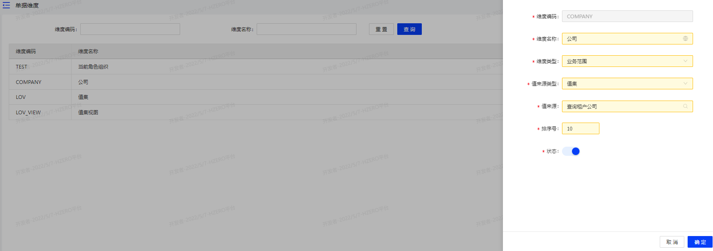
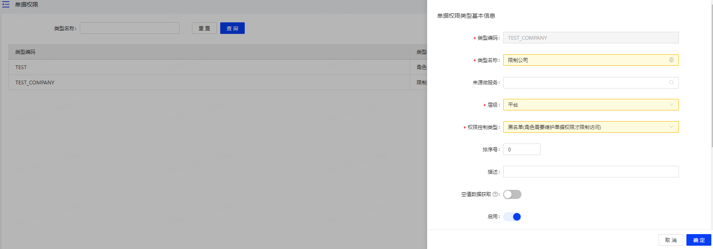
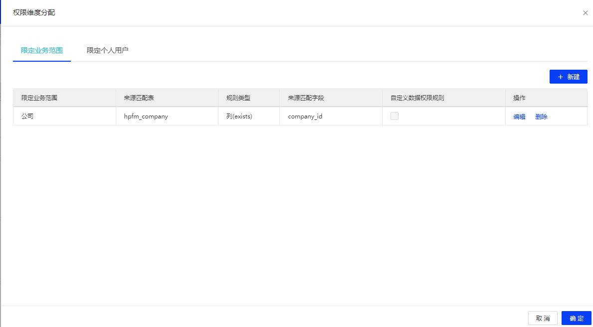
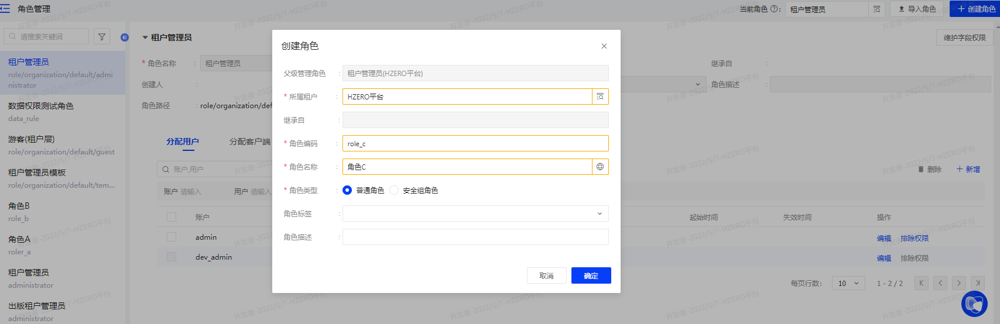
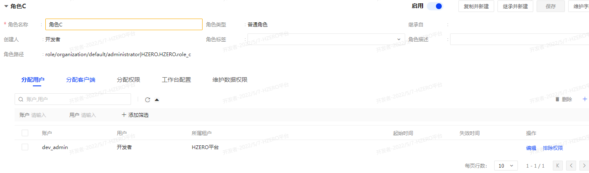
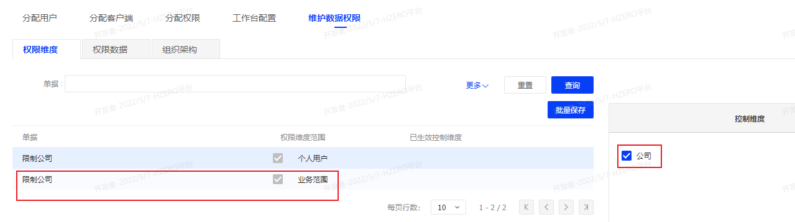
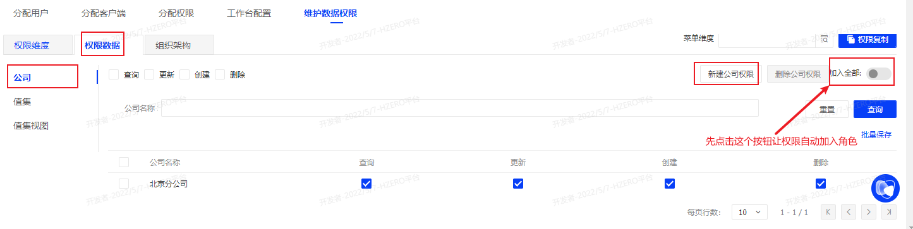
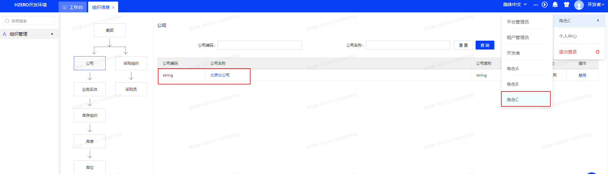

# 05月

## 05-05

### 今日任务

1. 创建用户及相应字段插入数据库
2. 拉取到对应用户的信息
3. 字段加密工具
4. 远程拉取用户数据

### 创建用户接口

* 接口地址
> post

http://192.168.56.104:8080/iam/v1/extend/{organizationId}/users

* 请求参数

```json
{
  "userType": "P",
  "loginName": "ht_test2",
  "realName": "华图测试4",
  "gender": "",
  "organizationId": "6",
  "internationalTelCode": "+86",
  "startDateActive": "2022-04-27",
  "tenantName": "华图",
  "defaultRoles": [],
  "memberRoleList": [
    {
      "code": "cbtest",
      "level": "organization",
      "tenantId": 7,
      "tenantName": "华图",
      "name": "华图租户角色",
      "sourceType": "organization",
      "memberType": "user",
      "assignLevel": "organization",
      "assignLevelValue": 7,
      "assignLevelValueMeaning": "华图",
      "_status": "create",
      "manageableFlag": 1,
      "roleId": "7",
      "sourceId": "7"
    }
  ],
  "extendUserInfo": {
    "applyType": "申请（代理）类型",
    "businessLicense": "营业执照",
    "idArdPicBack": "身份证反面",
    "userTypeYun": "出版云印用户类型",
    "subDomain": "子域名",
    "idCardNo": "身份证号码",
    "businessLicenseCode": "营业执照号",
    "bookLicense": "图书许可证",
    "menuLogo": "菜单logo",
    "userBelonging": "1",
    "abbreviationName": "公司简称",
    "moduleId": "1",
    "_innerMap": "{}",
    "adPic": "广告语图片",
    "proxyLogo": "代理LOGO图片",
    "upCustomer": "1",
    "companyType": "1",
    "bankLicense": "银行开户许可证",
    "companyId": "1",
    "themeColor": "主题颜色",
    "background": "登录图",
    "loginLogo": "登录logo",
    "idArdPicFront": "身份证正面",
    "taxLicense": "税务登记证",
    "proxyId": "1"
  }
}
```

## 05-06

### 加密id
```java
public class EncryptTest {

    @Test
    public void test() {

        List<String> encryptKeyList = new ArrayList(8);
        encryptKeyList.add("297010915528814633");// id
        encryptKeyList.add("");// 表名
        encryptKeyList.add(getSubToken("b093f338-266a-471d-ada8-7cbe8af1466c")); // token
        String s = wrap(EncryptionUtils.AES.encryptWithUrlEncoder(StringUtils.collectionToDelimitedString(encryptKeyList, ":"), "A5/vRTuHzZshct28bZSAiw=="));
        System.out.println(s);
    }

    String getSubToken(String token) {
        if (StringUtils.hasText(token)) {
            if (token.toLowerCase().startsWith("bearer ")) {
                token = token.substring("bearer ".length());
            }

            token = org.apache.commons.lang3.StringUtils.substring(token.replace("-", ""), 0, 10);
        } else {
            token = "NO_TOKEN";
        }

        return token;
    }
    private String wrap(String content) {
        return "=" + content + "=";
    }

}
```

### 创建租户关系接口

*　接口地址
> post

http://192.168.56.104:8080/iam/v1/tenant-relations
```json

```

## 05-07

### 数据权限

1. 创建公司
* model
```json5
{
  "longTermFlag": "1",  //长期标志
  "sourceKey": "string",  //源数据key
  "unifiedSocialCode": "123123123123123123",  //统一社会信用码
  "legalRepName": "123",  //法人姓名
  "domesticForeignRelation": "1",  //境内境外，1境内，0境外
  "companyName": "北京分公司",  //公司名称
  "groupId": "1",  //集团ID hpfm_group.group_id
  "enabledFlag": "1",  //启用标识
  "buildDate": "2012-07-07",  //成立日期
  "licenceUrl": "url",  //营业执照附件路径
  "sourceCode": "HZERO",  //数据来源,值集：HPFM.DATA_SOURCE
  "addressDetail": "detail address",  //详细地址
  "registeredRegionId": "1",  //地区ID
  "taxpayerType": "string",  //纳税人类型，值集HPFM.TAXPAYER_TYPE
  "unitId": "1",  //关联组织ID hpfm_unit.unit_id
  "registeredCountryId": "1",  //国家ID
  "companyType": "string",  //公司类型
  "licenceEndDate": "string",  //营业期限
  "businessScope": "string",  //经营范围
  "companyNum": "string",  //公司编码
  "companyId": "1",  //公司ID
  "organizingInstitutionCode": "123123123123",  //组织机构代码
  "tenantId": "8",  //租户ID hpfm_tenant.tenant_id
  "dunsCode": "string",  //邓白氏编码
  "shortName": "string"  //公司简称
}
```
* mock值
```json
{
  "longTermFlag": "1",  
  "sourceKey": "string",  
  "unifiedSocialCode": "123123123123123123",  
  "legalRepName": "123", 
  "domesticForeignRelation": "1",  
  "companyName": "北京分公司",  
  "groupId": "=eK8dolHMey8o2O2HiYNihQ===",  
  "enabledFlag": "1", 
  "buildDate": "2012-07-07",  
  "licenceUrl": "url", 
  "sourceCode": "HZERO",  
  "addressDetail": "detail address",
  "registeredRegionId": "=eK8dolHMey8o2O2HiYNihQ===", 
  "taxpayerType": "string", 
  "unitId": "=eK8dolHMey8o2O2HiYNihQ===",  
  "registeredCountryId": "=eK8dolHMey8o2O2HiYNihQ===",  
  "companyType": "string",  
  "licenceEndDate": "2022-12-25",
  "businessScope": "string", 
  "companyNum": "string",   
  "organizingInstitutionCode": "123123123123",  
  "tenantId": "8",  
  "dunsCode": "string",  
  "shortName": "string"  
}
```

2. 使用`平台管理员`新建`单据维度`-`company`



3. 使用`平台管理员`新建`单据权限`



4. 编辑`单据权限`的`维护权限维度`



5. 使用`租户管理员`创建角色



6. 分配用户,维护数据权限







7. 重新登陆会有新建角色可以选择,切换角色后公司只能看到配置的部分

