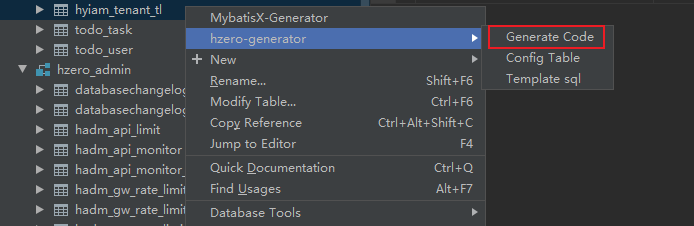
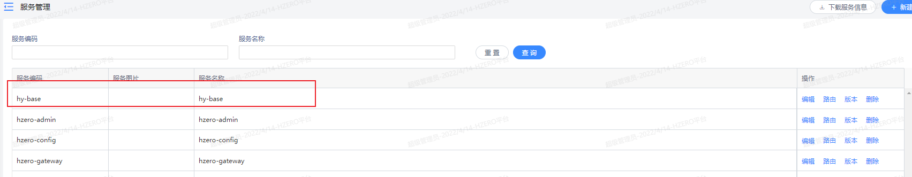
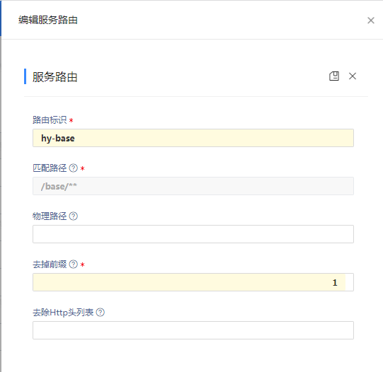
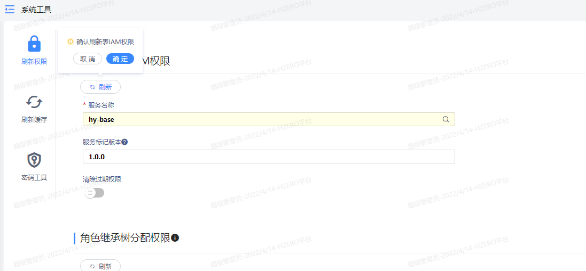
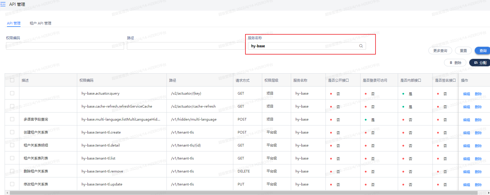
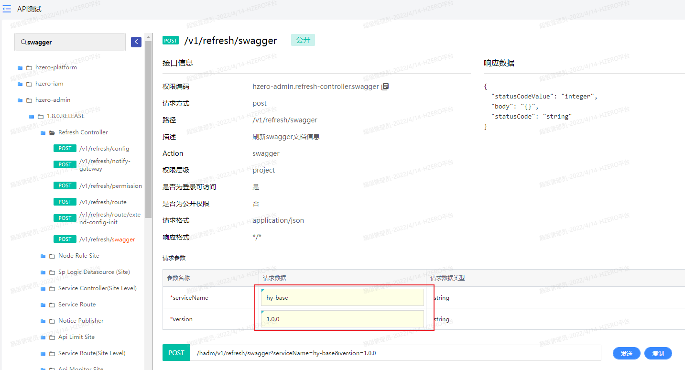
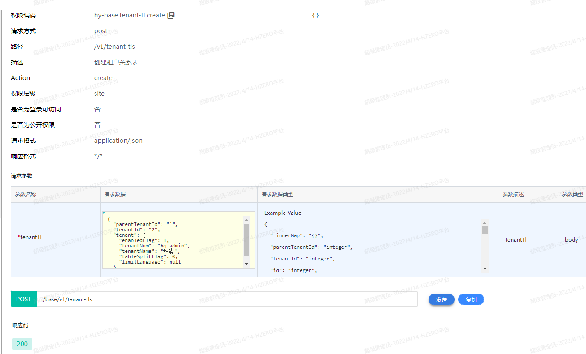
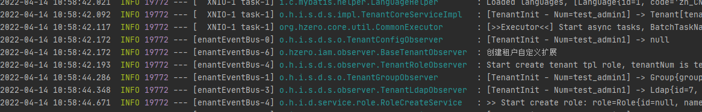

# 租户扩展开发

## 新建租户关系表
```sql
create table hyiam_tenant_tl
(
    id                    bigint auto_increment comment 'ID'
        primary key,
    parent_tenant_id      bigint                             null comment '父租户id',
    tenant_id             bigint                             null comment '租户id',
    object_version_number bigint   default 1                 not null comment '行版本号，用来处理锁',
    creation_date         datetime default CURRENT_TIMESTAMP not null,
    created_by            bigint   default -1                not null,
    last_updated_by       bigint   default -1                not null,
    last_update_date      datetime default CURRENT_TIMESTAMP not null
)
    comment '租户关系表' collate = utf8mb4_bin;

```

## 生成租户关系基本代码
1. idea安装插件`hzero-tools`
2. 通过idea连接数据源
3. 使用插件生成代码


## 新增租户关系
1. 添加原有租户参数
```java
@Data
public class TenantDTO {

    @ApiModelProperty("租户ID")
    private Long tenantId;
    @ApiModelProperty("租户名称")
    private String tenantName;
    @ApiModelProperty("租户编号")
    private String tenantNum;
    @ApiModelProperty("是否启用")
    private Integer enabledFlag;
    @ApiModelProperty("限制用户数")
    private Integer limitUserQty;
    @ApiModelProperty("是否启用数据分表")
    private Integer tableSplitFlag;
    @ApiModelProperty("租户可使用语言，null表示不限制")
    private String limitLanguage;
    
    @ApiModelProperty("默认集团")
    private GroupDTO group;
    
    @ApiModelProperty("数据来源key")
    private String sourceKey;
    
    @ApiModelProperty("数据来源代码")
    private String sourceCode;
    
    @ApiModelProperty("租户配置")
    private List<TenantConfigDTO> tenantConfigs;
    
    @ApiModelProperty("包含客制化菜单")
    private Integer customMenuFlag;
    
    @ApiModelProperty("是否开启数据加密")
    private Integer enableDataSecurity;
    
    private List<Long> excludeTenantIds;
    
    private Boolean extendTemplateRole;
    
    private String limitLanguageMeaning;
}
```
2. 在现有租户中加入参数
```java
@Getter
@Setter
@ApiModel("租户关系表")
@VersionAudit
@ModifyAudit
@JsonInclude(value = JsonInclude.Include.NON_NULL)
@Table(name = "hyiam_tenant_tl")
public class TenantTl extends AuditDomain {
    private static final long serialVersionUID = -17827783309047174L;

    public static final String FIELD_ID = "id";
    public static final String FIELD_PARENT_TENANT_ID = "parentTenantId";
    public static final String FIELD_TENANT_ID = "tenantId";

//
// 业务方法(按public protected private顺序排列)
// ------------------------------------------------------------------------------

//
// 数据库字段
// ------------------------------------------------------------------------------

    @Id
    @GeneratedValue
    private Long id;
    private Long parentTenantId;
    private Long tenantId;

//
// 非数据库字段
// ------------------------------------------------------------------------------
    @Transient
    private TenantDTO tenant;
    
}
```
3. 编写应用层service调用远程创建信息,并创建关系
```java
    @Transactional
    @Override
    public TenantTl create(TenantTl tenantTl) {
        // 远程调用
        ResponseEntity<String> responseEntity = iamFeign.create(tenantTl.getTenant());
        TenantDTO tenantDTO = ResponseUtils.getResponse(responseEntity, TenantDTO.class, (httpStatus, response) -> {
            //非2xx错误处理
            throw new CommonException(response);
        }, (exceptionResponse -> {
            //200，但是failed=true处理
            throw new CommonException(exceptionResponse.getMessage());
        }));
        tenantTl.setTenant(tenantDTO);
        tenantTl.setTenantId(tenantDTO.getTenantId());
        // 新增表数据
        tenantTlRepository.insertSelective(tenantTl);
        return tenantTl;
    }
```

## 代码自测
1. 将新建应用添加到`服务管理`中

2. 配置好路由

3. `系统工具`刷新权限,确保新增接口被hzero-admin收集到

4. 通过`api管理`查看效果

5. 通过`api测试`测试,并先调用`刷新swagger`接口,确保接口能够被扫描到
> 此处也可以通过swagger地址来调用,`api测试`菜单会方便些


6. 调用新的租户新增接口测试


## 通过服务提供的扩展自定义
> 多租户部分的源码里租户的操作用了观察者模式,所以可以在这里扩展,暂只做了一个测试,标注了方法的用途,以后有需求可以从这里扩展
1. 编写自定义扩展类
```java
@Slf4j
public class BaseTenantObserver implements TenantObserver<Tenant> {

    @Override
    public int order() {
        return 70;
    }

    @Override
    public Tenant tenantCreate(@Nonnull Tenant tenant) {
        log.info("创建租户自定义扩展");
        return tenant;
    }

    @Override
    public void tenantCreateCancel(@Nonnull Tenant tenant) {
        log.info("租户自定义扩展失败回滚");
    }

    @Override
    public Tenant tenantUpdate(@Nonnull Tenant tenant) {
        log.info("修改租户自定义扩展");
        return tenant;
    }
}
```
2. 编写配置类
```java
@Configuration
public class BaseTenantConfig {

    @Bean
    @ConditionalOnMissingBean({BaseTenantObserver.class})
    public BaseTenantObserver baseTenantObserver(){
        return new BaseTenantObserver();
    }

}
```
3. 调用`新增租户`成功后,会打印`创建租户自定义扩展`信息

​	
