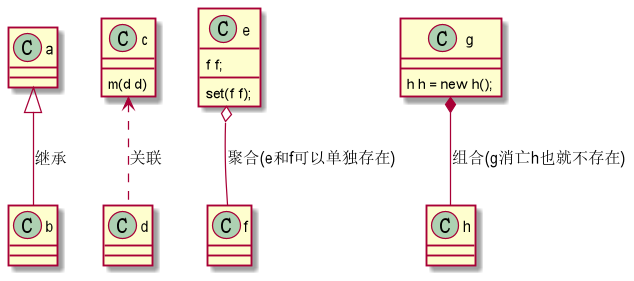
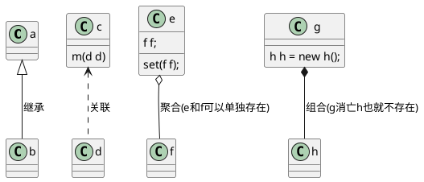

# 图解

```plantuml
@startuml
'https://plantuml.com/class-diagram

class a
class b
a<|--b:继承

class c{
m(d d)
}
class d
c<..d:关联

class e{
f f;
set(f f);
}
class f
e o-- f:聚合(e和f可以单独存在)

class g{
h h = new h();
}
class h
g *-- h:组合(g消亡h也就不存在)

@enduml
```

