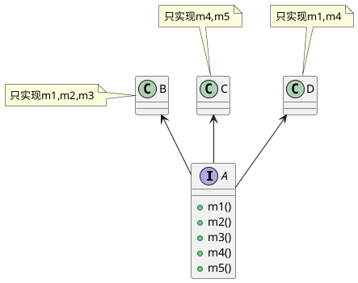
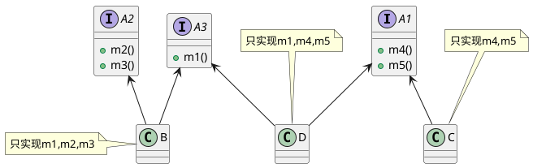

## 简介

接口隔离原则--Interface Segregation Principle

>  一个类对另一个类依赖应该建立在最小接口上

## 图示

>  b,c,d只实现接口a的部分方法,这样就违反了接口隔离原则;

```plantuml
@startuml
'https://plantuml.com/class-diagram

interface A{
+m1()
+m2()
+m3()
+m4()
+m5()
}
class B
note left: 只实现m1,m2,m3
class C
note top: 只实现m4,m5
class D
note top: 只实现m1,m4
B<--A
C<--A
D<--A
@enduml
```

> 改进,拆分接口a,使得各个实现的接口都应该被完全实现

```plantuml
@startuml
'https://plantuml.com/class-diagram

interface A1{
+m4()
+m5()
}
interface A2{
+m2()
+m3()
}
interface A3{
+m1()
}

class B
note left: 只实现m1,m2,m3
class C
note top: 只实现m4,m5
class D
note top: 只实现m1,m4,m5
A3<--B
A2<--B
A1<--C
A3<--D
A1<--D
@enduml
```

