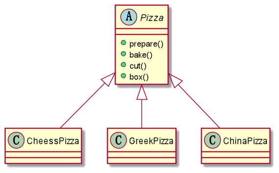
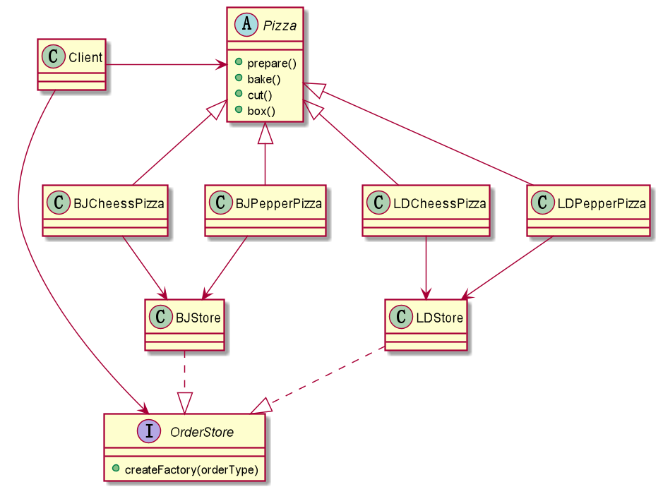

# 工厂模式

## 简介

> 有三种模式

1. 简单工厂
2. 工厂方法
3. 抽象工厂

## 引出问题

> 需求: 披萨店创建pizza

### 问题方案

> 直接使用判断来根据类型创建pizza

```
@startuml

abstract class Pizza{
+prepare()
+bake()
+cut()
+box()
}
class CheessPizza
class GreekPizza
class ChinaPizza

Pizza <|-- CheessPizza
Pizza <|-- GreekPizza
Pizza <|-- ChinaPizza

@enduml
```



```java
// 调用方直接判断生成pizza
Pizza pizza = null;
String orderType; // 订购披萨的类型
do {
    orderType = getType();
    if (orderType.equals("greek")) {
        pizza = new GreekPizza();
        pizza.setName(" 希腊披萨 ");
    } else if (orderType.equals("cheese")) {
        pizza = new CheesePizza();
        pizza.setName(" 奶酪披萨 ");
    } else if (orderType.equals("pepper")) {
        pizza = new PepperPizza();
        pizza.setName("胡椒披萨");
    } else {
        break;
    }
    //输出pizza 制作过程
    pizza.prepare();
    pizza.bake();
    pizza.cut();
    pizza.box();

} while (true);
    // 新增一个pizza时,需要新加一个类,同时调用方需要新增代码判断才能创建一个新的pizza,违反了ocp(开闭原则)
```

### 简单工厂

> 定义一个负责创建对象的类,由这个工厂类来决定需要创建哪种对象

```java
//简单工厂类
public class SimpleFactory {

	//传入orderType 返回对应的Pizza 对象
	public Pizza createPizza(String orderType) {

		Pizza pizza = null;

		System.out.println("使用简单工厂模式");
		if (orderType.equals("greek")) {
			pizza = new GreekPizza();
			pizza.setName(" 希腊披萨 ");
		} else if (orderType.equals("cheese")) {
			pizza = new CheesePizza();
			pizza.setName(" 奶酪披萨 ");
		} else if (orderType.equals("pepper")) {
			pizza = new PepperPizza();
			pizza.setName("胡椒披萨");
		}
		
		return pizza;
	}
	
	//将方法定义为静态方法;简单工厂模式 也叫 静态工厂模式 
	public static Pizza createPizza2(String orderType) {

		Pizza pizza = null;

		System.out.println("使用简单工厂模式2");
		if (orderType.equals("greek")) {
			pizza = new GreekPizza();
			pizza.setName(" 希腊披萨 ");
		} else if (orderType.equals("cheese")) {
			pizza = new CheesePizza();
			pizza.setName(" 奶酪披萨 ");
		} else if (orderType.equals("pepper")) {
			pizza = new PepperPizza();
			pizza.setName("胡椒披萨");
		}
		
		return pizza;
	}

}
// 订单使用
public OrderPizza2() {

    do {
        orderType = getType();
        // 使用工厂模式生成类,即使新加了pizza也不用再修改调用方
        pizza = SimpleFactory.createPizza2(orderType);

        // 输出pizza
        if (pizza != null) { // 订购成功
            pizza.prepare();
            pizza.bake();
            pizza.cut();
            pizza.box();
        } else {
            System.out.println(" 订购披萨失败 ");
            break;
        }
    } while (true);
}
```

### 	工厂方法模式

> 假如现在不止有口味,还新增一个地方种类,如现在有 `北京奶酪pizza`, `北京胡椒pizza`,`伦敦奶酪pizza`...如果使用`简单工厂模式`,那么每增加一个地方类,就需要增加每个口味加地方的类;

现在将创建对象的方法抽象,具体的创建过程给子类实现

```
@startuml

abstract class Pizza{
+prepare()
+bake()
+cut()
+box()
}
class BJCheessPizza
class BJPepperPizza
class LDCheessPizza
class LDPepperPizza


Pizza <|-- BJCheessPizza
Pizza <|-- BJPepperPizza
Pizza <|-- LDCheessPizza
Pizza <|-- LDPepperPizza

abstract OrderStore{
+createFactory(orderType)
}
class BJStore
class LDStore

BJCheessPizza --> BJStore
BJPepperPizza -->  BJStore

LDCheessPizza -->  LDStore
LDPepperPizza -->  LDStore

BJStore ..|> OrderStore
LDStore ..|> OrderStore

class Client

Client -> Pizza
Client -> OrderStore

@enduml
```




```java
// 抽象创建方法类
public abstract class OrderPizza {

	//定义一个抽象方法，createPizza , 让各个工厂子类自己实现
	abstract Pizza createPizza(String orderType);
	
	// 构造器
	public OrderPizza() {
		Pizza pizza = null;
		String orderType; // 订购披萨的类型
		do {
			orderType = getType();
			pizza = createPizza(orderType); //抽象方法，由工厂子类完成
			//输出pizza 制作过程
			pizza.prepare();
			pizza.bake();
			pizza.cut();
			pizza.box();
			
		} while (true);
	}

	

	// 写一个方法，可以获取客户希望订购的披萨种类
	private String getType() {
		try {
			BufferedReader strin = new BufferedReader(new InputStreamReader(System.in));
			System.out.println("input pizza 种类:");
			String str = strin.readLine();
			return str;
		} catch (IOException e) {
			e.printStackTrace();
			return "";
		}
	}

}

// 伦敦地
public class LDOrderPizza extends OrderPizza {

	
	@Override
	Pizza createPizza(String orderType) {
	
		Pizza pizza = null;
		if(orderType.equals("cheese")) {
			pizza = new LDCheesePizza();
		} else if (orderType.equals("pepper")) {
			pizza = new LDPepperPizza();
		}
		// TODO Auto-generated method stub
		return pizza;
	}

}

// 北京地
public class BJOrderPizza extends OrderPizza {

	
	@Override
	Pizza createPizza(String orderType) {
	
		Pizza pizza = null;
		if(orderType.equals("cheese")) {
			pizza = new BJCheesePizza();
		} else if (orderType.equals("pepper")) {
			pizza = new BJPepperPizza();
		}
		// TODO Auto-generated method stub
		return pizza;
	}

}

// 北京的奶酪pizza
public class BJCheesePizza extends Pizza {

	@Override
	public void prepare() {
		// TODO Auto-generated method stub
		setName("北京的奶酪pizza");
		System.out.println(" 北京的奶酪pizza 准备原材料");
	}

}

// client
public class PizzaStore {

	public static void main(String[] args) {
		String loc = "bj";
		if (loc.equals("bj")) {
			//创建北京口味的各种Pizza
			new BJOrderPizza();
		} else {
			//创建伦敦口味的各种Pizza
			new LDOrderPizza();
		}
		// TODO Auto-generated method stub
	}

}
...
```

