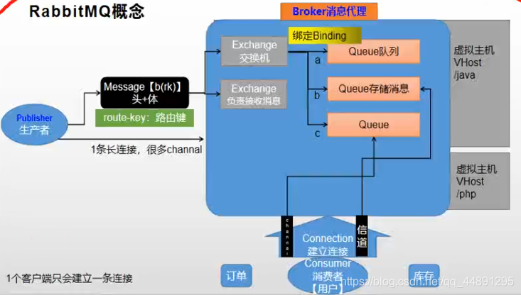
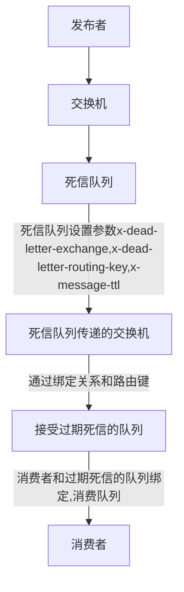
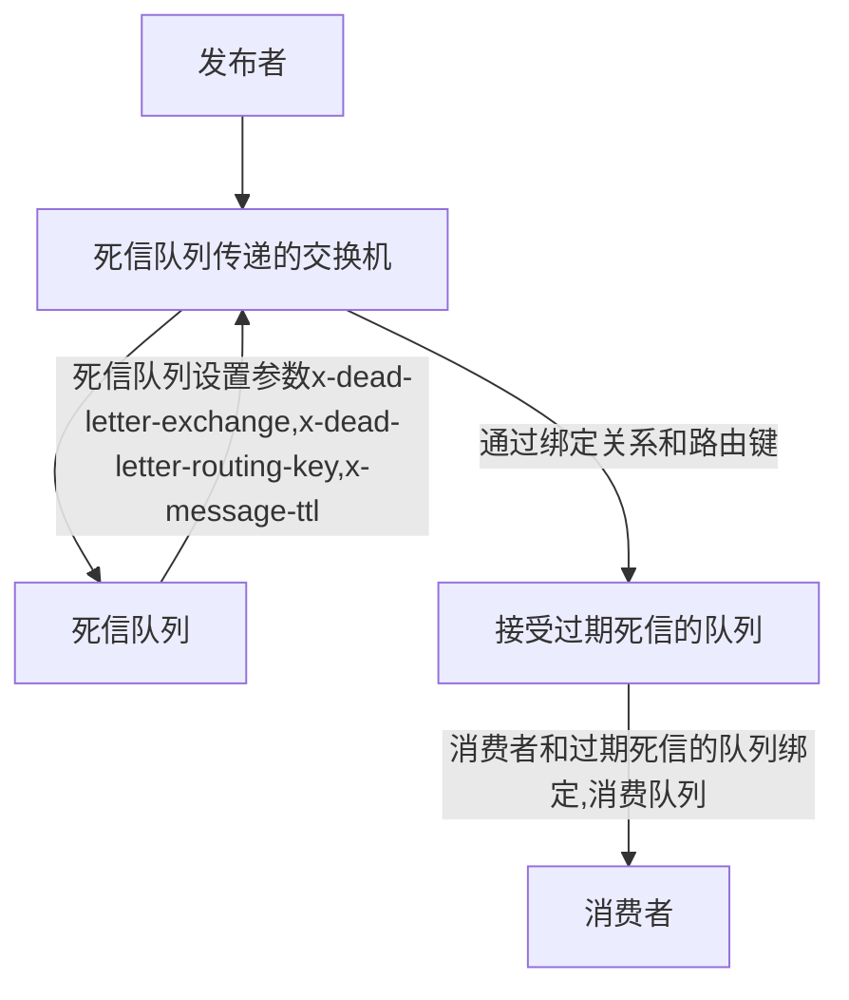

# 谷粒商城笔记

## 环境搭建

### linux虚拟机安装

#### virtualbox

* 安装包安装

#### vagrant

> 可以快速安装virtual虚拟机的工具

* 下载&安装
  * 镜像地址： https://app.vagrantup.com/boxes/search
  * 下载地址：https://www.vagrantup.com/downloads

* 打开windows cmd，运行vagrant init centos/7创建vagrantFile
* 使用vagrant up命令安装或启动虚拟机，确保在vagrantFile文件的目录下执行

##### 修改虚拟机的ip地址

* 修改vagrantFile文件配置使用私有ip

```xml
config.vm.network "private_network", ip: "192.168.56.10"
```

##### vagrant up出错问题

```java
# 出现D:/program/HashiCorp/Vagrant/embedded/gems/2.2.5/gems/vagrant-2.2.5/lib/vagrant/util/io.rb:32:in `encode': "\x95" followed by """ on GBK编码问题时，使用以下代码替换该文件的32行代码。
data << io.readpartial(READ_CHUNK_SIZE).encode('UTF-8', invalid: :replace, undef: :replace, replace: '?')
```

##### vagrant 使用xhsell连接

* vagrant账号和密码默认是  vagrant

* 登录vagrant后使用su命令可以切换root账号
* 登录root账号后，修改/etc/ssh/sshd_config文件
  *  **PermitRootLogin**属性 改为yes ，并把前面的`#` 去掉。
  * **PasswordAuthentication** 改为yes 并且去掉 `#`
  * 使用 systemctl restart sshd 重启ssh

### docker

#### docker镜像加速

> 使用阿里云镜像加速，登录阿里云后搜索有步骤

```
sudo mkdir -p /etc/docker
sudo tee /etc/docker/daemon.json <<-'EOF'
{
  "registry-mirrors": ["https://t1maorme.mirror.aliyuncs.com"]
}
EOF
sudo systemctl daemon-reload
sudo systemctl restart docker
```

#### docker使用开机自启

```
sudo systemctl enable docker
```

* 扩展：systemctl是CentOS7的服务管理工具中主要的工具，它融合之前service和chkconfig的功能于一体。

```
启动一个服务：
systemctl start firewalld.service
关闭一个服务：
systemctl stop firewalld.service
重启一个服务：
systemctl restart firewalld.service
显示一个服务的状态：
systemctl status firewalld.service
在开机时启用一个服务：
systemctl enable firewalld.service
在开机时禁用一个服务：
systemctl disable firewalld.service
查看服务是否开机启动：
systemctl is-enabled firewalld.service
查看已启动的服务列表：
systemctl list-unit-files|grep enabled
查看启动失败的服务列表：
systemctl --failed
```

#### docker常用命令

| 功能                 | 命令                                    |
| -- | -- |
|docker rm 容器id |  移除容器 |
|docker rmi 镜像id | 移除镜像 |
|docker update --restart=always mysql | 容器开机自动重启 |


#### docker新建mysql容器

> 新建文件及文件夹

```
mkdir -p /docker/mysql/conf/ /docker/mysql/data
vim /docker/mysql/conf/my.cnf
```
> my.cnf 文件内容

```
[mysqld]
user=mysql
character-set-server=utf8mb4
default_authentication_plugin=mysql_native_password
lower_case_table_names=1
default-time-zone='+8:00'
[client]
default-character-set=utf8mb4
[mysql]
default-character-set=utf8mb4
```
> docker创建容器

```
docker run -d -p 3306:3306 --name mysql \
--privileged=true \
-e MYSQL_ROOT_PASSWORD=123123 \
-v=/docker/mysql/data:/var/lib/mysql \
-v=/docker/mysql/conf/my.cnf:/etc/my.cnf mysql:5.6.39
```

> 遇到caching-sha2-password错误时，进入sql执行以下命令

```
ALTER USER 'root'@'%' IDENTIFIED WITH mysql_native_password BY '你的密码';
FLUSH PRIVILEGES;
```

##### mysql远程连接问题
> 遇到Host 'X.X.X.X' is not allowed to connect to this MySQL server

* 是因为远程连接被限制


#### docker新建nginx容器

1. 创建nginx目录

```
mkdir -p /docker/nginx/conf.d 
vim /docker/nginx/nginx.conf

```

2. 初始化nginx.conf（将以下语句写入nginx.conf文件中）

```
# For more information on configuration, see:
#   * Official English Documentation: http://nginx.org/en/docs/
#   * Official Russian Documentation: http://nginx.org/ru/docs/

user nginx;
worker_processes auto;
error_log /var/log/nginx/error.log;
pid /run/nginx.pid;

# Load dynamic modules. See /usr/share/nginx/README.dynamic.
include /usr/share/nginx/modules/*.conf;

events {
    worker_connections 1024;
}

http {
    log_format  main  '$remote_addr - $remote_user [$time_local] "$request" '
                      '$status $body_bytes_sent "$http_referer" '
                      '"$http_user_agent" "$http_x_forwarded_for"';

    access_log  /var/log/nginx/access.log  main;

    client_max_body_size 10m; 
    sendfile            on;
    tcp_nopush          on;
    tcp_nodelay         on;
    keepalive_timeout   65;
    types_hash_max_size 2048;
    
    include             /etc/nginx/mime.types;
    default_type        application/octet-stream;

    # Load modular configuration files from the /etc/nginx/conf.d directory.
    # See http://nginx.org/en/docs/ngx_core_module.html#include
    # for more information.
    include /etc/nginx/conf.d/*.conf;
    proxy_ignore_client_abort on;
    
    #设定负载均衡的服务器列表
    #upstream bigdata {
    #    # ip_hash;#此处配置指根据ip,每个ip访问固定的一个服务器
    #    #server后加weight=5(weigth参数表示权值，权值越高被分配到的几率越大)
    #    #server后加backup(指该服务器为备用服务器,其他服务器不能运行时才访问此服务器)
    #    #server后加max_fails=1 fail_timeout=30s(指改服务器如果在30s内失败次数超过1次,就判定此服务器异常,30s内不会再转发到此服务器)
    #    server 172.17.0.1:8100 max_fails=2 fail_timeout=10s;
    #    server 10.100.3.245:8100 max_fails=1 fail_timeout=30s backup;
    #}
    
    # server配置
    # http方式
    server {
       listen 80;
       server_name www.baidu.com;
       location / {
            proxy_pass http://172.17.0.1:8080;
            proxy_set_header  X-Real-IP  $remote_addr;
            proxy_set_header Host $host:80;
            proxy_set_header X-Forwarder-For $proxy_add_x_forwarded_for;
            #如果后端的服务器返回502、504、执行超时等错误，自动将请求转发到upstream负载均衡池中的另一台服务器，实现故障转移。
            proxy_next_upstream http_502 http_504 http_404 error timeout invalid_header;

            proxy_connect_timeout 30s;#nginx跟后端服务器连接超时时间(代理连接超时)
            proxy_read_timeout 180s;#连接成功后，后端服务器响应时间(代理接收超时)
            proxy_send_timeout 180s;#后端服务器数据回传时间(代理发送超时)
      }
    }
    
    # https方式
    # 将cret证书放到nginx.conf文件相同目录下的conf.d文件夹中
    #server {
    #    listen 80;
    #    listen 443 ssl;
    #
    #    server_name bigdata.833006.net;
    #
    #    ssl_certificate   ./conf.d/214629458610382.pem;
    #    ssl_certificate_key  ./conf.d/214629458610382.key;
    #    ssl_session_timeout 5m;
    #    ssl_ciphers ECDHE-RSA-AES128-GCM-SHA256:ECDHE:ECDH:AES:HIGH:!NULL:!aNULL:!MD5:!ADH:!RC4;
    #    ssl_protocols TLSv1 TLSv1.1 TLSv1.2;
    #    ssl_prefer_server_ciphers on;
    #
    #    # 访问HTTP时自动跳转到HTTPS
    #    if ($server_port = 80) {
    #        rewrite ^(.*)$ https://$host$1 permanent;
    #    }
    #
    #    location / {
    #        proxy_pass http://bigdata; #请求转向bigdata定义的服务器列表
    #        proxy_set_header Host $host;
    #        proxy_set_header X-Real-IP $remote_addr;
    #        proxy_set_header X-Forwarded-For $proxy_add_x_forwarded_for;#后端的Web服务器可以通过X-Forwarded-For获取用户真实IP
    #        proxy_set_header X-Forwarded-Proto https;
    #        #如果后端的服务器返回502、504、执行超时等错误，自动将请求转发到upstream负载均衡池中的另一台服务器，实现故障转移。
    #        proxy_next_upstream http_502 http_504 http_404 error timeout invalid_header;
    #
    #        proxy_connect_timeout 30;#nginx跟后端服务器连接超时时间(代理连接超时)
    #        proxy_read_timeout 300;#连接成功后，后端服务器响应时间(代理接收超时)
    #        proxy_send_timeout 300;#后端服务器数据回传时间(代理发送超时)
    #    }
    #}
    
}
```

3. 运行nginx

> 一般配置:

```
docker run -p 80:80 -p 443:443 --name nginx \
-e TZ="Asia/Shanghai" \
-v=/docker/nginx/conf.d:/etc/nginx/conf.d \
-v=/docker/nginx/nginx.conf:/etc/nginx/nginx.conf \
--privileged=true -d nginx
```

> 当需要访问其他服务器的容器的时候,采用--net=host模式,配置方法如下:

```
docker run --name nginx \
--net=host \
-e TZ="Asia/Shanghai" \
-v=/docker/nginx/conf.d:/etc/nginx/conf.d \
-v=/docker/nginx/nginx.conf:/etc/nginx/nginx.conf \
--privileged=true -d nginx
```


* 服务器重启报nginx错误：nginx: [error] open() "/run/nginx.pid"

```解决方法
sudo nginx -c /etc/nginx/nginx.conf
nginx -s reload
```

##### 其他

1. 如果https遇到项目里请求http的地址,会报错.

#### docker新建redis容器

* 新建文件

```
mkdir -p /docker/redis/conf
touch /docker/redis/conf/redis.conf
```

* 创建容器

```
docker run -d --name redis \
-p 6379:6379 \
--privileged=true \
-v=/docker/redis/data:/data \
-v=/docker/redis/conf/redis.conf:/etc/redis/redis.conf \
redis redis-server /etc/redis/redis.conf \
--appendonly yes \
--requirepass "你的密码"
```

```
docker run -d --name redis1 \
-p 6379:6379 \
--privileged=true \
-v=/docker/redis/data:/data \
redis \
redis-server \
--appendonly yes \
--requirepass "你的密码"
```

* 容器内运行

```
exec redis -it redis-cli
```


* 设置密码
```
config set requirepass 密码
```

#### docker安装nacos

###### 1.拉取镜像

```undefined
docker pull nacos/nacos-server
```

###### 2.挂载目录


```bash
#新建logs目录
mkdir -p /home/nacos/logs/                      
mkdir -p /home/nacos/init.d/          
vim /home/nacos/init.d/custom.properties        #修改配置文件
添加如下参数:
```


```cpp
server.contextPath=/nacos
server.servlet.contextPath=/nacos
server.port=8848

spring.datasource.platform=mysql

db.num=1
db.url.0=jdbc:mysql://xx.xx.xx.x:3306/nacos_devtest_prod?characterEncoding=utf8&connectTimeout=1000&socketTimeout=3000&autoReconnect=true
db.user=user
db.password=pass


nacos.cmdb.dumpTaskInterval=3600
nacos.cmdb.eventTaskInterval=10
nacos.cmdb.labelTaskInterval=300
nacos.cmdb.loadDataAtStart=false

management.metrics.export.elastic.enabled=false

management.metrics.export.influx.enabled=false


server.tomcat.accesslog.enabled=true
server.tomcat.accesslog.pattern=%h %l %u %t "%r" %s %b %D %{User-Agent}i


nacos.security.ignore.urls=/,/**/*.css,/**/*.js,/**/*.html,/**/*.map,/**/*.svg,/**/*.png,/**/*.ico,/console-fe/public/**,/v1/auth/login,/v1/console/health/**,/v1/cs/**,/v1/ns/**,/v1/cmdb/**,/actuator/**,/v1/console/server/**
nacos.naming.distro.taskDispatchThreadCount=1
nacos.naming.distro.taskDispatchPeriod=200
nacos.naming.distro.batchSyncKeyCount=1000
nacos.naming.distro.initDataRatio=0.9
nacos.naming.distro.syncRetryDelay=5000
nacos.naming.data.warmup=true
nacos.naming.expireInstance=true
:wq 保存退出
```

###### 3.启动容器


```jsx
docker  run \
--name nacos -d \
-p 8848:8848 \
--privileged=true \
--restart=always \
-e JVM_XMS=100m \
-e JVM_XMX=100m \
-e MODE=standalone \
-e PREFER_HOST_MODE=hostname \
-v /home/nacos/logs:/home/nacos/logs \
-v /home/nacos/init.d/custom.properties:/home/nacos/init.d/custom.properties \
nacos/nacos-server
```


### git

#### 安装和配置

1. 安装
2. 进入gitbash，配置

```
## 配置用户名
git config --global user.name "用户名"
## 配置邮箱
git config --global user.email "邮箱"
```

3. 配置shh免密登录

* 进入gitbash，使用命令

```ssh
ssh-keygen -t rsa -C "邮箱"
```

* 三次回车后用户目录下会有两个文件`id_rsa` 和`id_rsa.pub`
* 查看`id_rsa.pub`文件内容，复制到远程git仓库里配置

```
可以使用 cat ~/.ssh/id_rsa.pub查看
```

* 如果使用码云，可以使用`ssh -T git@gitee.com `测试是否配置成功

### 项目创建

#### 整体计划

1. 项目搭建，基本结构完成


## 各个基本项目生成并启动


### idea Run Dashboard配置

1. 打开项目所在路径下`.idea/workspace.xml`
2. 搜索`RunDashboard`
3. `<component name="RunDashboard">`标签内容

```xml
<component name="RunDashboard">
    <option name="configurationTypes">
        <set>
            <option value="SpringBootApplicationConfigurationType" />
        </set>
    </option>
    <option name="ruleStates">
        <list>
            <RuleState>
                <option name="name" value="ConfigurationTypeDashboardGroupingRule" />
            </RuleState>
            <RuleState>
                <option name="name" value="StatusDashboardGroupingRule" />
            </RuleState>
        </list>
    </option>
</component>
```

### Nacos注册中心

1. 下载nacos-server文件，解压
2. 开发时需里面的启动文件先改成单机模式运行 `mode=standalone`，cluster是默认集群模式

### openfeign调用远程服务

1. 引入openfeign

   ```
   <dependency>
       <groupId>org.springframework.cloud</groupId>
       <artifactId>spring-cloud-starter-openfeign</artifactId>
   </dependency>
   ```

   

2. 编写接口，告诉springcloud这是远程接口

   ```
   @FeignClient("bon-order")
   public interface OrderFeignService {
   
       @GetMapping("/order/order/list")
       public R getOrder();
   }
   ```

3. 可以调用feign接口去调用远程服务了

   ```
   	@Autowired
       private OrderFeignService orderFeignService;
   
       @GetMapping("/orders")
       public R getAll(){
           return R.ok().put("data",orderFeignService.getOrder());
       }
   ```

   

### nacos配置中心

* 使用步骤

```java
/**
 * 1、如何使用Nacos作为配置中心统一管理配置
 *
 * 1）、引入依赖，
 *         <dependency>
 *             <groupId>com.alibaba.cloud</groupId>
 *             <artifactId>spring-cloud-starter-alibaba-nacos-config</artifactId>
 *         </dependency>
 * 2）、创建一个bootstrap.properties。
 *      spring.application.name=gulimall-coupon
 *      spring.cloud.nacos.config.server-addr=127.0.0.1:8848
 * 3）、需要给配置中心默认添加一个叫 数据集（Data Id）gulimall-coupon.properties。默认规则，应用名.properties
 * 4）、给 应用名.properties 添加任何配置
 * 5）、动态获取配置。
 *      @RefreshScope：动态获取并刷新配置
 *      @Value("${配置项的名}")：获取到配置。
 *      如果配置中心和当前应用的配置文件中都配置了相同的项，优先使用配置中心的配置。
 *
 * 2、细节
 *  1）、命名空间：配置隔离；
 *      默认：public(保留空间)；默认新增的所有配置都在public空间。
 *      1、开发，测试，生产：利用命名空间来做环境隔离。
 *         注意：在bootstrap.properties；配置上，需要使用哪个命名空间下的配置，
 *         spring.cloud.nacos.config.namespace=9de62e44-cd2a-4a82-bf5c-95878bd5e871
 *      2、每一个微服务之间互相隔离配置，每一个微服务都创建自己的命名空间，只加载自己命名空间下的所有配置
 *
 *  2）、配置集：所有的配置的集合
 *
 *  3）、配置集ID：类似文件名。
 *      Data ID：类似文件名
 *
 *  4）、配置分组：
 *      默认所有的配置集都属于：DEFAULT_GROUP；
 *      1111，618，1212
 *
 * 项目中的使用：每个微服务创建自己的命名空间，使用配置分组区分环境，dev，test，prod
 *
 * 3、同时加载多个配置集
 * 1)、微服务任何配置信息，任何配置文件都可以放在配置中心中
 * 2）、只需要在bootstrap.properties说明加载配置中心中哪些配置文件即可
 * 3）、@Value，@ConfigurationProperties。。。
 * 以前SpringBoot任何方法从配置文件中获取值，都能使用。
 * 配置中心有的优先使用配置中心中的，
 *
 *
 */
```

### api网关

```
/**
 * 1、开启服务注册发现
 *  (配置nacos的注册中心地址)
 * 2、编写网关配置文件
 */
 示例：
 spring:
 	gateway:
      routes:
        - id: admin_route
          uri: lb://renren-fast
          predicates:
            - Path=/api/**
          filters:
          ## 过滤器可以转换路径
            - RewritePath=/api/(?<segment>.*),/renren-fast/$\{segment}
```

### Elasticsearch

#### 简介

Elasticsearch是一个基于[Lucene](https://baike.baidu.com/item/Lucene/6753302)的搜索服务器。它提供了一个分布式多用户能力的[全文搜索引擎](https://baike.baidu.com/item/全文搜索引擎/7847410)，基于RESTful web接口。Elasticsearch是用Java语言开发的，并作为Apache许可条款下的开放源码发布，是一种流行的企业级搜索引擎。

* 官方文档： https://www.elastic.co/guide/en/elasticsearch/reference/current/index.html

#### 基本概念

1. index索引（数据库）

   动词：相当于mysql的insert

   名词：相当于mysql的database

2. type类型（数据表）
3. document文档（数据行存的值）

##### 倒排索引

* 分词
* 检索
* 相关性得分

步骤：先将源数据分词，记录分词后的词分别在哪些源数据中，当要查询某个目标数据时，通过将目标数据分词，然后和源数据的分词对比，通过目标数据在源数据命中的百分比来确定相关性排序，可以得出最符合条件的源数据。

#### docker安装

1. 下载镜像文件

   docker pull elasticsearch:7.4.2

   docker pull kibana:7.4.2

2. 启动

* es

```
# 创建目录
mkdir -p /docker/elasticsearch/config
mkdir -p /docker/elasticsearch/data
echo "http.host: 0.0.0.0" >> /docker/elasticsearch/config/elasticsearch.yml
# 创建容器
docker run --name elasticsearch -p 9200:9200 -p 9300:9300 \
-e "discovery.type=single-node" \
-e ES_JAVA_OPTS="-Xms64m -Xmx128m" \
-v /docker/elasticsearch/config/elasticsearch.yml:/usr/share/elasticsearch/config/elasticsearch.yml \
-v /docker/elasticsearch/data:/usr/share/elasticsearch/data \
-v /docker/elasticsearch/plugins:/usr/share/elasticsearch/plugins \
--privileged=true -d elasticsearch:7.4.2

其中elasticsearch.yml是挂载的配置文件，data是挂载的数据，plugins是es的插件，如ik，而数据挂载需要权限，需要设置data文件的权限为可读可写,需要下边的指令。
chmod -R 777 要修改的路径

-e "discovery.type=single-node" 设置为单节点
特别注意：
-e ES_JAVA_OPTS="-Xms256m -Xmx256m" \ 测试环境下，设置ES的初始内存和最大内存，否则导致过大启动不了ES
--privileged=true 让容器具有root权限，让容器可以修改配置文件
```

* kibanna

```
docker run --name kibana \
-e ELASTICSEARCH_HOSTS=http://192.168.56.10:9200 -p 5601:5601 \
--privileged=true -d kibana:7.4.2

进入容器修改相应内容
server.port: 5601
server.host: 0.0.0.0
elasticsearch.hosts: [ "http://自己的IP地址:9200" ]
i18n.locale: "Zh-CN"

然后访问页面
http://自己的IP地址:5601/app/kibana
```

#### 文档操作

##### _cat

```
GET /_cat/node 查看所有节点
GET /_cat/health 查看es健康状况
GET /_cat/master 查看主节点
GET /_cat/indices 查看所有索引
```

##### 保存文档

保存一个数据，保存在那个索引的那个类型下，指定用唯一的标识，customer为索引,external为类型,1为标识。其中**PUT和POST都可以**，POST新增。如果不指定ID，会自动生成ID，指定ID就会修改这个数据，并新增版本号。PUT可以新增可以修改，PUT必须指定ID，一般都用来修改操作，不指定ID会报错。

```
PUT customer/external/1
{
  "name":"张三"
}

返回结果
{
  "_index" : "customer",
  "_type" : "external",
  "_id" : "1",
  "_version" : 3,
  "result" : "updated",
  "_shards" : {
    "total" : 2,
    "successful" : 1,
    "failed" : 0
  },
  "_seq_no" : 1001,
  "_primary_term" : 2
}
```

##### 查询

```
GET customer/external/1
    
结果:
{
  "_index" : "customer", //在那个索引
  "_type" : "external", //在那个类型
  "_id" : "1", //记录ID
  "_version" : 1, //版本号
  "_seq_no" : 0, //并发控制字段，每次更新就+1，可用于乐观锁
  "_primary_term" : 1, //主分片重新分配，如重启，就会变化
  "found" : true, //true就是找到数据了
  "_source" : { //数据
    "name" : "张三"
  }
}
```

##### 更新

```
POST操作带_update会对比原来的数据，如果是一样的那就不会更新了
POST customer/external/1/_update
{
  "doc":{
    "name":"你好"
  }
}
POST操作不带_update会直接更新操作
POST customer/external/1
{
  "name":"你好"
}
```

##### 删除

```
DELETE customer/external/1
```

6. bulk批量api

   测试数据：https://github.com/elastic/elasticsearch/blob/7.4/docs/src/test/resources/accounts.json

   ```
   需要加_bulk，然后请求体中的index是id，下边的是要保存的内容
   POST customer/external/_bulk
   {"index":{"_id":1}}
   {"name":"榨干"}
   {"index":{"_id":2}}
   {"name":"你瞅啥"}
   ```

##### 复杂查询

```
1.一种是通过REST request URI 发送搜索的参数，其中_search是固定写法，q=*是查询所有，sort=balance排序是按照balance排序的，asc是升序排序
GET bank/_search?q=*&sort=balance:asc

结果集，took是花费时间，timed_out没有超时，hits是命中的记录

2.另一种是通过REST request body 来发送，query代表查询条件，match_all是查询所有，sort代表排序条件
GET bank/_search
{
  "query": {
    "match_all": {}
  },
  "sort": [
    {
      "balance": "asc"
    }
  ]
}

3.分页操作，from是从第几条数据开始，size是一页多少个，默认是十条数据
4.按需返回参数为，_source
GET bank/_search
{
  "query": {
    "match_all": {}
  },
  "sort": [
    {
      "balance": "asc"
    }
  ],
  "from": 11,
  "size": 2, 
  "_source": ["account_number","balance"]
}

5.全文检索，使用match操作，查询的结果是按照评分从高到低排序的
GET bank/_search
{
  "query": {
    "match": {
      "age": 20
    }
  }
}

6.match_phrase的精确匹配，
GET bank/_search
{
  "query": {
    "match_phrase": {
      "age": 20
    }
  }
}

7.多字段匹配，multi_match
GET bank/_search
{
  "query": {
    "multi_match": {
      "query": "mill",
      "fields": ["address","email"]
    }
  }
}

8.复合查询bool，其中must是必须满足，must_not是必须不满足，should是应该满足，不过不满足的也能查出来，就是得分低，range是区间查询
GET bank/_search
{
  "query": {
    "bool": {
      "must": [
        {"match": {
          "gender": "F"
        }},
        {"match": {
          "address": "Mill"
        }}
      ],
      "must_not": [
        {"match": {
          "age": "38"
        }}
      ],
      "should": [
        {"match": {
          "lastname": "Long"
        }}
      ]
    }
  }
}

9.filter过滤，区间查询操作，而且filter不会计算相关性得分
GET bank/_search
{
  "query": {
  "bool": {
    "filter": [
      {"range": {
        "age": {
          "gte": 10,
          "lte": 30
        }
      }}
    ]
  }
  }
}

10.team查询，一些精确字段的推荐使用team，而一些全文检索的推荐使用match
GET bank/_search
{
  "query": {
    "term": {
      "age": "28"
    }
  }
}

11.keyword的作用：当有keyword的时候，就会精确查找，而没有keyword的时候，这个值会当成一个关键字
GET bank/_search
{
  "query": {"match": {
    "address.keyword": "789 Madison"
  }}
}

GET bank/_search
{
  "query": {"match_phrase": {
    "address": "789 Madison"
  }}
}
```

##### es分析，聚合函数

```
搜索address中包含mill的所有人的年龄分布以及平均年龄，但不显示这些人的详情
其中，aggs代表使用聚合函数，terms为结果种类求和，avg为平均值，size为0则不显示详细信息
GET customer/_search
{
  "query": {
    "match": {
      "address": "mill"
    }
  },
  "aggs": {
    "ageagg": {
      "terms": {
        "field": "age",
        "size": 10
      }
    },
    "ageavg":{
      "avg": {
        "field": "age"
      }
    }
  },
  "size": 0
}

聚合中还可以有子聚合
GET customer/_search
{
  "query": {
    "match_all": {}
  },
  "aggs": {
    "ageagg": {
      "terms": {
        "field": "age",
        "size": 10
      },
      "aggs": {
        "ageAvg": {
          "avg": {
            "field": "balance"
          }
        }
      }
    }
  },
  "size": 0
}
```

##### 映射

```
GET bank/_mapping
```

#### 分词

##### ik分词器

1. 下载地址：https://github.com/medcl/elasticsearch-analysis-ik/releases

   查找7.4.2版本

2. 解压到 /docker/elasticsearch/plugins/ik目录

3. 重启elasticsearch

4. 基本命令

   ```
   POST _analyze
   {
     "analyzer": "standard",
     "text": "hello world,me too"
   }
   
   POST _analyze
   {
     "analyzer": "standard",
     "text": "你好中国"
   }
   
   POST _analyze
   {
     "analyzer": "ik_smart",
     "text": "你好中国"
   }
   
   POST _analyze
   {
     "analyzer": "ik_max_word",
     "text": "我是中国人"
   }
   ```

##### nginx添加新单词

1. nginx容器

```
mkdir -p /docker/nginx/conf.d 
vim /docker/nginx/nginx.conf

docker run -p 80:80 -p 443:443 --name nginx \
-e TZ="Asia/Shanghai" \
-v=/docker/nginx/conf.d:/etc/nginx/conf.d \
-v=/docker/nginx/nginx.conf:/etc/nginx/nginx.conf \
-v=/docker/nginx/logs:/var/log/nginx \
-v=/docker/nginx/html:/usr/share/nginx/html \
--privileged=true -d nginx:1.10
```

2. nginx普通转发

```
# 普通方式,转发到文件夹下的内容
    server {
       listen 80;
       location / {
            root   /usr/share/nginx/html;
            index  index.html index.htm;
        }
    }
```

3. 修改分词器配置 /docker/elasticsearch/plugins/ik/config/IKAnalyzer.cfg.xml

```
<?xml version="1.0" encoding="UTF-8"?>
<!DOCTYPE properties SYSTEM "http://java.sun.com/dtd/properties.dtd">
<properties>
	<comment>IK Analyzer 扩展配置</comment>
	<!--用户可以在这里配置自己的扩展字典 -->
	<entry key="ext_dict"></entry>
	 <!--用户可以在这里配置自己的扩展停止词字典-->
	<entry key="ext_stopwords"></entry>
	<!--用户可以在这里配置远程扩展字典 -->
	<entry key="remote_ext_dict">http://192.168.56.10/es/fenci.txt</entry>
	<!--用户可以在这里配置远程扩展停止词字典-->
	<!-- <entry key="remote_ext_stopwords">words_location</entry> -->
</properties>
```

#### 整合es

1. pom

```
<properties>
        <java.version>1.8</java.version>
        <!--改变springboot原有版本号-->
        <elasticsearch.version>7.4.2</elasticsearch.version>
    </properties>
    
    
    <!--        es-->
        <dependency>
            <groupId>org.elasticsearch.client</groupId>
            <artifactId>elasticsearch-rest-high-level-client</artifactId>
            <version>7.4.2</version>
        </dependency>
```

2. 编写配置

```
@Configuration
public class EsConfig {

    @Bean
    public RestHighLevelClient restHighLevelClient(){
        RestHighLevelClient client = new RestHighLevelClient(
                RestClient.builder(
                        new HttpHost("192.168.56.10", 9200, "http")));
        return client;
    }

}
```

3. 参照文档操作api

api文档地址： https://www.elastic.co/guide/en/elasticsearch/client/java-rest/current/java-rest-high-getting-started-initialization.html

### thymeleaf模板引擎

1. 引入pom

```
<dependency>
    <groupId>org.springframework.boot</groupId>
    <artifactId>spring-boot-starter-thymeleaf</artifactId>
</dependency>
```

2. 关闭缓存

```
spring:
  thymeleaf:
    cache: false
```

3. 静态资源在/resources/static文件夹下,页面在/resources/templates文件夹下
4. 页面修改不需重启,实时更新

```
# 引入devtools
<dependency>
    <groupId>org.springframework.boot</groupId>
    <artifactId>spring-boot-devtools</artifactId>
    <optional>true</optional>
</dependency>
# 更新时再次编译就可以了
```

5. 页面提示

   ```
   <html xmlns:th="http://www.thymeleaf.org">
   ```

   

### nginx配置网关

1. nginx配置文件

```
	# 服务组,配置负载均衡
    upstream mall{
        server 192.168.56.1:88;
    }
    # 监听配置
    server{
        listen 80;
        server_name mall.com;

        location / {
            proxy_pass http://mall;
            # nginx代理给网关的时候,会丢失请求的host信息
            proxy_set_header Host $host;# 设置请求头的host,将Host使用当前host信息
        }
    }
```

2. 网关配置

```
		- id: mall_host_route
          uri: lb://bon-product
          predicates:
            # 使用host断言
            - Host=**.mall.com 
```

### 压力测试

1. 性能指标:

* 响应时间(response time:RT)
* HPS(hits per second) 每秒点击数
* TPS(transaction per second) 每秒处理交易数:一个完整的业务完成指标
* QPS(query per second) 每秒处理查询数
* 吞吐量,响应时间,错误率

2. Jmeter

* 新建线程组
* 新建http请求
* 监测->查看结果树,汇总报告,聚合报告

3. docker监控

```
# docker容器的状态
docker stats
```

4. 压测报告

压测内容|压测线程数|吞吐量/s|90%响应时间|99%响应时间
--|--|--|--|--
nginx|50|401|6|49
gateway|50|29226|3|11
简单服务|50|||
首页一级菜单渲染|50|||
三级分类数据获取|50|||
nginx+gateway|50|||
gateway+简单服务|50|||
全链路|50|||


##### jvisualvm

监控内存泄露,跟踪垃圾回收,执行时内存,cpu分析,线程分析

```
jvisualvm命令开启,是个桌面系统
```

### 缓存

#### redis

1. pom

```
		<dependency>
			<groupId>org.springframework.boot</groupId>
			<artifactId>spring-boot-starter-data-redis</artifactId>
		</dependency>
```

2. 配置redis

```
spring:
  redis:
    host: 192.168.56.10
    port: 6379
```

3. spring使用redisTemplate操作redis

##### 压测时的堆外异常 OutOfDirectMemoryError

springboot2.0 默认使用lettuce作为redis的客户端,它使用netty进行网络通信

lettuce的bug会导致netty堆外内存溢出

解决方案:

* 升级lettuce
* 切换使用jedis

##### 缓存问题

* 缓存穿透: 指大量查询一个不存在的值,导致大量请求去db里面查;  解决方案:将不存在的值设置一个默认值(比如null)
* 缓存雪崩: 指缓存在一个时间点大面积失效,导致大量请求到了db;  解决方案: 过期时间设置随机的值,防止大面积失效的情况
* 缓存击穿: 指热点数据失效了,但是同时有大量查询这个热点数据,导致大量请求到db; 解决方案:加锁,让某一个先查,放入缓存,再释放锁

#### 分布式锁

##### redis加锁

```java
// 查询redis中占锁的key是否已经被占
// setIfAbsent相当于 set lock 111 NX PX 300000
// 需要带上过期时间,防止特殊原因导致一直不释放key,导致死锁
String uuid = UUID.randomUUID().toString();
Boolean lock = redisTemplate.opsForValue().setIfAbsent("lock", uuid, 300L, TimeUnit.SECONDS);
while(true){
    if(lock){
        Map<String, List<Catalog2Vo>> catalogFromDb = null;
        try {
            // 加锁成功,可以去查数据库
            catalogFromDb = getCatalogFromDb();
        } finally {
            // 删除锁时需要确定删除的是自己的锁,使用设置值为生成的uuid来区分
            // 删除锁,删除的时候也需要考虑原子性,使用lua脚本删除
            String script = "if redis.call('get',KEYS[1]) == ARGV[1] then return redis.call('del',KEYS[1]) else return 0 end";
            redisTemplate.execute(new DefaultRedisScript<Long>(script,Long.class), Arrays.asList("lock"),uuid);
        }
        return catalogFromDb;
    }else {
        // 加锁失败,休眠300毫秒重试
        try {
            Thread.sleep(300);
        } catch (InterruptedException e) {
            e.printStackTrace();
        }
    }
}
```

##### redisson加锁

1. pom导入

```xml
<!-- redisson分布式锁 -->
<dependency>
    <groupId>org.redisson</groupId>
    <artifactId>redisson</artifactId>
    <version>3.12.0</version>
</dependency>
```

2. 配置

```java
@Configuration
public class MyRedissonConfig {

    @Bean(destroyMethod = "shutdown")
    public RedissonClient redisson(){
        Config config = new Config();
        //可以用"redis:// 或者 rediss://"来连接
        config.useSingleServer().setAddress("redis://192.168.56.10:6379");
        return Redisson.create(config);
    }
}
```

###### lock和unlock

```java
	@GetMapping("/product/hello")
    @ResponseBody
    public void hello(){
        Thread t1 = new Thread(() -> {
            RLock lock = redisson.getLock("mylock");
            lock.lock(30, TimeUnit.SECONDS);

            log.info("加锁成功,执行业务....");
            try {
                Thread.sleep(5000);
            } catch (InterruptedException e) {
            } finally {
                log.info("释放锁");
                lock.unlock();
            }
        },"t1");

        Thread t2 = new Thread(() -> {
            RLock lock = redisson.getLock("mylock");
            lock.lock(30, TimeUnit.SECONDS);

            log.info("加锁成功,执行业务....");
            try {
                Thread.sleep(5000);
            } catch (InterruptedException e) {
            } finally {
                log.info("释放锁");
                lock.unlock();
            }
        },"t1");

        t1.start();
        t2.start();
    }
```

lock没有指定过期时间时默认过期时间是30S,还有自动续期的功能,如果锁快要到期时方法还未执行玩会自动为锁续期,到达1/3过期时间时自动续期;

但是如果自己定义了过期时间,就不会自动续期;

最佳实战,还是使用自己定义过期时间,避免自动续期的消耗;

###### 读写锁

```java
RReadWriteLock lock = redisson.getReadWriteLock("mylock");
RLock readLock = lock.readLock();
RLock writeLock = lock.writeLock();
```

闭锁(CountDownLatch)

```java
RCountDownLatch lock = redisson.getCountDownLatch("mylock");
// 设置计数
lock.trySetCount(5);
// 锁等待
lock.await();
//计数减一
lock.countDown();
```

信号量(Semaphore)

```java
// 可以限流操作
// 当redis中的值为0时等待,与CountDownLatch相反
RSemaphore lock = redisson.getSemaphore("lock");
boolean b = lock.tryAcquire(); // 尝试获取锁,获取结果成功或失败,
lock.acquire();// 获取信号量,获取不到会一直阻塞 计数减一
lock.release();// 释放信号量 计数加一
```

###### 例子

```java
// 使用redisson加锁
private Map<String, List<Catalog2Vo>> getCatalogFromDbWithRedissonLock() {
    // redisson加锁,就是根据redis的key值来锁
    // 锁的粒度: 根据业务细分,是锁住某个商品,还是锁住所有商品,
    RLock lock = redisson.getLock("catalogJsonLock");
    lock.lock();
    Map<String, List<Catalog2Vo>> catalogFromDb = null;
    try {
        // 业务代码
        // 加锁成功,可以去查数据库
        catalogFromDb = getCatalogFromDb();
    } finally {
        // 解锁
        lock.unlock();
    }
    return catalogFromDb;
}
```

##### 缓存一致性

> 分析: 缓存中存有菜单,但是有可能数据库里面的菜单会修改,但是因为缓存里有数据,即使数据库的数据修改后查询的结果还是缓存里面的旧数据,这就导致了缓存一致性问题.

###### 缓存一致性方案

1. 双写模式: 更新数据库的时候同时修改缓存数据
2. 失效模式: 更新数据库时直接删掉缓存数据,使下次查询数据库重写缓存数据

> 即使使用了这些方案,在多线程下还是会有问题,比如双写下:a修改数据,此时b修改了修复,写入了缓存; 之后a才写入缓存;这里最新数据应该是b修改的数据,但是缓存里的数据变成了a的数据了.

###### 保证最终一致性

1. 缓存中加上过期时间,就是过一段时间缓存会变为数据库中的数据
2. 通过加锁,保证一个线程的修改数据库和修改缓存是原子的.但最好是加读写锁,因为读读,读写,写写之间有区别,可以提高一点性能.

3. 阿里的cannal中间件来更新缓存,cannal可以监听数据的状态,一但数据库更新就会更新缓存.

##### springCache

> 有Cache和CacheManager接口;Cache管理缓存的数据;CacheManager管理spirng中存在Cache; 
>
> springCache抽象了缓存的操作,比如以前需要自己写缓存的写入,删除,更新操作,springCache封装了这些操作,可以简化缓存的操作;

1. 整合

* 导入依赖

```xml
<!--springcache-->
<dependency>
    <groupId>org.springframework.boot</groupId>
    <artifactId>spring-boot-starter-cache</artifactId>
</dependency>
```

* 配置文件

  1. 自动配置文件CacheAutoConfiguration

  2. 配置选择器CacheConfigurationImportSelector

  3. ```
     使用redis的配置RedisCacheConfiguration;
     mappings.put(CacheType.REDIS, RedisCacheConfiguration.class);
     ```

  4. 放了一个RedisCacheManager

     ```
     @Bean
     RedisCacheManager cacheManager
     ```

  5. 配置

```yaml
spring:
  cache:
    type: redis
```

* 测试使用

```
@Cacheable: Triggers cache population. 触发缓存发布(新增)
@CacheEvict: Triggers cache eviction. 触发缓存驱逐(删除)
@CachePut: Updates the cache without interfering with the method execution. 在不干扰方法执行的情况下更新缓存
@Caching: Regroups multiple cache operations to be applied on a method.重新组合多个缓存操作以应用于一个方法
@CacheConfig: Shares some common cache-related settings at class-level.在类级别共享一些常见的缓存相关设置
```

> 使用缓存的失效模式确保缓存唯一性

 1. 开启缓存功能  启动类@EnableCaching//开启缓存

 2. 使用注解 

    ```java
    @Cacheable({"catalog"}) // 将结果放入缓存,如果缓存中有,直接返回结果,并且不会调用方法,没有时会调用方法,把结果放入缓存
    @Override
    public List<CategoryEntity> getLevel1Categorys() {
    ```

	3. 注解的使用

```java
1. 设置缓存key的名称 @Cacheable(value={"catalog"},key = "#root.method.name") // 使用方法名作为key值
key使用spEL语法: https://docs.spring.io/spring-framework/docs/current/reference/html/integration.html#cache-spel-context

2. 缓存的过期时间
spring:
  cache:
    type: redis
    redis:
      time-to-live: 360000 # 毫秒单位,过期时间
          
3. 缓存的存储格式改为json
@EnableConfigurationProperties(CacheProperties.class)
@EnableCaching//开启缓存
@Configuration
public class MyCacheConfig {

    @Bean
    RedisCacheConfiguration redisCacheConfiguration(CacheProperties cacheProperties){

        CacheProperties.Redis redisProperties = cacheProperties.getRedis();
        RedisCacheConfiguration config = RedisCacheConfiguration.defaultCacheConfig();
        config = config.serializeKeysWith(RedisSerializationContext.SerializationPair.fromSerializer(new StringRedisSerializer()));
        config = config.serializeValuesWith(RedisSerializationContext.SerializationPair.fromSerializer(new GenericJackson2JsonRedisSerializer()));
        if (redisProperties.getTimeToLive() != null) {
            config = config.entryTtl(redisProperties.getTimeToLive());
        }
        if (redisProperties.getKeyPrefix() != null) {
            config = config.prefixKeysWith(redisProperties.getKeyPrefix());
        }
        if (!redisProperties.isCacheNullValues()) {
            config = config.disableCachingNullValues();
        }
        if (!redisProperties.isUseKeyPrefix()) {
            config = config.disableKeyPrefix();
        }
        return config;
    }
}
```

4. 在修改数据库时清除缓存

```java
@CacheEvict(value={"catalog"},key = "'getLevel1Categorys'")
@Caching(evict = {
    @CacheEvict(value={"catalog"},key = "'getLevel1Categorys'"),
    @CacheEvict(value={"catalog"},key = "'getCatalogJson'")
})
@CacheEvict(value={"catalog"},allEntries = true)// 删除分区的全部key
@Transactional
@Override
public void updateCascade(CategoryEntity category) {
    this.updateById(category);
    categoryBrandRelationService.updateCategory(category.getCatId(),category.getName());
}
```

###### 原理与不足

1. 读模式

   * 缓存穿透: 查询一个不存在的值 ; 解决:缓存空数据 可以配置: spring.cache.redis.cache-null-values=true

   * 缓存击穿: 查询一个热点值; 解决: @Cacheable默认是无锁,通过设置值sync = true;

     @Cacheable(value={"catalog"},key = "#root.method.name",sync = true)

   * 缓存雪崩: 缓存大面积失效; 解决:设置过期时间 spring.cache.redis.time-to-live=360000

2. 写模式:(即缓存一致性问题)
   * 读写加锁
   * 引入cannal,感知到mysql更新,去更新缓存
   * 读多写多的,直接去数据库里查询

总结: 

1. 常规数据(读多写少,并且即时性和一致性要求不高的数据);完全可以使用springcache
2. 特殊的数据需要特殊的处理

### nginx动静分离

将前端静态资源(如js,css)放到nginx展示,后端处理接口内容;可以提升系统性能;

1. 将静态资源放入nginx/html文件夹下
2. 配置nginx

```nginx
1. nginx.conf
    # 服务组,配置负载均衡,请求到gateway网关
    upstream mall{
        server 192.168.56.1:88;
    }
    
    
2. conf.d/mall.conf
# 监听配置,最好放到conf.d文件夹下单独配置,用来区分
server{
    listen 80;
    server_name mall.com *.mall.com; # 多个域名配置

    # 静态资源转发
    location /static/ { 
        root /usr/share/nginx/html;
    }

    location / {
        proxy_pass http://mall;
        proxy_set_header Host $host;# 设置请求头的host
    }
}
```

### 商品管理流程

##### 商品新增

1. 新增平台属性
   * 属性分组: 为spu提供分组功能
   * spu(规格参数): 指一个分类产品需要的参数,如手机分类时,都会有尺寸,入网型号等参数;
   * sku(销售属性): 指一个分类产品有此参数,并且此参数不同值会有不同价格,如手机分32G,64G;

2. 去发布商品,添加商品信息->添加spu信息->添加销售属性(会根据选择的属性,进行笛卡尔积生成对应种类的商品)->保存商品信息
3. spu管理中去上架商品-> 上架商品->上架商品时会将商品信息发送到es中,提供商品检索功能

##### 商品库存新增

1. 新增仓库
2. 新建采购需求
3. 采购需求合并后生成一个采购单
4. 采购单分配采购人员
5. 调用接口进行采购操作

```json
/ware/purchase/done
{
	"id":1,
	"items":[
		{
			"itemId":3, // 采购需求的id
			"status":3, // 采购的状态 0新建，1已分配，2正在采购，3已完成，4采购失败
			"reason":"采购成功"
		},
		{
			"itemId":4,
			"status":4,
			"reason":"采购失败"
		}
	]
}
```

### es实现商品检索功能

#### es使用DSL分析

1. 条件查询

   ```json
   GET product/_search
   {
     "query": {
       "bool": {
         "must": [
           {
             "match": {
               "skuTitle": "荣耀"
             }
           }
         ],
         "filter": [
           {
             "term": {
               "catalogId": "225"
             }
           },
           {
             "terms": {
               "brandId": [
                 "2",
                 "1"
               ]
             }
           },
             // 嵌套类型的查询
           {
             "nested": {
               "path": "attrs",
               "query": {
                 "bool": {
                   "must": [
                     {
                       "term": {
                         "attrs.attrId": {
                           "value": "8"
                         }
                       }
                     },
                     {
                       "terms": {
                         "attrs.attrValue": [
                           "联发科（MTK)"
                         ]
                       }
                     }
                   ]
                 }
               }
             }
           },
           {
             "term": {
               "hasStock": true
             }
           },
           {
             "range": {
               "skuPrice": {
                 "gte": 100,
                 "lte": 300
               }
             }
           }
         ]
       }
     },
     "sort": [
       {
         "skuPrice": {
           "order": "desc"
         }
       }
     ],
     "from": 0,
     "size": 1,
      // 高亮
     "highlight": {
       "pre_tags": "<b style='color: red;'>",
       "post_tags": "</b>",
       "fields": {"skuTitle": {}}
     }
   }
   ```

   

2. 结果聚合

   ```json
   GET product/_search
   {
     "query": {
       "match_all": {}
     },
     "aggs": {
       "brand_agg": {
         "terms": {
           "field": "brandId",
           "size": 10
         },
         "aggs": {
           "brand_name_agg": {
             "terms": {
               "field": "brandName",
               "size": 10
             }
           }
         }
       },
       "catalog_agg": {
         "terms": {
           "field": "catalogId",
           "size": 10
         },
         "aggs": {
           "catalog_name_agg": {
             "terms": {
               "field": "catalogName",
               "size": 10
             }
           }
         }
       },
         // 嵌套类型的聚合
       "attr_agg": {
         "nested": {
           "path": "attrs"
         },
         "aggs": {
           "attr_id_agg": {
             "terms": {
               "field": "attrs.attrId",
               "size": 10
             },
             "aggs": {
               "attr_name_agg": {
                 "terms": {
                   "field": "attrs.attrName",
                   "size": 10
                 }
               },
               "attr_value_agg": {
                 "terms": {
                   "field": "attrs.attrValue",
                   "size": 10
                 }
               }
             }
           }
         }
       }
     }
   }
   ```

   

3. 数据迁移

```
# 可以将映射相同的索引数据传输
POST _reindex
{
  "source": {
    "index": "product"
  },
  "dest": {
    "index": "new_product"
  }
}
```

### 异步&线程池

#### 创建线程的方式

1. 继承Thread

2. 实现Runable

3. 实现Callable+FutureTask(可以拿到返回结果,可以处理异常)

4. 利用线程池

```
1,2不可以得到返回值。3可以获取返回值
1,2，3都不可以控制资源
4可以控制资源，性能稳定，不会让资源耗尽
```

```java
public class MyThreadTest {

    // 定义线程池,使用静态属性,让这个类始终只有一个线程池
    public static ExecutorService executor = Executors.newFixedThreadPool(3);

    public static void main(String[] args) throws ExecutionException, InterruptedException {
        System.out.println("main。。。。start..");
        // 1继承Thread
        Thread01 thread01 = new Thread01();
        thread01.start();

        // 2实现Runnable接口
        Runnable02 runnable02 = new Runnable02();
        // 新建Thread来接收Runnable任务
        new Thread(runnable02).start();

        // 3实现callable接口
        FutureTask<Integer> futureTask = new FutureTask<>(new Callable03());
        new Thread(futureTask).start();
        // 此时主线程会等待task的任务执行完获得返回结果后才继续执行
        Integer res = futureTask.get();

        // 4 使用线程池(管理线程的资源)
        // 执行Runnable,Thread继承Runnable
        // execute(执行无返回值)
        executor.execute(new Thread01());
        executor.execute(new Runnable02());
        // submit(执行后会有返回值)
        Future<Integer> task = executor.submit(new Callable03());
        task.get();

        System.out.println("main。。。。end..");
    }

    public static class Thread01 extends Thread {
        @Override
        public void run() {
            System.out.println("当前线程1：" + Thread.currentThread().getId());
            int i = 10 / 2;
            System.out.println("运行结果1：" + i);
        }
    }

    public static class Runnable02 implements Runnable {
        @Override
        public void run() {
            System.out.println("当前线程2：" + Thread.currentThread().getId());
            int i = 10 / 2;
            System.out.println("运行结果2：" + i);
        }
    }

    public static class Callable03 implements Callable {
        @Override
        public Integer call() {
            System.out.println("当前线程3：" + Thread.currentThread().getId());
            int i = 10 / 2;
            System.out.println("运行结果3：" + i);
            return i;
        }
    }
}
```

#### 线程池的创建方法

1. 使用Executors快速的创建出线程池

```java
1. Executors.newCachedThreadPool()
//说明：创建一个线程池，根据需要创建新的线程，但是将重用之前构建的可用线程
//这些池通常会提高性能执行许多短期的异步任务的程序    
//创建一个线程池，根据需要创建新的线程，但是将重用之前构建的可用线程
//这些池通常会提高性能执行许多短期的异步任务的程序
ExecutorService service = Executors.newCachedThreadPool();
//源代码
public static ExecutorService newCachedThreadPool() {
    return new ThreadPoolExecutor(0, Integer.MAX_VALUE,
                                  60L, TimeUnit.SECONDS,
                                  new SynchronousQueue<Runnable>());
}

2. Executors.newFixedThreadPool();
说明：创建重用固定数量线程的线程池，操作一个共享的无界队列。在任何点，最多线程将是活动的处理任务。如果在所有线程都处于活动状态时提交了额外的任务，它们将在队列中等待，直到线程可用。
ExecutorService service = Executors.newFixedThreadPool();
//源代码
public static ExecutorService newFixedThreadPool(int nThreads) {
    return new ThreadPoolExecutor(nThreads, nThreads,
                                  0L, TimeUnit.MILLISECONDS,
                                  new LinkedBlockingQueue<Runnable>());
}

3. Executors.newScheduledThreadPool
说明：创建一个线程池，该线程池可以调度命令在执行后运行给定延迟，或定期执行。
ScheduledExecutorService scheduledExecutorService = Executors.newScheduledThreadPool();
//源代码
public static ScheduledExecutorService newScheduledThreadPool(
    int corePoolSize, ThreadFactory threadFactory) {
    return new ScheduledThreadPoolExecutor(corePoolSize, threadFactory);
}
//源代码1
public ScheduledThreadPoolExecutor(int corePoolSize,
                                   ThreadFactory threadFactory) {
    super(corePoolSize, Integer.MAX_VALUE, 0, NANOSECONDS,
          new DelayedWorkQueue(), threadFactory);
}

4. Executors.newSingleThreadExecutor();
说明：创建使用单个工作线程操作的执行器关闭一个未绑定队列，并使用所提供的线程工厂来在需要时创建一个新线程。
ExecutorService service = Executors.newSingleThreadExecutor();
//源代码
public static ExecutorService newSingleThreadExecutor() {
    return new FinalizableDelegatedExecutorService
        (new ThreadPoolExecutor(1, 1,
                                0L, TimeUnit.MILLISECONDS,
                                new LinkedBlockingQueue<Runnable>()));
}

```

2. 使用原生的方式new线程池

```java
1.int corePoolSize,：核心线程数;一直存在不会销毁;除非设置了（allowCoreThreadTimeOut）
2.int maximumPoolSize,【200】最大线程数量；控制资源并发的;
3.long keepAliveTime,如果当前线程的数量大于core数量。释放空闲的线程。只要线程空闲（maximumPoolSize-corePoolSize）大于指定的keepAliveTime；
4.TimeUnit unit, 时间单位
5.BlockingQueue<Runnable> workQueue,阻塞队列。如果任务有很多，就会将目前多的任务放在队列里面。只要有线程空闲，就会去队列里面取出新的任务继续执行
6.ThreadFactory threadFactory, 线程的创建工厂
7.RejectedExecutionHandler handler：如果队列满了按照我们指定的拒绝策略拒绝执行任务

ThreadPoolExecutor executor = new ThreadPoolExecutor();
```

#### 线程池运行流程

1. 线程池创建,准备好核心线程数的线程,等待接收任务
2. 任务进来后,有以下流程
   1. 如果核心线程有空闲,使用核心线程运行
   2. 如果核心线程不能执行,放入阻塞队列中等待执行
   3. 如果阻塞队列不能再放任务,就新创建少于最大线程的临时线程来执行(临时线程在执行完成后如果没有新任务,在keepAliveTime时间后会自动销毁)
   4. 如果已经超过最大线程,就采用拒绝策略拒绝新来的任务

3. 所有线程创建都是有ThreadFactory创建的

#### 为何使用线程池

1. 降低资源消耗

通过重复利用已经创建的线程,减少线程的创建和销毁带来的损耗

2. 提升执行速度

当有任务来的时候,可以使用已经创建好的线程直接运行,减少重新新建线程时的时间

3. 便于管理线程

线程池可以根据当前系统情况进行优化处理,对线程资源进行管理,减少创建和销毁的系统开销;提高系统的稳定性.

#### 线程池中阻塞队列的作用？

普通的队列只能保证一个有限长度的缓冲区,而超出长度就无法保留当前的任务,阻塞队列可以在超出长度时通过阻塞保留住当前想要入队的任务

阻塞队列可以保证队列中没有任务时阻塞住想要获取任务的线程,使线程进入wait状态,释放cpu的资源;也可以保证核心线程的存活,不至于核心线程没有任务时

#### 为什么是先添加队列而不是先创建最大线程？

因为先放到队列的中开销小,创建非核心线程也是需要有开销的,后期非核心线程的销毁也需要额外开销;

```
就好比一个企业里面有十个（core）正式工的名额，最多招十个正式工（核心线程），要是任务超过正式人数（task>core）的情况下，工厂领导（线程池）不是首先扩招工人，还是这十个人，但是任务可以稍积压一下。即先放到队列中去（代价低）。十个正式工慢慢干，迟早会干完的，如果任务还在持续增加，超过正式工的加班忍耐极限了（队列满了），就招外包（非核心线程）帮忙了，还是正式工加外包还不能完成任务，那么新来的任务就会被领导拒绝（线程池拒绝策略）。
```

#### 线程池中线程复用的原理

线程池将任务和线程解耦了,不必像之前Thread创建线程那样,一个线程对应一个任务;

线程池中,同一个线程是可以不断从阻塞队列中获取新任务,核心原理就是对Thread进行了封装,并不是一个线程要执行就调用Thread.start(),而是让线程循环去执行任务,在循环中不断的检查是否有任务需要被执行,有得话就调用任务的run(),这样就可以一个线程去执行不同的任务;

#### run()和start()的区别

run()会在当前线程中执行任务

start()会新创建一个线程来执行任务

### 认证服务

#### OAuth2.0

对于获取用户信息的开放接口,三方平台为了保护用户的隐私,都需要显式的向用户获取授权.

##### 一般流程

1. 用户`点击登录`,网页跳转至三方平台
2. 用户在三方平台上输入`账号密码`并`确认授权给应用`,确认可以让应用获取用户信息
3. 三方平台收到确认结果回调至配置的`应用地址`,并带上一个`code(此code只能使用一次)`
4. 应用服务拿到code后调用从三方平台`获取token的接口`,拿到token信息
5. 应用服务`使用token去调用三方平台上的用户信息等接口`,获取三方平台存储的用户信息

#### 分布式session不共享不同步问题

```
session是保存在服务器内存中的一个map键值对;
浏览器请求中第一次会使用到session的时候,会让客户端浏览器保存一个JSESSIONID这个cookies,以后每次这个浏览器来请求的时候,都会带上这个cookies;
```

1. 不同的服务,不同域名间session是不共享的,如auth.mall.com保存了一个session跳转到mall.com之后,mall.com中没有这个session

```
可以通过赋值sessionId地时候,指定域名为父域名,那么子域名之间也可以使用;
如:让浏览器保存cookies时,设置域名setDomain()为mall.com;那么auth.mall.com,search.mall.com等子域名都会是保存同一个cookies,访问的也是同一个session;
就是服务器给父域名发卡;
```

2. 同一个服务,在多个服务器中部署了多份,每一个服务器之间的session在自己的内存中,不能跟其他服务器中的session同步

   * session复制:  每个服务器都从其他服务器中拷贝没有的session  

     ```
     优点: tomcat原生支持
     缺点: 服务间的同步占用了带宽; 每一台服务器都得存储全量的session,session多时占用大量的内存空间; 分布式下session会太多,所以不采用
     ```

     

   * 客户端自己存储: 不安全,不采用

   * **ip的hash一致性**: 每个用户通过hash计算固定会去访问某一台服务器,就保证此用户在存和取的时候都是同一台

   ```
   优点: 改变nginx就可以,不用修改代码;  负载均衡hash的值分布式均匀的;   可以支持水平扩展,加多的服务器;
   缺点: 由于存在服务器内存中,服务器重启的时候会丢失session;  服务器水平扩展时也会重新计算hash,可能会有部分用户丢失session;
   总结: 缺点不是很严重,可以采用
   ```

   * **统一存储**: 使用数据库或者redis等nosql数据库存储;

   ```
   优点:没有安全隐患;可以水平扩展;服务重启也不会影响session
   缺点:增加了从redis读取session的步骤;  而且要把所有对session的操作都要替换为从redis中操作;
   总结:可以使用spring session简化开发,我们不用再写redis操作session部分的代码;
   ```

> 总结,两个问题解决之后,浏览器去请求带的sessionId会是同一个;并且所有服务都可以从redis取到session

#### spring session

* 官网地址

```
https://docs.spring.io/spring-session/docs/2.5.5/reference/html5/
```

* 导入依赖

```xml
<dependency>
    <groupId>org.springframework.session</groupId>
    <artifactId>spring-session-data-redis</artifactId>
</dependency>
```


* 配置文件

```properties
spring.session.store-type=redis
# 会话超时。如果未指定持续时间后缀，则使用秒。
server.servlet.session.timeout =120m
# 会话刷新模式
spring.session.redis.flush-mode=on_save
# 用于存储会话的键的命名空间。
spring.session.redis.namespace=spring:session
```


* 自定义配置

```
@EnableRedisHttpSession // 整合redis存储session,需要加上注解才能开启spring session
@Configuration
public class SessionConfig {
    // todo 1：默认发的令牌：session=dsajkdjl：作用域：当前域（必须解决子域session共享问题）
    // todo 2：使用json的序列化方式来序列化对象到redis中

    @Bean
    public CookieSerializer cookieSerializer(){
        DefaultCookieSerializer cookieSerializer = new DefaultCookieSerializer();
        cookieSerializer.setCookieName("BONSESSIONID"); // 设置session名称
        cookieSerializer.setDomainName("mall.com");// 设置域名
        return cookieSerializer;
    }

    @Bean
    public RedisSerializer<Object> springSessionDefaultRedisSerializer() {
        return new GenericFastJsonRedisSerializer();
    }

}
```


* 原理

```
* springsession的核心原理：
 * 1）@EnableRedisHttpSession导入RedisHttpSessionConfiguration配置
 * sessionRepository==》RedisHttpSessionConfiguration给容器中添加了一个组件：RedisIndexedSessionRepository：==》redis操作session，session的增删改查封装类
 *
 * 2：RedisHttpSessionConfiguration 继承了SpringHttpSessionConfiguration这里面有一个
 * SessionRepositoryFilter组件==》filiter：session存储过滤器：每个请求过来都必须经过filiter
 *    1：创建的时候，就自动从容器中获取到了sessionRepository
 *    2：SessionRepositoryFilter类里面调用了doFilterInternal方法==》原始的request,response都被这个方法包装成了SessionRepositoryRequestWrapper  SessionRepositoryResponseWrapper
 *    3：以后获取session。request.getSession
 *    4：wrappedRequest.getSession()===>SessionRespository中获取到
 *
 *    装饰者模式
 * 自动延期，redis中的数据也是有过期时间的
```

#### 单点登录

* 问题

  在上诉spring session中,session的获取只能放大到`mall.com`,但是如果是不同的父域名如:`study.com`,那么就不能获取到登录过的域名session了.

* 单点登录场景示例

  在新浪微博中登录后`weibo.com`有登录信息;在新浪旗下的其他域名`sina.com`中不需要登录,可以直接访问.这是在同一个浏览器中;在不同浏览器中并不能实现;因为单点登录的原理就是在浏览器保存一个登录服务器的cookies;里面有登录的session信息;

##### 单点登录原理

1. 准备工作

   ```
   登录服务器: ssoserver.com
   客户服务器1: client1.com
   客户服务器2: client2.com
   
   # 在单机下可以让三个域名都指向本地来测试,本地运行后用端口来区分,如:
   客户服务器1: client1.com:8081
   客户服务器2: client2.com:8082
   
   核心流程: 三个系统虽然域名不一样,但是想办法让三个系统同步一个用户的票据;
   1. 所有系统的登录都到ssoserver.com去登录
   2. 在登录成功后,由ssoserver.com跳转到对应服务器,并且带上想要去的地址:`ssoserver.com/login?redirect_url=想要跳转的地址`
   3. 只要有一个服务器去登录了,其他都不需要再登录;
   4. 全系统只有一个sso-session票据,每次登录时,都去检查是否已经有其他服务器登录过,是否存在sso-session
   ```

2. 具体流程

   > 为了方便,使用以下名称
   >
   > 浏览器 => go
   >
   > ssoserver.com => s
   >
   > client1.com => c1
   >
   > client2.com => c2

   ```sequence
   participant go
   participant c1
   participant c2
   participant s
   go->c1: 1.访问被保护的数据:如:c1/list
   c1->c1: 2. 判断是否登录,是否有当前会话的用户;
   c1->go: 3.没有登录就会让浏览器去请求登录服务器
   go->s: 4. 访问登录服务器的登录地址 \n(并且带上要跳转的c1地址): \n s/login?redirect_url=c1/list
   s->go: 5. 浏览器在登录服务器的登录页输入账号密码
   go->s: 6. 请求s的登录接口s/doLogoin
   s->s: 7. 处理登录,登录成功;\n 保存用户信息\n redis中设置一个token键值,\n用户信息为value的值;
   s->go: 8. 让浏览器跳转到c1,带上token: c1/list?token=123; \n并且让浏览器保存一个cookies:sso_token=uuid
   go->go: 9. 浏览器保存了cookies:sso_token,\n以后访问s的时候都会带上这个cookies
   go->c1: 10. 访问c1,并且带上token:c1/list?token=123
   c1->c1: 11. c1判断是否登录: \n①根据token去redis取用户信息;\n②在自己的session中取用户信息;\n有一个取得到,都证明是登录过的\n 此时假设c1已经登录成功了,登录成功后,\n c1需要在自己的session中保存用户数据
   go->c2: 12. 浏览器访问c2被保护的数据:c2/list
   c2->c2: 13. 判断是否登录,\n 此时路径没有token,\n c2也没有在自己的session中保存数据
   c2->go: 13_1. 让浏览器去访问登录服务器等登录页
   go->s: 14. 去访问登录服务器s;带上跳转地址:s/login?redirect_url=c2/list;\n 此时浏览器访问s会带上sso_token=uuid,此cookies会提供s服务器去验证是否登录过.
   s->s: 15. 判断登录过,\n存在一个sso_token,\n不需要跳转登录页,\n直接让浏览器跳转c2
   s->go: 16. 让浏览器跳转c2,并带上s提供的token: c2/list?token=123
   go->c2: 17. 访问c2/list?token=123
   c2->c2: 18. 判断登录,此时有token,\n取出登录信息,\n并在自己域名下存储一份session\n
   go->s: 总结:当浏览器访问c2的时候,虽然c2会跳转到s,但是在s中并不会需要用户名和密码,\n因为浏览器请求s时有一个cookies保存了sso_token,根据此token可以拿到用户信息,因此实现了单点登录
   
   ```

### 购物车

#### 数据模型分析

1. 离线购物车

   ```
   用户在不登录的情况下也可以添加购物车
   即使浏览器关闭,等到下次再打开时,购物车的内容依然不会消失;其实是浏览器保存一个cookies值,添加时访问cookies,服务器根据cookies去取数据库里的数据;
   在用户登录之后,自动把离线购物车的内容合并到在线购物车中,并且删掉离线购物车的内容
   ```

2. 在线购物车

   ```
   登录之后的购物车
   ```

3. 使用的数据库选择

   ```
   登录购物车: 采用redis来存储,但是redis必须要做持久化,因为购物车是持久数据
   
   临时购物车: 也放在redis中
   ```

4. 数据格式

   ```
   采用redis的hash结构:
   使用userId作为键值,表示是哪个用的购物车
   使用hash结构(key-map)的接口来存储购物车数据
   
   如:Map<String k1, Map<String k2,CartItemInfo>>
   k1表示用户
   k2表示购物车中的某一个商品
   ```

#### 购物车流程

* 请求购物车接口时拦截

  ```java
  // 自定义编写拦截器继承HandlerInterceptor
  //  由于是在mvcconfig中new,所以不需要使用配置放入spring容器中
  //@Component
  public class CartInterceptor implements HandlerInterceptor {
  
      public static ThreadLocal<UserInfoDTO> threadLocal = new ThreadLocal<>();
  
      /**
       * 我们最好要在执行controller方法执行之前，我们封装一个dto UserInfoDTO
       * @param request
       * @param response
       * @param handler
       * @return
       * @throws Exception
       */
      public boolean preHandle(HttpServletRequest request, HttpServletResponse response, Object handler) throws Exception {
          UserInfoDTO userInfoDTO = new UserInfoDTO();
          //先判断请求中的session是否存有用户信息,如果有session,证明已经登录过了
          HttpSession session = request.getSession();
          // session里面存的是认证服务里面的用户类型,现在不同子域名可以共享session,所以能取到auth.com里面的session
          MemberRespVo memberRespVo = (MemberRespVo) session.getAttribute(AuthConstant.SESSION_USER_NAME);
          if(memberRespVo != null){
              userInfoDTO.setUserId(memberRespVo.getId());
          }
          // 没有登录就是访问离线购物车,判断cookies中的user-key,根据user-key里的值来确定购物车数据
          Cookie[] cookies = request.getCookies();
          if(cookies != null && cookies.length > 0){
              for (Cookie cookie : cookies) {
                  // user-key
                  if(cookie.getName().equals(CartConstant.COOKIE_TEMP_NAME)){
                      userInfoDTO.setTempUser(true);
                      userInfoDTO.setUserKey(cookie.getValue());
                  }
              }
          }
  
          // 如果都获取不到临时用户,就要创建一个临时用户,并且在请求之后给浏览器设置一个cookies
          if(StringUtils.isBlank(userInfoDTO.getUserKey())){
              userInfoDTO.setUserKey(UUID.randomUUID().toString().replace("-",""));
          }
  
          // 使用ThreadLocal来存储和获取当前线程里的用户信息,ThreadLocal保证一个线程的存有的数据不受其他线程的影响,是自己线程私有的;
          threadLocal.set(userInfoDTO);
  
          return true;
      }
  
  
      /**
       * 业务执行之后，（controller执行之后）：分配临时用户，让浏览器进行保存
       * @param request
       * @param response
       * @param handler
       * @param modelAndView
       * @throws Exception
       */
      public void postHandle(HttpServletRequest request, HttpServletResponse response, Object handler, @Nullable ModelAndView modelAndView) throws Exception {
          // 如果返回的用户是临时用户,就要让浏览器保存一个cookies
          UserInfoDTO userInfoDTO = threadLocal.get();
          if(!userInfoDTO.isTempUser()){
              Cookie cookie = new Cookie(CartConstant.COOKIE_TEMP_NAME,userInfoDTO.getUserKey());
              cookie.setMaxAge(CartConstant.COOKIE_TIME_OUT);
              cookie.setDomain("mall.com");//设置cookies的作用域是父域名的.
              response.addCookie(cookie);
          }
      }
  }
  
  // 拦截器需要在webmvc中配置才能使用
  @Configuration
  public class CartMvcConfig implements WebMvcConfigurer {
  
      /**
       * 添加一个拦截器，拦截器才可以工作
       * @param registry
       */
      @Override
      public void addInterceptors(InterceptorRegistry registry) {
          // 拦截所有请求
          registry.addInterceptor(new CartInterceptor()).addPathPatterns("/**");
      }
  
  }
  ```

* 技术点

```
拦截器
session
cookie
ThreadLocal
线程池分任务执行
redis的hash类型操作
```

### RabbitMQ

#### 介绍

* 使用场景
  1. 异步处理:比如用户注册时,要保存用户信息,邮件信息,发送短信等等,这些操作并不一定要同步执行.
  2. 应用解耦: 比如下了订单,订单系统可以只给消息队列发送消息,需要订单信息的服务从消息里面取信息,而不需要订单系统和其他系统绑定死
  3. 流量控制:大量的请求同时来请求会导致服务器卡顿或者宕机,如果请求都发给队列,服务器再从队列中按能力来取数据,就不会出现宕机情况;也叫流量削峰;
* 消息队列的名词
  1. message: 消息->由消息头和消息体组成;
     * 消息体是不透明的
     * 消息头是由一系列可选属性组成,如routing-key路由键,priority相对于其他消息的优先权,delivery-mode(传输模式,是否需要持久化等)
  2. publisher: 发布者
  3. Exchange: 交换机,发布者将消息发送给交换机
     * 交换机有四种类型direct(默认); topic; fanout; headers(效率低,一般不用)
     * 不同的交换机转发的策略不同
  4. queque: 队列,消费者与队列建立连接,从队列里面取消息
  5. binding: 绑定关系,交换机通过绑定关系把消息发送给指定的队列
  6. connection: 网络连接  生产者和交换机的连接;  消费者和队列的连接;
  7. channel: 通道  在一个连接中产生多条通道;
  8. consumer: 消费者
  9. virtual host: 虚拟主机   可以在一个rabbitmq服务中分隔出多个虚拟主机,相当于部署了多个rabbitmq服务
  10. broker 消息代理  表示消息队列的实体,比虚拟主机小一层,包含了一个单独队列服务的内容;

#### 流程



#### 安装

1. docker安装命令

   ```sh
   docker run -d --name rabbitmq \
    -p 5671:5671 -p 5672:5672 \
    -p 4369:4369 -p 25672:25672 \
    -p 15671:15671 \
    -p 15672:15672 \
    rabbitmq:management
    
    # 端口作用
   # 4369,25672 erlang发现&集群
   # 5672,5671 AMQP端口
   # 15672 web端管理控制台端口
   ```

2. 使用15672端口访问控制台界面(默认账号密码: guest   guest)

#### Exchange类型

> 交换是把消息发给队列

* direct(点对点)

  消息体中的routing-key和binding(绑定关系)的key一致,就把消息发送到此绑定关系的对应队列上

* fanout(扇出)

  交换机向所有跟这个交换机有绑定关系的队列发送消息,不需要判断路由key之类的.

* topic(主题模式)

  通过匹配关系来确定发送给哪些队列;`direct是完全匹配,topic是根据条件匹配`;

  匹配的规则`*代表一个单词`;`#代表若干个单词`; 

  格式如: `user.*` 可以匹配`user.bon和user.alice`,而不可以匹配`user.bon.son`

  

#### rabbitmq整合

1. 引入依赖

   ```xml
   <dependency>
       <groupId>org.springframework.boot</groupId>
       <artifactId>spring-boot-starter-amqp</artifactId>
   </dependency>
   ```

2. 配置文件

   ```
   ## 基本配置
   spring.rabbitmq.host=192.168.56.10
   spring.rabbitmq.port=5672
   spring.rabbitmq.virtual-host=/
   
   ## 可靠投递部分
   # 开启confirmCallback,默认是关闭的
   spring.rabbitmq.publisher-confirms=true
   
   # 开启发送端消息抵达队列的确认
   spring.rabbitmq.publisher-returns=true
   #只要抵达队列，以异步发送优先回调我们这个returns
   spring.rabbitmq.template.mandatory=true
   
   #手动确认接收消息,spring默认的是自动的,就是消息从队列里面
   spring.rabbitmq.listener.simple.acknowledge-mode=manual
   ```

3. 自定义发送消息的序列化机制

   ```java
   @EnableRabbit // 如果要监听消息,必须要开启此注解
   @Configuration
   public class MyRabbitMQConfig {
   
       // 使用json作为序列化机制
       @Bean
       public MessageConverter messageConverter(){
           return new Jackson2JsonMessageConverter();
       }
   }
   ```

   

4. 自动配置信息解析

   ```
   /**
    * 使用RabbitMQ
    * 1：引入amqp场景：RabbitAutoConfiguration就会自动生效
    * 2：RabbitAutoConfiguration就会自动生效给容器中自动配置了
    * CachingConnectionFactory  RabbitTemplateConfigurer  RabbitTemplate RabbitMessagingTemplate amqpAdmin
    * // @Bean
    public CachingConnectionFactory rabbitConnectionFactory(RabbitProperties properties,
    上面代码可以知道我们要去application.yml种进行配置
    所有的属性都是在下面的类中绑定
    @ConfigurationProperties(prefix = "spring.rabbitmq")
    public class RabbitProperties {
    3：给配置文件中配置spring.rabbitmq信息
     *  4：@EnableRabbit :这种注解用到了非常多开启相关功能
    */
   ```

#### 测试rabbitmq

1. AmqmAdmin: 管理组件

```java
@RunWith(SpringRunner.class)
@SpringBootTest
@Slf4j
public class BonOrderApplicationTests {

	@Autowired
	AmqpAdmin amqpAdmin;

	@Test
	public void createExchange() {
		DirectExchange directExchange = new DirectExchange("bon.hello.exchange");
		amqpAdmin.declareExchange(directExchange);
		log.info("创建交换机成功");
	}

	@Test
	public void createQueque(){

		Queue queque = new Queue("bon.hello.queque");
		amqpAdmin.declareQueue(queque);
		log.info("创建队列成功");
	}

	@Test
	public void createBinding(){
		// String destination,目的地
		// Binding.DestinationType destinationType,目的地类型:可以是交换机也可以是队列
		// String exchange,要绑定的交换机
		// String routingKey,绑定关系的路由键
		// Map<String, Object> arguments,可以设置一些参数
		Binding binding = new Binding("bon.hello.queque",
				Binding.DestinationType.QUEUE,
				"bon.hello.exchange",
				"bon.hello",
				null);
		amqpAdmin.declareBinding(binding);
		log.info("创建绑定成功");
	}

}
```

2. RabbitTemplate: 消息发送处理组件

```java
@Test
public void sendMsg(){
    RefundInfoEntity orderEntity = new RefundInfoEntity();
    orderEntity.setRefundContent("123123");
    rabbitTemplate.convertAndSend("bon.hello.exchange","bon.hello",orderEntity);
    log.info("发送消息成功");
}
```

​	3. 监听消费消息

```java
//使用@RabbitListener注解来监听消息
@RabbitListener(queues = {"bon.hello.queque"})
public void listen(Message msg, RefundInfoEntity content){
    byte[] body = msg.getBody();
    MessageProperties messageProperties = msg.getMessageProperties();
    System.out.println("监听的消息:" + msg + "\n消息内容:" + content);
}


// 使用@RabbitListener和@RabbitHandler细化监听消息
@RabbitListener(queues="bon.hello.queque") // 类上标记listener
@Service("orderItemService")
public class OrderItemServiceImpl extends ServiceImpl<OrderItemDao, OrderItemEntity> implements OrderItemService {

    @RabbitHandler// 方法上标记RabbitHandler,可以根据消息类型自动判断接受那些消息
    public void receiveMessage1(OrderEntity message){//此方法是OrderEntity类,如果消息类型是OrderEntity类的,会执行此方法
        System.out.println("111");
        System.out.println("接受到的消息。。内容:"+message+"==>类型"+message.getClass());

    }
    @RabbitHandler
    public void receiveMessage2(OrderItemEntity message){// 此方法是OrderItemEntity类
        System.out.println("222");

        System.out.println("接受到的消息。。内容:"+message+"==>类型"+message.getClass());

    }
}
```

#### 可靠投递

>可靠投递可以分为三个阶段的可靠
>
>1. 生产者->exchange: ConfirmCallback
>2. exchange->queque: returnCallback
>3. queque->消费者:  ack机制
>
>其中1,2是属于发布者端; 3是属于消费端;

##### ConfirmCallback

1. 配置开启

   ```properties
   # 开启confirmCallback,默认是关闭的
   spring.rabbitmq.publisher-confirms=true
   ```

2. 设置请求模板

   ```java
   @EnableRabbit // 如果要监听消息,必须要开启此注解
   @Configuration
   public class MyRabbitMQConfig {
   
       @Autowired
       RabbitTemplate rabbitTemplate;
   
       // 使用json作为序列化机制
       @Bean
       public MessageConverter messageConverter(){
           return new Jackson2JsonMessageConverter();
       }
   
       /**
        * 定制RabbitTemplate
        * 1：服务器收到消息就回调
        *  1：spring.rabbitmq.publisher-confirm-type=correlated
        *  2：设置确认回调setConfirmCallback
        */
       @PostConstruct // 在此类的构造方法后执行
       public void initRabbitTemplate(){
           rabbitTemplate.setConfirmCallback(new RabbitTemplate.ConfirmCallback() {
               /**
                *1：只要消息抵达Broker就ack=true
                * @param correlationData：当前消息唯一的关联数据(这个是消息的唯一id)
                * @param ack 消息是否成功收到
                * @param cause 失败原因
                */
               @Override
               public void confirm(CorrelationData correlationData, boolean ack, String cause) {
                  System.out.println("CorrelationData："+correlationData+"===>ack："+ack+"==>cause："+cause);
               }
           });
       }
   }
   ```

   3. 要点总结

      ```
      confirmCallback
      ```

##### returnCallback

1. 配置文件

   ```
   # 开启发送端消息抵达队列的确认
   spring.rabbitmq.publisher-returns=true
   #只要抵达队列，以异步发送优先回调我们这个returns
   spring.rabbitmq.template.mandatory=true
   ```

2. 模板设置

   ```java
   rabbitTemplate.setReturnCallback(new RabbitTemplate.ReturnCallback() {
   
       /**
                * 只要消息没有投递给指定队列，就触发这失败回调(路由键错误,rabbitmq服务器在传递时宕机等)
                * @param message 投递失败的消息信息
                * @param replyCode 回复状态码
                * @param replyText 回复的文本内容
                * @param exchange 当时的交换机
                * @param routingKey 当时的路由键
                */
       @Override
       public void returnedMessage(Message message, int replyCode, String replyText, String exchange, String routingKey) {
           System.out.println("消息投递失败:Message："+message+"===>replyCode："+replyCode+"==>replyText："+replyText
                              +"==>exchange："+exchange+"==>routingKey："+routingKey);
       }
   });
   ```

##### Ack消息确认机制

1. 配置文件

   ```
   #手动确认接收消息;
   spring.rabbitmq.listener.simple.acknowledge-mode=manual
   #spring默认的是自动的,就是消息从队列里面取了之后不管消费者消费是否有异常队列里的消息都会消失,开启手动模式后,必须要手动确认后才会让消息消失,一般都要用手动模式
   ```

2. 监听部分编写

   ```
   
   ```

   

##### 测试controller

```java
@RabbitListener(queues = {"bon.hello.queque"})
@RestController
public class TestRabbitMqController {

    @Autowired
    AmqpAdmin amqpAdmin;

    @Autowired
    RabbitTemplate rabbitTemplate;

    // order.mall.com/sendMsg
    @GetMapping("/sendMsg")
    public String sendMsg(){
        for (int i = 0; i < 5; i++) {
            MsgTest msgTest = new MsgTest(i,"消息名", "消息内容");
            CorrelationData correlationData = new CorrelationData(String.valueOf(i));
            if(i<=1){
                rabbitTemplate.convertAndSend("bon.hello.exchange","bon.hello",msgTest,correlationData);
            }else {
                // 错误的路由键,会发送不到queque中,会回调returnCallback
                rabbitTemplate.convertAndSend("bon.hello.exchange","bon.hello11",msgTest,correlationData);
            }
            System.out.println("消息发送成功===>"+msgTest);
        }
        return "消息发送成功";
    }

//    @RabbitListener(queues = {"bon.hello.queque"}) //可担负放在方法上
    @RabbitHandler
    public void listen(MsgTest content, Message message, Channel channel){
//        byte[] body = msg.getBody();
//        MessageProperties messageProperties = msg.getMessageProperties();
//        System.out.println("监听的消息:" + msg + "\n消息内容:" + content);

        // 手动模式下监听
        //消息头属性信息
        MessageProperties messageProperties = message.getMessageProperties();

        //channel内按顺序自增
        long deliveryTag = message.getMessageProperties().getDeliveryTag();
        System.out.println("deliveryTag："+deliveryTag);
        System.out.println("接受到的消息。。内容:"+content+"==>类型"+content.getClass());
        //签收货物，非批量模式
        try {
            if (deliveryTag<=2){// 只有两个会让其消费成功
                channel.basicAck(deliveryTag,false);
                System.out.println("签收了货物:"+deliveryTag);
            }else {
                // long deliveryTag, boolean multiple(是否是批量失效), boolean requeue(是否重新入队)
//                channel.basicNack(deliveryTag,false,true);
                channel.basicNack(deliveryTag,false,false);
//                //long deliveryTag, boolean requeue
//                channel.basicReject(deliveryTag,true);
                System.out.println("没有签收货物："+deliveryTag + "");
            }

        }catch (Exception e){

            //网络中断
        }
    }

}

@NoArgsConstructor
@AllArgsConstructor
@ToString
@Data
class MsgTest {
    private int id;
    private String name;
    private String content;
}
```

### 订单服务

1. 整理页面(动静分离)
2. 整合spring session功能;线程池配置;redis配置,redis换成jedis做客户端底层实现,方便操作redis数据;

#### feign远程请求丢失头数据

1. 分析

   ```
   因为feign的远程调用时,是新的一个请求去调用其他服务的接口,新的请求中并没有浏览器里面的请求头信息;
   比如order服务用feign调用cart服务接口,但是每个cart的接口访问都要请求头的cookie做判断是否登录,而feign远程调用时,是新建的请求,并没有带上浏览器请求时的头信息,导致cart服务的接口用feign调用不成功;
   解决: feign的请求前会执行一个过滤器,我们可以在这个过滤器里给feign的request加上cookie信息;
   ```

2. 过滤器配置

   ```java
   @Configuration
   public class MyFeignInterceptor {
   
       @Bean
       public RequestInterceptor requestInterceptor(){
           return new RequestInterceptor() {
               @Override
               public void apply(RequestTemplate requestTemplate) {
                   // RequestContextHolder请求上下文,可以获取到原始请求的信息; 原理就是通过ThreadLocal保存了当前请求线程的请求信息
                   // RequestAttributes可以转化为ServletRequestAttributes,以便获取更详细的信息;因为是继承关系,且最开始存储的就是ServletRequestAttributes类型;
                   ServletRequestAttributes requestAttributes = (ServletRequestAttributes) RequestContextHolder.getRequestAttributes();
                   // 原始请求request获取cookie
                   HttpServletRequest request = requestAttributes.getRequest();
                   String cookie = request.getHeader("Cookie");
                   // 新请求设置cookie
                   requestTemplate.header("Cookie",cookie);
               }
           };
       }
   }
   ```

3. 改造多线程异步执行

   ```java
   	@Override
       public OrderConfirmVo confirmOrder() {
           OrderConfirmVo confirmVo = new OrderConfirmVo();
           //使用拦截器里面的threalocal
           MemberRespVo memberRespVo = OrderInterceptor.loginUser.get();
   
           // 多线程下异步执行
           CompletableFuture<Void> addressFuture = CompletableFuture.runAsync(() -> {
               //1：远程查询所有的收货地址列表。。。远程调用查询收货地址ums_member_receive_address表  mall-member
               List<MemberAddressVo> address = memberFeignService.getAddress(memberRespVo.getId());
               confirmVo.setAddress(address);
           }, executor);
   
           CompletableFuture<Void> orderItemFuture = CompletableFuture.runAsync(() -> {
               //2：远程查询购物车所有选中的购物项 mall-order
               List<OrderItemVo> currentUserCartItem = cartFeignService.getCurrentUserCartItem();
               confirmVo.setItems(currentUserCartItem);
           }, executor);
   
           CompletableFuture<Void> integrationFuture = CompletableFuture.runAsync(() -> {
               //3：查询用户积分
               Integer integration = memberRespVo.getIntegration();
               confirmVo.setInteger(integration);
           }, executor);
   
           try {
               CompletableFuture.allOf(addressFuture,orderItemFuture,integrationFuture).get();
           } catch (InterruptedException e) {
               e.printStackTrace();
           } catch (ExecutionException e) {
               e.printStackTrace();
           }
   
   
           //4：一些其他数据
   
           //5：todo 防重令牌
           return confirmVo;
       }
   ```

4. Feign异步调用丢失请求头问题

   > 描述: 当把服务改造为多线程异步执行时,因为feign执行的线程和原来request执行的线程不是同一个线程(ThreadLocal只是当前线程有效)导致feign的过滤器中获取到的RequestContextHolder.getRequestAttributes();并不是原来请求的,导致request是空的.

   ```java
   // 先拿到requestAttributes,然后在每个线程的RequestContextHolder里放入请求头信息
   RequestAttributes requestAttributes = RequestContextHolder.getRequestAttributes();
   
   CompletableFuture<Void> addressFuture = CompletableFuture.runAsync(() -> {
       RequestContextHolder.setRequestAttributes(requestAttributes);
       //1：远程查询所有的收货地址列表。。。远程调用查询收货地址ums_member_receive_address表  mall-member
       List<MemberAddressVo> address = memberFeignService.getAddress(memberRespVo.getId());
       confirmVo.setAddress(address);
   }, executor);
   
   CompletableFuture<Void> orderItemFuture = CompletableFuture.runAsync(() -> {
       RequestContextHolder.setRequestAttributes(requestAttributes);
       //2：远程查询购物车所有选中的购物项 mall-order
       List<OrderItemVo> currentUserCartItem = cartFeignService.getCurrentUserCartItem();
       confirmVo.setItems(currentUserCartItem);
   }, executor);
   ```

#### 接口幂等性

##### 介绍

> 幂等性就是提交一次和提交一百次的结果都是相同的.

##### 解决方案

###### token机制


```sequence
participant a
participant b
Note left of a: 服务器
Note left of b: 前端
a->>b: 服务器有专门提供token的服务,特定业务给到前端页面时,给一个token,并且把redis存到如武器中
b->>a: 前端组织好提交数据后,带上服务器提供的token一起提交需要保证幂等性的接口,一般放在请求头中
a->>a: 服务器判断token是否存在,如果存在就证明是第一次请求,请求成功后删除token
b->>a: 前端第二次请求
a->>a: 判断token不存在就证明不是第一次请求
a->>b: 服务器发给前端,说这个不是第一次请求
```

* 删除token的在执行业务的前后,可能出现的问题
  * `先删除token`:如果删除后服务出现,如果业务执行错误,下次执行时由于没有token导致业务永远不能执行
  * `后删除token`:如果执行业务比较久,在删除之前有多个都执行了业务,这更不行
  * `结论`: 采用`先删除token`,如果业务执行错误,就让前端重新获取token;

* 判断token是否存在和删除token的机制必须是原子性的

  可以采用lua脚本来让这两个操作保持原子性;

  ```lua
  // reids判断获取key里面保存的value值是否跟传递的value值一样
  // 如果不一样就返回0
  // 如果一样就返回 删除这个key的结果
  // 如果删除成功call('del')方法会返回1,不是的话会返回0
  // 所以原子操作成功是1, 失败是0
  if redis.call('get',KEYS[1]) == ARGV[1] then return redis.call('del',KEYS[1]) else return 0 end
  ```

* 示例

  ```java
  @Override
      public SubmitOrderResponseVo submitOrder(OrderSubmitVo vo) {
          /*// 此种方法判断token和删除token不是原子性的
          String redistoken = redisTemplate.opsForValue().get(OrderConstant.USER_ORDER_TOKEN_PREFIX + memberRespVo.getId());
          if (orderToken!=null&&orderToken.equals(redistoken)){
              //令牌验证通过
              redisTemplate.delete(OrderConstant.USER_ORDER_TOKEN_PREFIX + memberRespVo.getId());
              // 逻辑
              return null;
          }else {
              //不通过
              return null;
          }*/
  
  
          SubmitOrderResponseVo submitOrderResponseVo=new SubmitOrderResponseVo();
          //使用拦截器里面的threadlocal数据
          MemberRespVo memberRespVo = OrderInterceptor.loginUser.get();
          //1：验证令牌【令牌的对比和删除，获取令牌必须保证原子性】
          //如果redis调用get方法获取KEYS[1]值，然后它就会返回令牌删除，然后返回0
          //0令牌对比不一样就删除失败 1令牌对比删除成功
          String script="if redis.call('get',KEYS[1]) == ARGV[1] then return redis.call('del',KEYS[1]) else return 0 end";
          String orderToken = vo.getOrderToken();
          //原子令牌验证和删除; 参数: 脚本类型,key值(List),value值(...args)  都是多个key和value,所以可以判断多个,但是脚本是判断第一个
          Long result = redisTemplate.execute(new DefaultRedisScript<Long>(script, Long.class),
                  Arrays.asList(OrderConstant.USER_ORDER_TOKEN_PREFIX + memberRespVo.getId()),
                  orderToken);
          if (result==0){
              //令牌验证不通过
  
              return null;
          }else {
              //令牌验证通过
  //        下单：去创建订单，验证令牌，验证价格，锁库存
  
              return null;
          }
      }
  ```

###### 各种锁机制

###### 各种唯一约束

> 数据库约束,比如设置某个值只能插入一条数据
>
> 将提交的数据生成MD5放入redis,如果redis中有值,就说明已经请求过了

###### 防重表

###### 全局请求的唯一id

#### 订单请求时锁库存

远程调用库存系统,在库存系统中判断是否还有订单里的商品库存,有的话就锁定库存数量,再返回给订单服务;

#### 分布式事务

> 问题: 比如订单提交过程中出现了异常,订单方法里面的所有操作的数据都需要回滚;
>
> 此时涉及到远程调用了,锁库存的操作,因为是远程调用,下单过程在订单服务的服务,库存服务并不能知道订单有异常,导致了订单服务触发了事务回滚,而库存服务没有回滚.他们不是处于一个事务中的

##### 事务的特性及隔离级别

> 特性 ACID:原子性,一致性,隔离性,永久性
>
> 隔离级别: 未提交读;已提交读(不可重复读oracle,sqlserver默认);可重复读(mysql和spring默认);串行化(性能很低)
>
> 幻读

##### 事务传播特性

指几个方法间的是事务的传递性;几个方法处于一个事务还是不同事务的判断;

require,support,mandatory,require_new,not_support,never,nested

##### spring事务的坑

###### 事务不生效

1. 事务切面未配置正确

2. 本类方法调用

   > 如果事务是调用的同类方法里的事务,那个同类方法的事务会失效;
   > 因为Spring的事务本质上是个代理类，而本类方法直接调用时其对象本身并不是织入事务的代理，所以事务切面并未生效

   ```java
   // 错误示范
   //调用同类方法，外围配置事务
   public void openTx(String aname, double money) {
       openAccount(aname,money);
       openStock(aname,11);
   }
   
   // 通过获取当前代理类的方法
   //通过AopContext.currentProxy()方法获取代理
   @Override
   public void openWithMultiTx(String aname, double money) {
       ((IStockProcessService)AopContext.currentProxy()).openAccount(aname,money);
   
       ((IStockProcessService)AopContext.currentProxy()).openStockInAnotherDb(aname, 11);
   }
   ```

   

3. 多线程调用

   > Spring是通过TransactionSynchronizationManager类中线程变量来获取事务中数据库连接，所以如果是**多线程调用**或者**绕过Spring获取数据库连接**，都会导致Spring事务配置失效。

4. 绕开Spring获取数据库连接

###### 事务回滚失效

1. 事务配置切面未生效

2. 应用方法中将异常捕获

3. 抛出的异常不属于运行时异常（例如IOException）

   > Spring事务默认只对RuntimeException和Error进行回滚;如果异常没有继承这两个异常而是自定义的就捕获不到,不会触发回滚

4. rollback-for属性配置不正确

###### Spring事务超时不准确或失效

1. 超时发生在最后一次JdbcTemplate操作之后
2. 通过非JdbcTemplate操作数据库，例如Mybatis

#### CAP和BASE

###### CAP

1. 一致性consistency
   * 在所有节点的数据备份中,同一时刻访问的结果是否相同;

2. 可用性availability
   * 在集群某一个节点发生故障时,集群是否还能响应客户的读写请求
   * 一致性的raft算法图形演示: `http://thesecretlivesofdata.com/raft/`  `http://raft.github.io/`
3. 分区容错性partition tolerance
   * 分布式系统一般分布在多个子网络中;这些子网络称为一个区,分区容错指这些区之间的通信可能会互相不能通信;

> 这三个不能同时满足,分区容错不能避免,所以一般是CP或者AP的系统
>
> 而对于大多数应用的场景,由于主机众多,部署分散,规模也越来越大,所以节点故障,网络故障是常态,需要保证可用性达到N个9(99.99999%),所以一般保证A和P,舍弃C

##### BASE理论

> 是CAP的延伸,无法做到强一致性,可以采取弱一致性,达到最终一致性;也就是某个节点没有同步到最新数据,但是最后一定会通过某种机制达到和其他节点一致

##### 分布式事务常见解决方案

1. 2PC模式(两阶段提交)

   原理: 有一个事务管理器,两个阶段

   1. 每个服务的数据操作准备好提交内容(mysql的预提交),并反映是否可以提交(准备就绪),事务管理器确认每个节点都准备好
   2. 每个服务器都执行,事务管理器确认是否每个都执行成功,如果有失败的就让所有节点的都回滚操作数据之前的状态

2. 柔性事务-TCC事务补偿方案

3. 柔性事务-最大努力通知型方案: 比如支付宝支付成功后的结果通知

4. 柔性事务-可靠消息+最终一致性(异步确保型)

#### seata

> 原理简要概述: 两阶段提交类似,不过seata是一阶段数据会直接提交,没有准备阶段;  但是二阶段在事务中执行有异常时,通过保存的操作数据日志,让其他节点也进行回滚
>
> 
>
> seata不适用高并发的场景,因为seata做分布式事务的时候会加很多锁.

#### 延时队列

##### 延时队列简单流程

> 通过一个队列来设置过期时间,过期后转到另一个队列中,达到一定时间后在消费消息的功能



##### 延时队列第二版

> 可以节省一个交换机



##### 业务中的延时队列

1. 库存解锁,订单调用库存服务的解锁方法,库存服务的解锁任务可以放入延时队列里面等待支付关单后执行
2. 订单延时30分钟关单,把关单任务放到队列中延时执行;  其中需要考虑支付关单在解锁任务后执行了,导致一直不会解锁,所以需要支付关单后也放入一个解锁的任务到解锁队列中;

##### 消息的可靠性;丢失,积压,重复等解决方案

1. 消息丢失

   做好容错方法(try-catch); 做好日志记录,在mysql中记录消息日志; 做好定期重发,消息没有发送成功,定期去扫描未成功的重发;

   发布者加入确认回调机制,确认成功后修改数据消息状态;

   开启手动ack,消费成功后才丢掉消息

2. 消息积压

   提高消费者能力;

   上限专门的消费队列,先批量取出来,记录数据库,再离线慢慢处理;

3. 消息重复

   设计业务处理是幂等性的,即消息不管重复消费几次,结果都一样.

#### 支付宝支付

##### 沙箱环境

文档地址: https://opendocs.alipay.com/common/02kkv7

管理地址: https://open.alipay.com/platform/appDaily.htm?tab=info

##### 对称加密和非对称加密

###### 对称加密

> 请求方和接受方用来加密的密钥是同一个;不安全

###### 非对称加密

> 总共有四把密钥A->B请求时会有两把密钥;B->A返回时又有两把密钥;
>
> 公钥和私钥是相对的.
>
> 加签和验签是保证发送的数据是正确的没经过篡改的;
>
> 支付宝的私钥商户是不知道的.
>
> RSA加密

```sequence
商户->支付宝:商户通过`商户密钥`加密并`加签`,将数据发给支付宝;
支付宝->支付宝: 支付宝通过`商户的公钥`进行解密并`验签`;
支付宝->商户: 支付宝通过`支付宝私钥`加密并加签,发送给商户;
商户->商户: 商户用`支付宝提供公钥`解密并`验签`;
```


##### 内网穿透

## 服务部署

### k8s

#### 官方文档

https://kubernetes.io/#

#### minikube(简单方式)安装

#### kubeadm(集群方式)安装

1. 创建三个虚拟机

2. 修改配置,开启密码访问,使得xshell可以访问

   ```cpp
   E:\linux\k8s>vagrant ssh k8s-node3
   [vagrant@k8s-node3 ~]$ su root
   Password:
   [root@k8s-node3 vagrant]# vi /etc/ssh/ssh_config
   # 把PasswordAuthentication设置为yes
   [root@k8s-node3 vagrant]# [root@k8s-node3 vagrant]# service sshd restart
   Redirecting to /bin/systemctl restart sshd.service
   [root@k8s-node3 vagrant]# exit
   ```

   

3. 虚拟机网卡设置nat网络(解决三个节点的ip地址一样)

   ```
   1. 虚拟机管理全局设定->网络->新建nat网络
   2. 三个节点设置网卡1为nat网络
   3. 高级->MAC地址刷新(不然会认以前的MAC地址,不会刷新ip)
   ```

4. 配置linux环境

   ```
   # 关闭防火墙(就不用花心思去配置规则了)
   systemctl stop firewalld
   systemctl disable firewalld
   
   # 禁用掉selinux安全策略  
   sed -i 's/enforcing/disabled/' /etc/selinux/config
   cat /etc/selinux/config(确认是否设置成功)
   setenforce 0
   
   #关闭内存交换
   swapoff -a
   sed -ri 's/.*swap.*/#&/' /etc/fstab
   cat /etc/fstab(确认是否设置成功)
   
   # 添加主机名与ip对应关系
   ip addr(查看本机网管1的ip)
   vi /etc/hosts
   内容:
   10.0.2.15 k8s-node1
   10.0.2.4 k8s-node2
   10.0.2.5 k8s-node3
   
   # 将桥接的ipv4流量传递到iptables的链
   cat>/etc/sysctl.d/k8s.conf<<EOF
   net.bridge.bridge-nf-call-ip6tables = 1
   net.bridge.bridge-nf-call-iptables = 1
   EOF
   sysctl --system(重启系统配置)
   ```

5. 安装docker

   ```
   安装yum必须的依赖
   yum install -y yum-utils \
   device-mapper-persistent-data \
   lvm2
   
   # 配置docker的yum下载地址
   yum-config-manager \
   --add-repo \
   https://download.docker.com/linux/centos/docker-ce.repo
   
   #安装docker以及docker-cli
   yum install -y docker-ce docker-ce-cli containerd.io
   
   
   # docker镜像加速
   sudo mkdir -p /etc/docker
   sudo tee /etc/docker/daemon.json <<-'EOF'
   {
     "registry-mirrors": ["https://t1maorme.mirror.aliyuncs.com"]
   }
   EOF
   sudo systemctl daemon-reload
   sudo systemctl restart docker
   
   # 开机启动
   systemctl enable docker
   ```

6. kubeadm(); kubelet(); kubectl(k8s命令行程序)安装

   ```
   # 配置yum地址
   cat > /etc/yum.repos.d/kubernetes.repo <<EOF
   [kubernetes]
   name=Kubernetes
   baseurl=https://mirrors.aliyun.com/kubernetes/yum/repos/kubernetes-el7-x86_64/
   enabled=1
   gpgcheck=0
   repo_gpgcheck=0
   gpgkey=https://mirrors.aliyun.com/kubernetes/yum/doc/yum-key.gpg https://mirrors.aliyun.com/kubernetes/yum/doc/rpm-package-key.gpg
   EOF
   
   # 安装
   yum install -y kubelet-1.17.3 kubeadm-1.17.3 kubectl-1.17.3
   
   # 开启开机启动
   systemctl enable kubelet & systemctl start kubelet
   ```

7. master节点初始化

   ```
   #可以使用k8s文件夹下的master-image.sh先执行下载镜像再执行以下命令
   # 初始化命令
   kubeadm init \
   --apiserver-advertise-address=10.0.2.15 \
   --image-repository registry.cn-hangzhou.aliyuncs.com/google_containers \
   --kubernetes-version v1.17.3 \
   --service-cidr=10.96.0.0/16 \
   --pod-network-cidr=10.244.0.0/16
   
   ## 切记一定要记录下,运行完之后的日志,用来给其他节点添加进集群的命令,如下: 
   kubeadm join 10.0.2.15:6443 --token lyo38z.9x8lcxmu04dks99q \
       --discovery-token-ca-cert-hash sha256:ec60e7ac264def3eb961ed15367bc182665216f73fc89712e81c7e73615a52ed
   
   # 运行前准备
   # To start using your cluster, you need to run the following as a regular user:
   
   mkdir -p $HOME/.kube
   sudo cp -i /etc/kubernetes/admin.conf $HOME/.kube/config
   sudo chown $(id -u):$(id -g) $HOME/.kube/config
     
   # 安装pod网络插件
   运用k8s文件夹下的kube-flannel.yml配置
   kubectl apply -f kube-flannel.yml
   
   # 将节点加入集群(用日志记录下的内容)
   kubeadm join 10.0.2.15:6443 --token lyo38z.9x8lcxmu04dks99q \
       --discovery-token-ca-cert-hash sha256:ec60e7ac264def3eb961ed15367bc182665216f73fc89712e81c7e73615a52ed
   
   # 查询所有pods
   kubectl get pods --all-namespaces
   # 查询节点
   kubectl get nodes
   # 查询名称空间
   kubectl get ns
   # 监控master信息
   watch kubectl get pod -n kube-system -o wide
   ```

8. k8s操作
   ```
   在主节点操作,可以操作其他两个节点
   
   1. 创建一个tomcat镜像
   kubectl create deployment tomcat6 --image=tomcat:6.0.53-jre8
   
   2. 获取k8s所有资源
   kubectl get all -o wide
   
   3. 暴露tomcat6的8080给80端口,用nginx访问
   kubectl expose deployment tomcat6 --port=80 --target-port=8080 --type=NodePort
   
   4. 扩展tomcat6副本
   kubectl scale --replicas=3 deployment tomcat6
   
   5. 删除部署
   kubectl delete deployment tomcat6
   
   ```

#### kubesphere

1. 官网

   https://kubesphere.com.cn/

   https://v2-1.docs.kubesphere.io/docs/zh-CN/installation/prerequisites/

##### 安装步骤

##### helm

1. 下载

   ```
   # 第一种方案(可以一个命令安装完成,但是有可能下载缓慢或者下载不了)
   curl -L https://git.io/get_helm.sh | bash 
   
   # 第二种方案(手动下载和安装)
   1. 下载(使用国内镜像): wget https://mirrors.huaweicloud.com/helm/v2.16.3/helm-v2.16.3-linux-amd64.tar.gz
   2. 解压: tar -zxvf helm-v2.16.3-linux-amd64.tar.gz
   3. 安装(将执行文件复制bin目录): mv linux-amd64/helm /usr/local/bin/helm 
   4. tiller也安装一下: mv linux-amd64/tiller /usr/local/bin/tiller
   5. helm version检查一下
   ```

   

2. 创建权限

   ```
   kubectl apply -f helm-rbac.yaml
   ```

   helm-rbac.yaml内容

   ```
   apiVersion: v1
   kind: ServiceAccount
   metadata:
     name: tiller
     namespace: kube-system
   ---
   apiVersion: rbac.authorization.k8s.io/v1beta1
   kind: ClusterRoleBinding
   metadata:
     name: tiller
   roleRef:
     apiGroup: rbac.authorization.k8s.io
     kind: ClusterRole
     name: cluster-admin
   subjects:
     - kind: ServiceAccount
       name: tiller
       namespace: kube-system
   ```

3. 安装tiller

   ```
   helm init --service-account tiller --skip-refresh
   ```

4. 安装openebs

   https://v2-1.docs.kubesphere.io/docs/zh-CN/appendix/install-openebs/

   创建namespace: `kubectl create ns openebs`
   其中的坑点,安装出问题: 要使用`kubectl apply -f openebs.yaml`命令安装(在k8s文件夹中有yaml文件)

5. 安装最小化的kubesphere

   ```
   kubectl apply -f kubesphere-minimal.yaml
   ```

   

