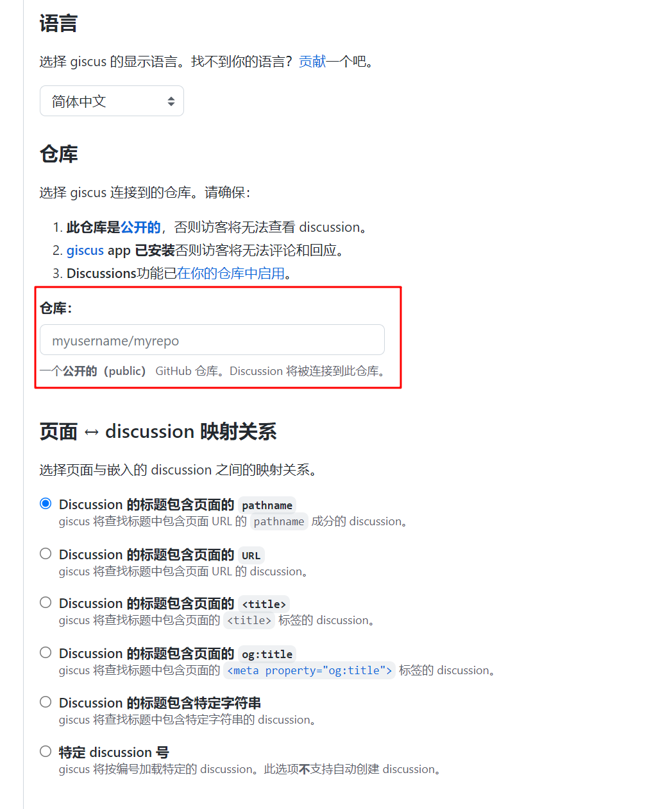
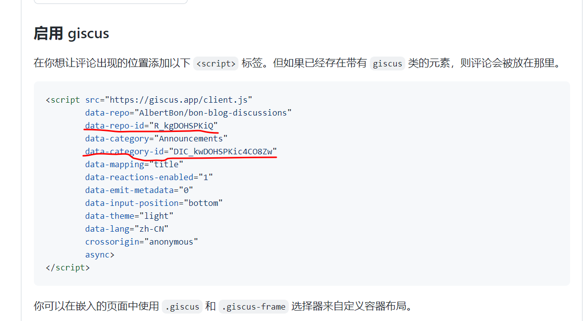

# giscus评论

## 简介
`giscus` 是github中的一个应用,所以需要在github中使用

## 1. 创建评论库
> 在github创建一个公开仓库，并开启评论区，以作为评论存放的地点

## 2. 在自己的github中安装`giscus`

* [安装地址](https://github.com/apps/giscus)

## 3. 在`giscus`中获取自己项目的配置信息
* [访问地址](https://giscus.app/zh-CN)
* 填写仓库信息

* 获取自己的配置信息


## 4. theme-hope主题中配置
```js
comment: {
  /**
   * Using giscus
   */
  type: "giscus",
  repo: "AlbertBon/bon-blog-discussions",
  repoId: "R_kgDOHSPKiQ",
  category: "Announcements", // 选择新 discussions 所在的分类。 推荐使用公告（announcements）类型的分类，以确保新 discussion 只能由仓库维护者和 giscus 创建。
  categoryId: "DIC_kwDOHSPKic4CO8Zw",
  mapping: "title", // 页面 与 discussion 映射关系
  inputPosition: "top", // 输入框的位置
  reactionsEnabled: true, //是否启用主帖子上的反应
}
```


